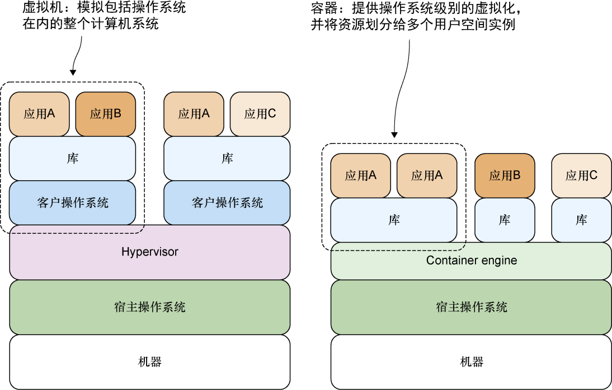

### 10.4.1　什么是Docker

Docker是一个非常了不起的项目，PaaS公司dotCloud最初在2013年发布了这个开源项目，之后无论是大型公司还是小型公司，都被这一项目震撼了。Google、AWS以及微软这样的技术公司都在拥抱Docker，AWS拥有EC2 Container Service（容器服务），Google提供了Google Container Engine（容器引擎），Digital Ocean、Rackspace甚至IBM等众多云供应商也纷纷加入了支持Docker的行列当中。除此之外，像BBC、ING这样的银行以及高盛这样的传统公司也开始在内部尝试使用Docker。

一言以蔽之，Docker就是在容器中构建、发布和运行应用的一个开放平台。容器并不是一项新技术——它在Unix初期就已经出现，Docker最初基于Linux的容器就是在2008年引入的。Heroku的dynos同样也是一种容器。

如图10-5所示，容器与虚拟机的不同之处在于，虚拟机模拟的是包括操作系统在内的整个计算机系统，而容器只提供操作系统级别的虚拟化，并将计算机资源划分给多个独立的用户空间实例使用。这两种虚拟方式的差异导致容器对资源的需求比虚拟机要少得多，并且容器的启动速度和部署速度也比虚拟机快得多。

<b class="my_markdown">图10-5　容器与虚拟机的不同之处在于，容器提供的是操作系统级别的虚拟化，并且容器可以将资源划分给多个独立的用户空间实例</b>

Docker实质上就是一种管理容器的软件，它的存在使开发者可以更为简单地使用容器。除Docker之外，市面上还存在着chroot、Linux containers（LXC）、Solaris Zones、CoreOS和lmctfy等一系列同类软件，但Docker是其中名声最显赫的一款。

