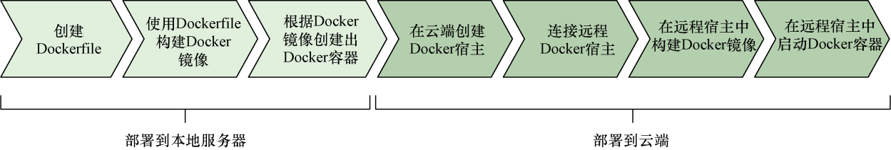

### 10.4.4　Docker化一个Go Web应用

尽管Docker使用了那么多的技术，但Docker化一个Go Web应用却一点也不困难。因为Web服务拥有对整个容器的完整访问权限，所以我们不需要对服务的代码做任何修改，只要使用Docker并进行相应的配置就可以了。作为例子，图10-7从高层次的角度展示了将一个Web应用Docker化并部署到本地以及云端的具体步骤。

在本节中，我们将使用 `ws-d` 作为Web服务的名字。部署的第一步是在应用程序的根目录中创建一个代码清单10-7所示的Dockerfile文件。


<center class="my_markdown"><b class="my_markdown">图10-7　将Go Web应用Docker化并部署到本地以及云端的具体步骤</b></center>

代码清单10-7　简单Web服务的Dockerfile文件

```go
FROM golang ❶
ADD . /go/src/github.com/sausheong/ws-d ❷
WORKDIR /go/src/github.com/sausheong/ws-d
RUN go get github.com/lib/pq ❸
RUN go install github.com/sausheong/ws-d
ENTRYPOINT /go/bin/ws-d ❹
EXPOSE 8080 ❺
```

❶ 使用一个安装了Go 并且将GOPATH 设置为/go 的Debian 镜像作为容器的起点

❷ 把本地的包文件复制到容器的工作空间里面

❸ 在容器内部构建ws-d 命令

❹ 把ws-d 命令设置为随容器启动

❺ 注明该服务监听的端口号为8080

这个Dockerfile文件的第一行告诉Docker使用 `golang` 镜像启动，这是一个安装了最新版Go并将工作空间设置为 `/go` 的Debian镜像。之后的两行会将当前目录中的本地代码复制到容器中，并设置相应的工作目录。在此之后，文件使用 `RUN` 命令指示Docker获取PostgreSQL驱动并构建Web服务的代码，然后将可执行的二进制文件放置到 `/go/bin` 目录中。在此之后，文件使用 `ENTRYPOINT` 命令指示Docker将 `/go/bin/ws-d` 设置为随容器启动。最后，文件使用 `EXPOSE` 命令指示容器将8080端口暴露给其他容器。需要注意的是，这个 `EXPOSE` 命令只会对同一宿主内的其他容器打开8080端口，但它并不会对外开放8080端口。

在编写好Dockerfile文件之后，我们就可以使用以下命令来构建镜像了：

```go
docker build –t ws-d .
```

这条命令将执行Dockerfile文件，并根据文件中的指示构建一个本地镜像。如果一切顺利，那么在这条命令执行完毕之后，用户应该可以通过 `docker images` 命令看到新鲜出炉的镜像文件：

```go
REPOSITORY　　 TAG　　　　　IMAGE ID　　　　 CREATED　　　　　VIRTUAL SIZE
ws-d　　　　　 latest　　　 65e8437fce6b　　 10 minutes ago　 534.7 MB
```

在成功创建镜像之后，我们就可以通过运行镜像来创建和启动容器了：

```go
docker run --publish 80:8080 --name simple_web_service --rm　ws-d
```

这条命令会通过 `ws-d` 镜像创建出一个名为 `simple_web_service` 的容器。 `--publish80:8080标志` 打开HTTP端口80并将其映射至前面通过 `EXPOSE` 命令暴露的8080端口，而 `—rm` 标志则指示Docker在容器已经存在的情况下，先移除已有的容器，然后再创建并启动新容器。如果不设置 `--rm` 标志，那么Docker在容器已经存在的情况下将保留已有的容器，并直接启动该容器，而不是创建并启动新容器。为了确认容器是否已经启动，我们可以执行以下命令：

```go
docker ps
```

如果一切正常，你的容器应该会作为其中一员，出现在已激活容器列表当中：

```go
CONTAINER ID　IMAGE ...　PORTS　　　　　　　　　NAMES
eeb674e289a4　ws-d　...　0.0.0.0:80->8080/tcp　 simple_web_service
```

因为页面宽度的限制，这里忽略了 `docker ps` 命令输出的某些列，但这里展示的信息已经足以表明我们的容器现在已经正常地运行在本地的Docker宿主之上了。跟之前一样，我们可以通过 `curl` 命令向服务器发送一个 `POST` 请求，创建一条记录：

```go
curl -i -X POST -H "Content-Type: application/json" -d '{"content":"My first 
➥post","author":"Sau Sheong"}' http://127.0.0.1/post/
HTTP/1.1 200 OK
Content-Type: text/html; charset=utf-8
Date: Sat, 01 Aug 2015 06:46:59 GMT
Server: Google Frontend
Content-Length: 0
Alternate-Protocol: 80:quic,p=0
```

现在，通过curl命令获取之前创建的记录：

```go
curl -i -X GET http://127.0.0.1/post/1
HTTP/1.1 200 OK
Content-Type: application/json
Date: Sat, 01 Aug 2015 06:44:29 GMT
Server: Google Frontend
Content-Length: 69
Alternate-Protocol: 80:quic,p=0
{
　　"id": 1,
　　"content": "My first post",
　　"author": "Sau Sheong"
}
```

