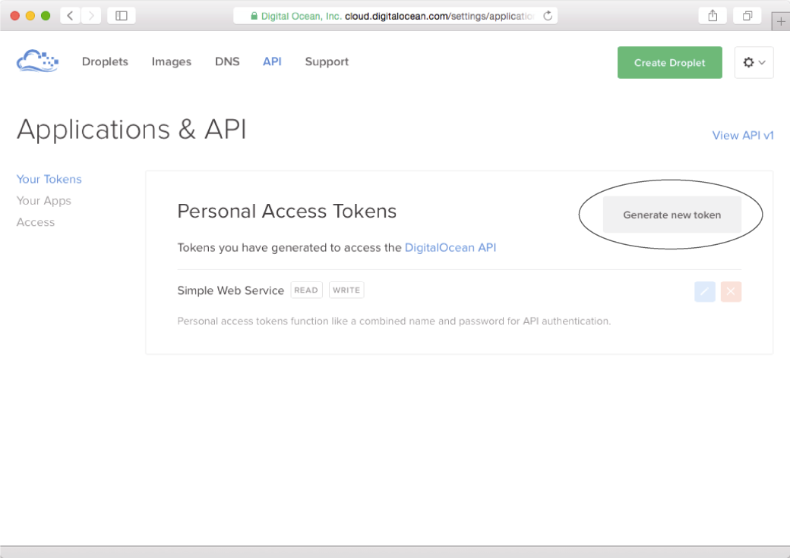

### 10.4.5　将Docker容器推送至互联网

把简单Web服务Docker化为容器听起来是一件非常棒的事情，但这个容器现在还只是运行在本地宿主上，而我们真正想要做的是把容器放到互联网上运行。有几种不同的方法可以把Docker容器部署到远程宿主上运行，目前来说，最简单的一种方法就是使用Docker机器了。

Docker机器（machine）是一个命令行接口，它允许用户在本地以及云端创建公开或者私有的Docker宿主。在编写本书时，Docker机器支持包括AWS、Digital Ocean、Google Compute Engine、IBM Softlayer、Microsoft Azure、Rackspace、Exoscale和VMWare vCloud Air在内的公有云供应商；与此同时，Docker机器也支持在私有云供应商以及运行着OpenStack、VMWare或者Microsoft Hyper-V的云供应商上创建宿主。

Docker机器并不会与Docker本身一同被安装，而需要单独安装。用户可以通过克隆代码库https://github.com/docker/machine或者从https://docs.docker.com/machine/install-machine/下载相应平台的二进制包来安装Docker机器。比如，使用Linux的用户就可以通过以下命令来获得Docker机器的二进制包：

```go
curl -L https://github.com/docker/machine/releases/download/v0.3.0/docker-
➥machine_linux-amd64 /usr/local/bin/docker-machine
```

在下载完二进制包之后，用户还需要执行以下命令将二进制包变成可执行文件：

```go
chmod +x /usr/local/bin/docker-machine
```

在下载完Docker机器并将它变成可执行文件之后，用户就可以在Docker机器支持的云端上创建Docker宿主了。要做到这一点，其中最为轻松的一种办法就是使用Digital Ocean。Digital Ocean是一个虚拟专用服务器（virtual private server，VPS）供应商，它的服务以易于使用以及价格实惠而著称（VPS是供应商以服务形式销售的虚拟机）。Digital Ocean在2015年5月成为了仅次于AWS的世界第二大Web服务器托管公司。

为了在Digital Ocean上创建Docker宿主，我们需要先申请一个Digital Ocean账号，并在拥有账号之后，访问Digital Ocean的“Applications & API”（应用与API）页面https://cloud.digitalocean.com/ settings/applications。

图10-8展示了“Applications & API”页面的样子，该页面中包含了一个“Generate new token” （生成新令牌）按钮，我们可以通过点击这个按钮来生成一个新的令牌。生成令牌时首先要做的就是输入一个名字，并勾选其中的“Write”（写入）复选框，然后点击“Generate new token”（生成令牌）按钮。这样一来，你就会拥有一个由用户名和密码混合而成的个人访问令牌，这个令牌可以用于进行API身份验证。需要注意的是，令牌只会在生成时出现一次，之后便不再出现，因此用户需要把这个令牌存储到安全的地方。


<center class="my_markdown"><b class="my_markdown">图10-8　在Digital Ocean上生成个人访问令牌非常简单，只需要点击“Generate new token”即可</b></center>

为了使用Docker机器在Digital Ocean上创建Docker宿主，我们需要在控制台执行以下命令：

```go
docker-machine create --driver digitalocean --digitalocean-access-token <tokenwsd
Creating CA: /home/sausheong/.docker/machine/certs/ca.pem
Creating client certificate: /home/sausheong/.docker/machine/certs/cert.pem
Creating SSH key...
Creating Digital Ocean droplet...
To see how to connect Docker to this machine, run: docker-machine env wsd
```

在成功创建远程Docker宿主之后，接下来要做的就是与之进行连接。注意，因为我们的Docker客户端目前还连接着本地Docker宿主，所以我们需要对它进行调整，让它改为连接Digital Ocean上的Docker宿主。Docker机器返回的结果提示我们应该如何做到这一点。简单来说，我们需要执行以下命令：

```go
docker-machine env wsd
export DOCKER_TLS_VERIFY="1"
export DOCKER_HOST="tcp://104.236.0.57:2376"
export DOCKER_CERT_PATH="/home/sausheong/.docker/machine/machines/wsd" 
export DOCKER_MACHINE_NAME="wsd"
# Run this command to configure your shell:
# eval "$(docker-machine env wsd)"
```

这条命令展示了云上的Docker宿主的环境设置，而我们要做的就是修改现有的环境设置，让客户端指向这个Docker宿主而不是本地Docker宿主，这一点可以通过执行以下命令来完成：

```go
eval "$(docker-machine env wsd)"
```

这条简单的命令会让Docker客户端连接到Digital Ocean的Docker宿主之上。为了确认这一点，我们可以执行以下命令：

```go
docker images
```

如果一切正常，应该不会看见任何镜像。回想一下，之前我们在连接本地Docker宿主的时候，曾经在本地创建过一个镜像，如果客户端还在连接本地宿主，那么至少会看到之前创建的镜像，而没有看见任何镜像则表示客户端已经没有再连接到本地Docker宿主了。

因为新的Docker宿主还没有任何镜像可用，所以我们接下来要做的就是在新宿主上重新创建镜像，为此，我们需要再次执行之前提到过的 `docker build` 命令：

```go
docker build –t ws-d .
```

在这条命令执行完毕之后，用户使用 `docker images` 至少会看到两个镜像，其中一个是 `golang` 基础镜像，而另一个则是新创建的 `ws-d` 镜像。现在，一切都已就绪，我们最后要做的就是跟之前一样，通过镜像运行容器：

```go
docker run --publish 80:8080 --name simple_web_service --rm　ws-d
```

这条命令将在远程Docker宿主上面创建并启动一个容器。为了验证这一点，我们可以跟之前一样，通过 `curl` 创建并获取一条数据库记录。跟之前不一样的是，这次 `curl` 将不再是向本地服务器发送  `POST`  请求，而是向远程服务器发送  `POST`  请求，而这个远程服务器的 IP 地址就是 `docker-machine env wsd` 命令返回的IP地址：

```go
curl -i -X GET http://104.236.0.57/post/1
HTTP/1.1 200 OK
Content-Type: application/json
Date: Mon, 03 Aug 2015 11:35:46 GMT
Content-Length: 69
{
　　"id": 2,
　　"content": "My first post",
　　"author": "Sau Sheong"
}
```

大功告成！以上就是通过Docker容器将一个简单的Go Web服务部署到互联网所需的全部步骤。Docker并不是部署Go Web应用最简单的方式，但这种部署方式正在变得越来越流行。与此同时，通过使用Docker，用户只需要在本地成功部署过一次，就可以毫不费力地在多个私有或者公有的云供应商上重复进行部署，而这一点正是Docker真正的威力所在。幸运的是，现在你已经知道该如何通过Docker来获得这一优势了。

为了保证本章以及本节的内容足够简短并且目标足够明确，这里介绍的内容省略了大量的细节。如果你对Docker感兴趣（这是一件好事，因为它是一个非常有趣的新工具），那么可以花些时间阅读Docker的在线文档（https://docs.docker.com/）以及其他关于Docker的文章。

