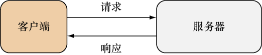
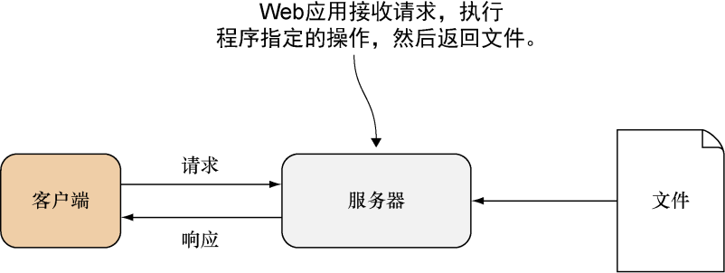

### 1.2　Web应用的工作原理

如果你在一个技术会议上向在场的程序员们提出“什么是Web应用”这一问题，那么通常会得到五花八门的回答，有些人甚至可能还会因为你问了个如此基础的问题而感到惊讶和不解。通过不同的人对这个问题的不同回答，我们可以了解到人们对Web应用并没有一个十分明确的定义。比如说，Web服务算不算Web应用？因为Web服务通常会被其他软件调用，而Web应用则是为人类提供服务，所以很多人都认为Web服务与Web应用是两种不同的事物。但如果一个程序能够像RSS feed那样，产生出来的数据既可以被其他软件使用，又可以被人类理解，那么这个程序到底是一个Web服务还是一个Web应用呢？

同样地，如果一个应用只会返回HTML页面，但却并不对页面进行任何处理，那么它是一个Web应用吗？运行在Web浏览器之上的Adobe Flash程序是一个Web应用吗？对于一个纯HTML5编写的应用，如果它运行在一个长期驻留于计算机的浏览器中，那么它算是一个Web应用吗？如果一个应用在向服务器发送请求时没有使用HTTP协议，那么它算是一个Web应用吗？大多数程序员都能够从高层次的角度去理解Web应用是什么，但是一旦我们深入一些，尝试去探究Web应用的实现层次，事情就会变得含糊不清起来。

从纯粹且狭隘的角度来看，Web应用应该是这样的计算机程序：它会对客户端发送的HTTP请求做出响应，并通过HTTP响应将HTML回传至客户端。但这样一来，Web应用不就跟Web服务器一样了吗？的确如此，如果按照上面给出的定义来看，Web服务器和Web应用将没有区别：一个Web服务器就是一个Web应用（如图1-1所示）。

<b class="my_markdown">图1-1　Web应用最基本的请求与响应结构</b>

将Web服务器看作是Web应用的一个问题在于，像httpd和Apache这样的Web服务器都会监视特定的目录，并在接收到请求时返回位于该目录中的文件（比如Apache就会对docroot目录进行监视）。与此相反，Web应用并不会简单地返回文件：它会对请求进行处理，并执行应用程序中预先设定好的操作（如图1-2所示）。

<b class="my_markdown">图1-2　Web应用的工作原理</b>

从以上观点来看，我们也许可以把Web服务器看作是一种特殊的Web应用，这种应用只会返回被请求的文件。普遍来讲，很多用户都会把使用浏览器作为客户端的应用看作是Web应用。这其中包括Adobe Flash应用、单页Web应用，甚至是那些不使用HTTP协议进行通信但却驻留在桌面或系统上的应用。

为了在书中讨论Web编程的相关技术，我们必须给这些技术一个明确的定义。首先，让我们来给出应用的定义。

应用（application）是一个与用户进行互动并帮助用户执行指定活动的软件程序。比如记账系统、人力资源系统、桌面出版软件等。而Web应用则是部署在Web之上，并通过Web来使用的应用。

换句话说，一个程序只需要满足以下两个条件，我们就可以把它看作是一个Web应用：

+ 这个程序必须向发送命令请求的客户端返回HTML，而客户端则会向用户展示渲染后的HTML；
+ 这个程序在向客户端传送数据时必须使用HTTP协议。

在这个定义的基础上，如果一个程序不是向用户渲染并展示HTML，而是向其他程序返回某种非HTML格式的数据，那么这个程序就是一个为其他程序提供服务的Web服务。本书将在第7章对Web服务进行更详细的说明。

与大部分程序员对Web应用的定义相比，上面给出的定义可能显得稍微狭隘了一些，但因为这个定义消除了所有的模糊与不清晰，并使Web应用变得更加易于理解，所以它对于本书讨论的问题是非常有帮助的。随着读者对本书阅读的不断深入，这一定义将变得更为清晰，但是在此之前，让我们先来回顾一下HTTP协议的发展历程。

