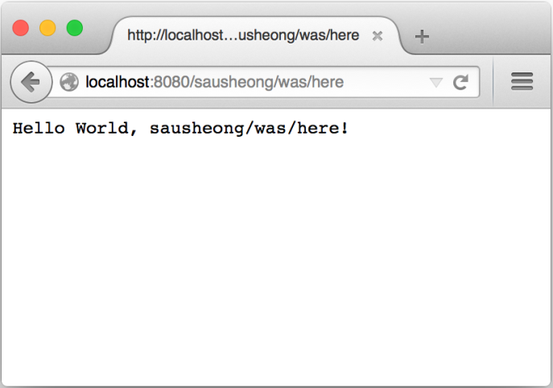

### 1.10　Hello Go

在这一节，我们将开始学习如何实际地使用Go语言构建Web应用。如果你还没有安装Go，那么请先阅读本书的附录，根据附录中的指示安装Go并设置相关的环境变量。本节在构建Web应用时将会用到Go的 `net/http` 包，因为本书将会在接下来的几章中对这个包进行详细的介绍，所以即使目前对这个包知之甚少，也不必过于担心。目前来说，你只需要在计算机上键入本节展示的代码，编译它，然后观察这些代码是如何运行的就可以了。习惯了使用大小写无关编程语言的读者请注意，因为Go语言是区分大小写的，所以在键入本书展示的代码时请务必注意代码的大小写。

本书展示的所有代码都可以在这个GitHub页面找到：https://github.com/sausheong/gwp。

请在你的工作空间的 `src` 目录中创建一个 `first_webapp` 子目录，并在这个子目录里面创建一个 `server.go` 文件，然后将代码清单1-1中展示的源代码键入到文件里面。

代码清单1-1　使用Go构建的Hello World Web应用

```go
package main
import (
　　"fmt"
　　"net/http"
)
func handler(writer http.ResponseWriter, request *http.Request) {
　　fmt.Fprintf(writer, "Hello World, %s!", request.URL.Path[1:])
}
func main() {
　　http.HandleFunc("/", handler)
　　http.ListenAndServe(":8080", nil)
}
```

在一切就绪之后，请打开你的终端，执行以下命令：

```go
$ go install first_webapp
```

你可以在任意目录中执行这个命令。在正确地设置了 `GOPATH` 环境变量的情况下，这个命令将在你的 `$GOPATH/bin` 目录中创建一个名为 `first_webapp` 的二进制可执行文件，接着就可以在终端里面运行这个文件了。如果你按照附录的指示，将 `$GOPATH/bin` 目录也添加到了 `PATH` 环境变量当中，那么你也可以在任意目录中执行 `first_webapp` 文件。被执行的 `first_webapp` 文件将在系统的8080端口上启动你的Web应用。一切就这么简单！

现在，打开网页浏览器，访问http://localhost:8080/。如果一切正常，那么你将会看到图1-3所示的内容。


<center class="my_markdown"><b class="my_markdown">图1-3　我们创建的首个Web应用</b></center>

让我们来仔细地分析一下这个Web应用的代码。第一行代码声明了这个程序所属的包，跟在 `package` 关键字之后的 `main` 就是包的名字。Go语言要求可执行程序必须位于 `main` 包当中，Web应用也不例外。如果你曾经使用过Ruby、Python或者Java等其他编程语言来开发Web应用，那么你可能已经发现了Go和这些语言之间的区别：其他语言通常需要将Web应用部署到应用服务器上面，并由应用服务器为Web应用提供运行环境，但是对Go来说，Web应用的运行环境是由 `net/http` 包直接提供的，这个包和应用的源代码会一起被编译成一个可以快速部署的独立Web应用。

位于 `package` 语句之后的 `import` 语句用于导入所需的包：

```go
import (
　　 "fmt"
　　 "net/http" 
)
```

被导入的包分别为 `fmt` 包和 `http` 包，前者使得程序可以使用 `Fprintf` 等函数对I/O进行格式化，而后者则使得程序可以与HTTP进行交互。顺带一提，Go的 `import` 语句不仅可以导入标准库里面的包，还可以从第三方库里面导入包。

出现在导入语句之后的是一个函数定义：

```go
func handler(writer http.ResponseWriter, request *http.Request) {
　　fmt.Fprintf(writer, "Hello World, %s!", request.URL.Path[1:])
}
```

这3行代码定义了一个名为 `handler` 的函数。处理器（handler）这个名字通常用来表示在指定事件被触发之后，负责对事件进行处理的回调函数，这也正是我们如此命名这个函数的原因（不过从技术上来说，至少在Go语言里面，这个函数并不是一个处理器，而是一个处理器函数，处理器和处理器函数之间的区别将在第3章中介绍）。

这个处理器函数接受两个参数作为输入，第一个参数为 `ResponseWriter` 接口，第二个参数则为指向 `Request` 结构的指针。 `handler` 函数会从 `Request` 结构中提取相关的信息，然后创建一个HTTP响应，最后再通过 `ResponseWriter` 接口将响应返回给客户端。至于 `handler` 函数内部的 `Fprintf` 函数在被调用时则会使用一个 `ResponseWriter` 接口、一个带有单个格式化指示符（ `%s` ）的格式化字符串以及从 `Request` 结构里面提取到的路径信息作为参数。因为我们之前访问的地址为http://localhost:8080/，所以应用并没有打印出任何路径信息，但如果我们访问地址http://localhost:8080/sausheong/was/here，那么浏览器应该会展示出图1-4所示的信息。

Go语言规定，每个需要被编译为二进制可执行文件的程序都必须包含一个 `main` 函数，用作程序执行时的起点：

```go
func main() {
　　 http.HandleFunc("/", handler)
　　 http.ListenAndServe(":8080", nil)
}
```

这个 `main` 函数的作用非常直观，它首先把之前定义的 `handler` 函数设置成根（root）URL（ `/` ）被访问时的处理器，然后启动服务器并让它监听系统的8080端口（按下Ctrl+C可以停止这个服务器）。至此，这个使用Go语言编写的Hello World Web应用就算顺利完成了。


<center class="my_markdown"><b class="my_markdown">图1-4　带有路径信息的Hello World示例</b></center>

本章以介绍Web应用的基础知识开始，并最终走马观花地编写了一个简单却没什么用处的Go Web应用作为结束。在接下来的一章中，我们将会看到更多代码，并学习如何使用Go语言以及它的标准库去编写更真实的Web应用（不过这些应用距离真正生产级别的应用还有一定距离）。尽管第2章出现的大量代码可能会让读者有一种囫囵吞枣的感觉，但我们将会从中学习到一个典型的Go Web应用是如何组织的。

