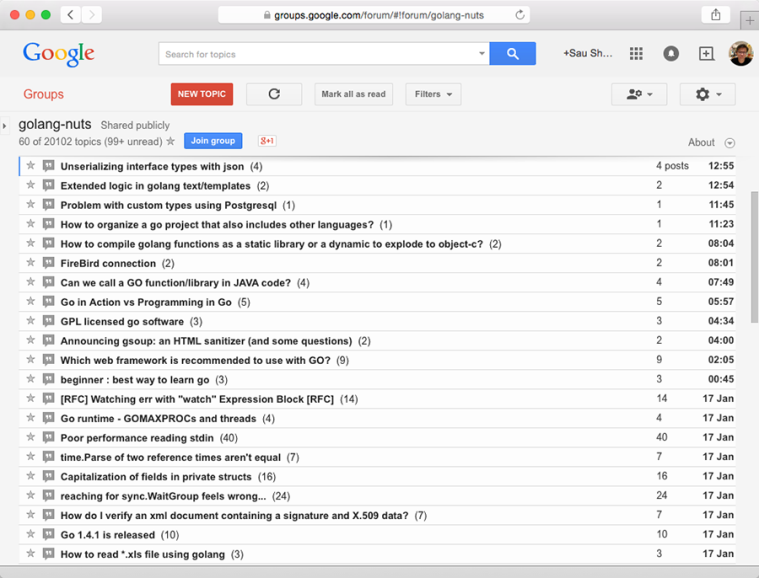

### 2.1　ChitChat简介

网上论坛无处不在，它们是互联网上最受欢迎的应用之一，与旧式的电子公告栏（BBS）、新闻组（Usenet）和电子邮件一脉相承。雅虎公司和Google公司的群组（Groups）都非常流行，雅虎报告称，他们总共拥有1000万个群组以及1.15亿个群组成员，其中每个群组都拥有一个自己的论坛；而全球最具人气的网上论坛之一——Gaia在线——则拥有2300万注册用户以及接近230亿张帖子，并且这些帖子的数量还在以每天上百万张的速度持续增长。尽管现在出现了诸如Facebook这样的社交网站，但论坛仍然是人们在网上进行交流时最为常用的手段之一。作为例子，图2-1展示了GoogleGroups的样子。

<b class="my_markdown">图2-1　一个网上论坛示例：GoogleGroups里面的Go编程语言论坛</b>

从本质上来说，网上论坛就相当于一个任何人都可以通过发帖来进行对话的公告板，公告板上面可以包含已注册用户以及未注册的匿名用户。论坛上的对话称为帖子（thread），一个帖子通常包含了作者想要讨论的一个主题，而其他用户则可以通过回复这个帖子来参与对话。比较复杂的论坛一般都会按层级进行划分，在这些论坛里面，可能会有多个讨论特定类型主题的子论坛存在。大多数论坛都会由一个或多个拥有特殊权限的用户进行管理，这些拥有特殊权限的用户被称为版主（moderator）。

在本章中，我们将会开发一个名为ChitChat的简易网上论坛。为了让这个例子保持简单，我们只会为ChitChat实现网上论坛的关键特性：在这个论坛里面，用户可以注册账号，并在登录之后发表新帖子又或者回复已有的帖子；未注册用户可以查看帖子，但是无法发表帖子或是回复帖子。现在，让我们首先来思考一下如何设计ChitChat这个应用。

关于本章展示的代码

> 跟本书的其他章节不一样，因为篇幅的关系，本章并不会展示ChitChat论坛的所有实现代码，但你可以在GitHub页面https://github.com/sausheong/gwp找到这些代码。如果你打算在阅读本章的同时实际了解一下这个应用，那么这些完整的代码应该会对你有所帮助。

