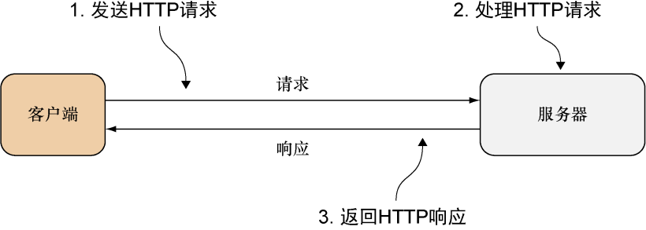
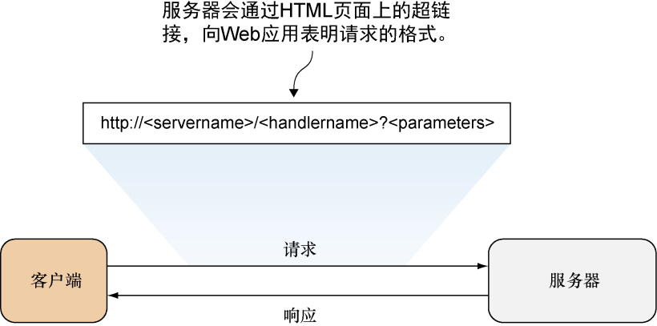
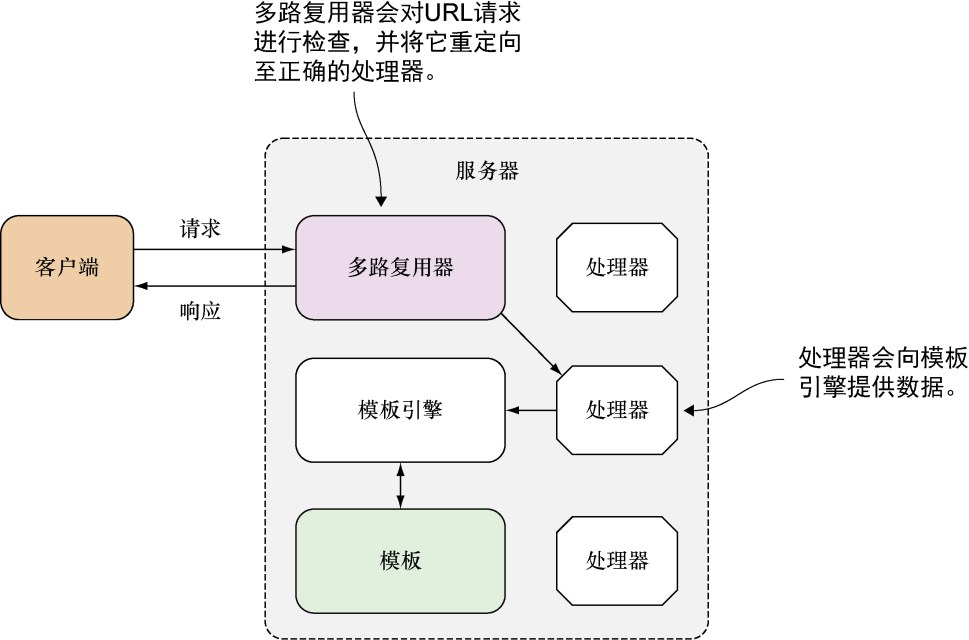

### 2.2　应用设计

正如第1章所说，Web应用的一般工作流程是客户端向服务器发送请求，然后服务器对客户端进行响应（如图2-2所示），ChitChat应用的设计也遵循这一流程。

<b class="my_markdown">图2-2　Web应用的一般工作流程，客户端向服务器发送请求，然后等待接收响应</b>

ChitChat的应用逻辑会被编码到服务器里面。服务器会向客户端提供HTML页面，并通过页面的超链接向客户端表明请求的格式以及被请求的数据，而客户端则会在发送请求时向服务器提供相应的数据，如图2-3所示。

<b class="my_markdown">图2-3　HTTP请求的URL格式</b>

请求的格式通常是由应用自行决定的，比如，ChitChat的请求使用的是以下格式： `http://<服务器名><处理器名>?<参数>` 。

服务器名（server name）是ChitChat服务器的名字，而处理器名（handler name）则是被调用的处理器的名字。处理器的名字是按层级进行划分的：位于名字最开头是被调用模块的名字，而之后跟着的则是被调用子模块的名字，以此类推，位于处理器名字最末尾的则是子模块中负责处理请求的处理器。比如，对 `/thread/read` 这个处理器名字来说， `thread` 是被调用的模块，而 `read` 则是这个模块中负责读取帖子内容的处理器。

该应用的参数（parameter）会以URL查询的形式传递给处理器，而处理器则会根据这些参数对请求进行处理。比如说，假设客户端要向处理器传递帖子的唯一ID，那么它可以将URL的参数部分设置成 `id=123` ，其中 `123` 就是帖子的唯一ID。

如果 `chitchat` 就是ChitChat服务器的名字，那么根据上面介绍的URL格式规则，客户端发送给ChitChat服务器的URL可能会是这样的：http://chitchat/thread/read?id=123。

当请求到达服务器时，多路复用器（multiplexer）会对请求进行检查，并将请求重定向至正确的处理器进行处理。处理器在接收到多路复用器转发的请求之后，会从请求中取出相应的信息，并根据这些信息对请求进行处理。在请求处理完毕之后，处理器会将所得的数据传递给模板引擎，而模板引擎则会根据这些数据生成将要返回给客户端的HTML，整个过程如图2-4所示。

<b class="my_markdown">图2-4　服务器在典型Web应用中的工作流程</b>

