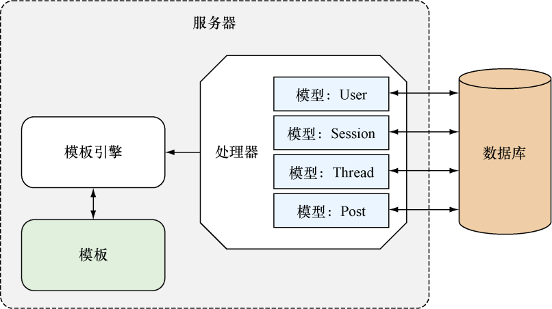

### 2.3　数据模型

绝大多数应用都需要以某种方式与数据打交道。对ChitChat来说，它的数据将被存储到关系式数据库PostgreSQL里面，并通过SQL与之交互。

ChitChat的数据模型非常简单，只包含4种数据结构，它们分别是：

+ User——表示论坛的用户信息；
+ Session——表示论坛用户当前的登录会话；
+ Thread——表示论坛里面的帖子，每一个帖子都记录了多个论坛用户之间的对话；
+ Post——表示用户在帖子里面添加的回复。

以上这4种数据结构都会被映射到关系数据库里面，图2-5展示了这4种数据结构是如何与数据库交互的。

ChitChat论坛允许用户在登录之后发布新帖子或者回复已有的帖子，未登录的用户可以阅读帖子，但是不能发布新帖子或者回复帖子。为了对应用进行简化，ChitChat论坛没有设置版主这一职位，因此用户在发布新帖子或者添加新回复的时候不需要经过审核。

<b class="my_markdown">图2-5　Web应用访问数据存储系统的流程</b>

在了解了ChitChat的设计方案之后，现在可以开始考虑具体的实现代码了。在开始学习ChitChat的实现代码之前，请注意，如果你在阅读本章展示的代码时遇到困难，又或者你是刚开始学习Go语言，那么为了更好地理解本章介绍的内容，你可以考虑先花些时间阅读一本Go语言的编程入门书，比如，由William Kennedy、Brian Ketelsen和Erik St. Martin撰写的《Go语言实战》就是一个很不错的选择。

除此之外，在阅读本章时也请尽量保持耐心：本章只是从宏观的角度展示Go Web应用的样子，并没有对Web应用的细节作过多的解释，而是将这些细节留到之后的章节再进一步说明。在有需要的情况下，本章也会在介绍某种技术的同时，说明在哪一章可以找到这一技术的更多相关信息。

