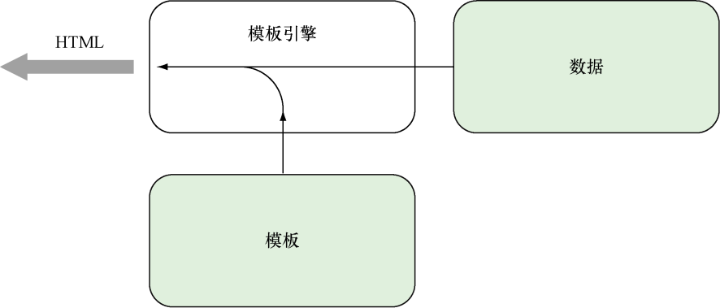
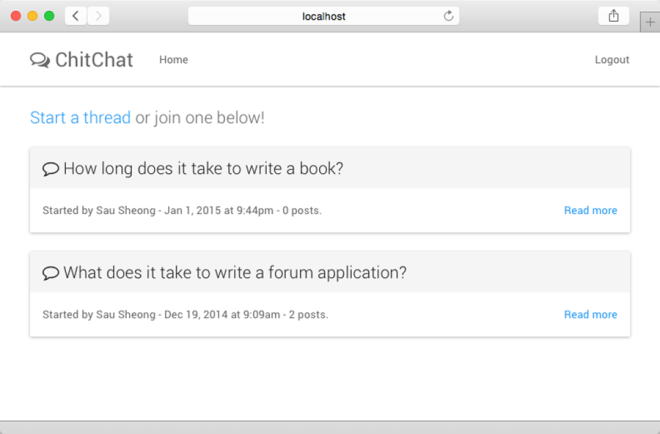

### 2.5　使用模板生成HTML响应

`index` 处理器函数里面的大部分代码都是用来为客户端生成HTML的。首先，函数把每个需要用到的模板文件都放到了Go切片里面（这里展示的是私有页面的模板文件，公开页面的模板文件也是以同样方式进行组织的）：

```go
private_tmpl_files := []string{"templates/layout.html",
　　　　　　　　　　　　　　　 "templates/private.navbar.html",
　　　　　　　　　　　　　　　 "templates/index.html"}
```

跟Mustache和CTemplate等其他模板引擎一样，切片指定的这3个HTML文件都包含了特定的嵌入命令，这些命令被称为动作（action），动作在HTML文件里面会被 `{{` 符号和 `}}` 符号包围。

接着，程序会调用 `ParseFiles` 函数对这些模板文件进行语法分析，并创建出相应的模板。为了捕捉语法分析过程中可能会产生的错误，程序使用了 `Must` 函数去包围 `ParseFiles` 函数的执行结果，这样当 `ParseFiles` 返回错误的时候， `Must` 函数就会向用户返回相应的错误报告：

```go
templates := template.Must(template.ParseFiles(private_tmpl_files...))
```

好的，关于模板文件的介绍已经足够多了，现在是时候来看看它们的庐山真面目了。

ChitChat论坛的每个模板文件都定义了一个模板，这种做法并不是强制的，用户也可以在一个模板文件里面定义多个模板，但模板文件和模板一一对应的做法可以给开发带来方便，我们在之后就会看到这一点。代码清单2-7展示了 `layout.html` 模板文件的源代码，源代码中使用了 `define` 动作，这个动作通过文件开头的 `{{ define "layout" }}` 和文件末尾的 `{{ end }}` ，把被包围的文本块定义成了 `layout` 模板的一部分。

代码清单2-7　 `layout.html` 模板文件

```go
{{ define "layout" }}
<!DOCTYPE html>
<html lang="en">
　<head>
　　<meta charset="utf-8">
　　<meta http-equiv="X-UA-Compatible" content="IE=9">
　　<meta name="viewport" content="width=device-width, initial-scale=1">
　　<title>ChitChat</title>
　　<link href="/static/css/bootstrap.min.css" rel="stylesheet">
　　<link href="/static/css/font-awesome.min.css" rel="stylesheet">
　</head>
　<body>
　　{{ template "navbar" . }}
　　<div class="container">
　　　{{ template "content" . }}
　　</div> <!-- /container -->
　　<script src="/static/js/jquery-2.1.1.min.js"></script>
　　<script src="/static/js/bootstrap.min.js"></script>
　</body>
</html>
{{ end }}
```

除了 `define` 动作之外， `layout.html` 模板文件里面还包含了两个用于引用其他模板文件的 `template` 动作。跟在被引用模板名字之后的点（ `.` ）代表了传递给被引用模板的数据，比如 `{{ template "navbar" . }}` 语句除了会在语句出现的位置引入 `navbar` 模板之外，还会将传递给 `layout` 模板的数据传递给 `navbar` 模板。

代码清单2-8展示了 `public.navbar.html` 模板文件中的 `navbar` 模板，除了定义模板自身的 `define` 动作之外，这个模板没有包含其他动作（严格来说，模板也可以不包含任何动作）。

代码清单2-8　 `public.navbar.html` 模板文件

```go
{{ define "navbar" }}
<div class="navbar navbar-default navbar-static-top" role="navigation">
　<div class="container">
　　<div class="navbar-header">
　　　<button type="button" class="navbar-toggle collapsed"
　　　➥ data-toggle="collapse" data-target=".navbar-collapse">
　　　　<span class="sr-only">Toggle navigation</span>
　　　　<span class="icon-bar"></span>
　　　　<span class="icon-bar"></span>
　　　　<span class="icon-bar"></span>
　　　</button>
　　　<a class="navbar-brand" href="/">
　　　　<i class="fa fa-comments-o"></i>
　　　　ChitChat
　　　</a>
　　</div>
　　<div class="navbar-collapse collapse">
　　　<ul class="nav navbar-nav">
　　　　<li><a href="/">Home</a></li>
　　　</ul>
　　　<ul class="nav navbar-nav navbar-right">
　　　　<li><a href="/login">Login</a></li>
　　　</ul>
　　</div>
　</div>
</div>
{{ end }}
```

最后，让我们来看看定义在 `index.html` 模板文件中的 `content` 模板，代码清单2-9展示了这个模板的源代码。注意，尽管之前展示的两个模板都与模板文件拥有相同的名字，但实际上模板和模板文件分别拥有不同的名字也是可行的。

代码清单2-9　 `index.html` 模板文件

```go
{{ define "content" }}
<p class="lead">
　<a href="/thread/new">Start a thread</a> or join one below!
</p>
{{ range . }}
　<div class="panel panel-default">
　　<div class="panel-heading">
　　　<span class="lead"> <i class="fa fa-comment-o"></i> {{ .Topic }}</span>
　　</div>
　　<div class="panel-body">
　　　Started by {{ .User.Name }} - {{ .CreatedAtDate }} - {{ .NumReplies }}
　posts.
　　　<div class="pull-right">
　　　　<a href="/thread/read?id={{.Uuid }}">Read more</a>
　　　</div>
　　</div>
　</div>
{{ end }}
{{ end }}
```

`index.html` 文件里面的代码非常有趣，特别值得一提的是文件里面包含了几个以点号（ `.` ）开头的动作，比如 `{{ .User.Name }}` 和 `{{ .CreatedAtDate }}` ，这些动作的作用和之前展示过的 `index` 处理器函数有关：

```go
threads, err := data.Threads(); if err == nil {
　templates.ExecuteTemplate(writer, "layout", threads)
}
```

在以下这行代码中：

```go
templates.ExecuteTemplate(writer, "layout", threads)
```

程序通过调用 `ExecuteTemplate` 函数，执行（execute）已经经过语法分析的 `layout` 模板。执行模板意味着把模板文件中的内容和来自其他渠道的数据进行合并，然后生成最终的HTML内容，具体过程如图2-6所示。


<center class="my_markdown"><b class="my_markdown">图2-6　模板引擎通过合并数据和模板来生成HTML</b></center>

程序之所以对 `layout` 模板而不是 `navbar` 模板或者 `content` 模板进行处理，是因为 `layout` 模板已经引用了其他两个模板，所以执行 `layout` 模板就会导致其他两个模板也被执行，由此产生出预期的HTML。但是，如果程序只执行 `navbar` 模板或者 `content` 模板，那么程序最终只会产生出预期的HTML的一部分。

现在，你应该已经明白了，点号（ `.` ）代表的就是传入到模板里面的数据（实际上还不仅如此，接下来的小节会对这方面做进一步的说明）。图2-7展示了程序根据模板生成的ChitChat论坛的样子。


<center class="my_markdown"><b class="my_markdown">图2-7　ChitChat Web应用示例的主页</b></center>

