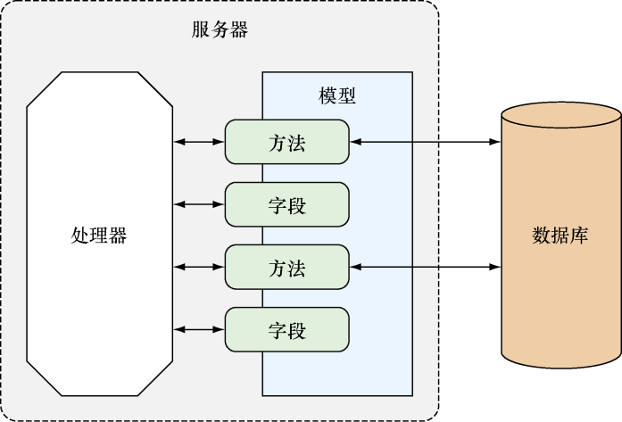

### 2.7　连接数据库

本章前面在展示ChitChat应用的设计方案时，曾经提到过ChitChat应用包含了4种数据结构。虽然把这4种数据结构放到主源码文件里面也是可以的，但更好的办法是把所有与数据相关的代码都放到另一个包里面——ChitChat应用的 `data` 包也因此应运而生。

为了创建 `data` 包，我们首先需要创建一个名为 `data` 的子目录，并创建一个用于保存所有帖子相关代码的 `thread.go` 文件（在之后的小节里面，我们还会创建一个用于保存所有用户相关代码的 `user.go` 文件）。在此之后，每当程序需要用到 `data` 包的时候（比如处理器需要访问数据库的时候），程序都需要通过 `import` 语句导入这个包：

```go
import (
　"github.com/sausheong/gwp/Chapter_2_Go_ChitChat/chitchat/data"
)
```

代码清单2-12展示了定义在 `thread.go` 文件里面的 `Thread` 结构，这个结构存储了与帖子有关的各种信息。

代码清单2-12　定义在 `thread.go` 文件里面的 `Thread` 结构

```go
package data
import(
　"time"
)
type Thread struct {
　Id　　　　int
　Uuid　　　string
　Topic　　 string
　UserId　　int
　CreatedAt time.Time
}
```

正如代码清单2-12中加粗显示的代码行所示，文件的包名现在是 `data` 而不再是 `main` 了，这个包就是前面小节中我们曾经见到过的 `data` 包。 `data` 包除了包含与数据库交互的结构和代码，还包含了一些与数据处理密切相关的函数。隶属于其他包的程序在引用 `data` 包中定义的函数、结构或者其他东西时，必须在被引用元素的名字前面显式地加上 `data` 这个包名。比如说，引用 `Thread` 结构就需要使用 `data.Thread` 这个名字，而不能仅仅使用 `Thread` 这个名字。

`Thread` 结构应该与创建关系数据库表 `threads` 时使用的数据定义语言（Data Definition Language，DDL）保持一致。因为 `threads` 表目前尚未存在，所以我们必须创建这个表以及容纳该表的数据库。创建 `chitchat` 数据库的工作可以通过执行以下命令来完成：

```go
createdb chitchat
```

在创建数据库之后，我们就可以通过代码清单2-13展示的 `setup.sql` 文件为ChitChat论坛创建相应的数据库表了。

代码清单2-13　用于在PostgreSQL里面创建数据库表的 `setup.sql` 文件

```go
create table users (
　id　　　　 serial primary key,
　uuid　　　 varchar(64) not null unique,
　name　　　 varchar(255),
　email　　　varchar(255) not null unique,
　password　 varchar(255) not null,
　created_at timestamp not null
);
create table sessions (
　id　　　　 serial primary key,
　uuid　　　 varchar(64) not null unique,
　email　　　varchar(255),
　user_id　　integer references users(id),
　created_at timestamp not null
);
create table threads (
　id　　　　 serial primary key,
　uuid　　　 varchar(64) not null unique,
　topic　　　text,
　user_id　　integer references users(id),
　created_at timestamp not null
);
create table posts (
　id　　　　 serial primary key,
　uuid　　　 varchar(64) not null unique,
　body　　　 text,
　user_id　　integer references users(id),
　thread_id　integer references threads(id),
　created_at timestamp not null
);
```

运行这个脚本需要用到 `psql` 工具，正如上一节所说，这个工具通常会随着PostgreSQL一同安装，所以你只需要在终端里面执行以下命令就可以了：

```go
psql –f setup.sql –d chitchat
```

如果一切正常，那么以上命令将在 `chitchat` 数据库中创建出相应的表。在拥有了表之后，程序就必须考虑如何与数据库进行连接以及如何对表进行操作了。为此，程序创建了一个名为 `Db` 的全局变量，这个全局变量是一个指针，指向的是代表数据库连接池的 `sql.DB` ，而后续的代码则会使用这个 `Db` 变量来执行数据库查询操作。代码清单2-14展示了 `Db` 变量在 `data.go` 文件中的定义，此外还展示了一个用于在Web应用启动时对 `Db` 变量进行初始化的 `init` 函数。

代码清单2-14  ` `data.go` ` 文件中的 `Db` 全局变量以及 `init` 函数

```go
Var Db *sql.DB
func init() {
　var err error
　Db, err = sql.Open("postgres", "dbname=chitchat sslmode=disable")
　if err != nil {
　　log.Fatal(err)
　}
　return
}
```

现在程序已经拥有了结构、表以及一个指向数据库连接池的指针，接下来要考虑的是如何连接（connect） `Thread` 结构和 `threads` 表。幸运的是，要做到这一点并不困难：跟ChitChat应用的其他部分一样，我们只需要创建能够在结构和数据库之间互动的函数就可以了。例如，为了从数据库里面取出所有帖子并将其返回给 `index` 处理器函数，我们可以使用 `thread.go` 文件中定义的 `Threads` 函数，代码清单2-15给出了这个函数的定义。

代码清单2-15  `threads.go` 文件中定义的 `Threads` 函数

```go
func Threads() (threads []Thread, err error){
　rows, err := Db.Query("SELECT id, uuid, topic, user_id, created_at FROM
　threads ORDER BY created_at DESC")
　if err != nil {
　　return
　}
　for rows.Next() {
　　th := Thread{}
　　if err = rows.Scan(&th.Id, &th.Uuid, &th.Topic, &th.UserId,
　　➥&th.CreatedAt); err != nil {
　　　return
　　}
　　threads = append(threads, th)
　}
　rows.Close()
　return
}
```

简单来讲， `Threads` 函数执行了以下工作：

（1）通过数据库连接池与数据库进行连接；

（2）向数据库发送一个SQL查询，这个查询将返回一个或多个行作为结果；

（3）遍历行，为每个行分别创建一个 `Thread` 结构，首先使用这个结构去存储行中记录的帖子数据，然后将存储了帖子数据的 `Thread` 结构追加到传入的 `threads` 切片里面；

（4）重复执行步骤3，直到查询返回的所有行都被遍历完毕为止。

本书的第6章将对数据库操作的细节做进一步的介绍。

在了解了如何将数据库表存储的帖子数据提取到 `Thread` 结构里面之后，我们接下来要考虑的就是如何在模板里面展示 `Thread` 结构存储的数据了。在代码清单2-9中展示的index.html模板文件，有这样一段代码：

```go
{{ range . }}
　<div class="panel panel-default">
　　<div class="panel-heading">
　　　<span class="lead"> <i class="fa fa-comment-o"></i> {{ .Topic }}</span>
　　</div>
　　<div class="panel-body">
　　　Started by {{ .User.Name }} - {{ .CreatedAtDate }} - {{ .NumReplies }}
　posts.
　　　<div class="pull-right">
　　　　<a href="/thread/read?id={{.Uuid }}">Read more</a>
　　　</div>
　　</div>
　</div>
{{ end }}
```

正如之前所说，模板动作中的点号（ `.` ）代表传入模板的数据，它们会和模板一起生成最终的结果，而 `{{ range . }}` 中的 `.` 号代表的是程序在稍早之前通过 `Threads` 函数取得的 `threads` 变量，也就是一个由 `Thread` 结构组成的切片。

`range` 动作假设传入的数据要么是一个由结构组成的切片，要么是一个由结构组成的数组，这个动作会遍历传入的每个结构，而用户则可以通过字段名访问结构里面的字段，比如，动作 `{{ .Topic }}` 访问的是 `Thread` 结构的 `Topic` 字段。注意，在访问字段时必须在字段名的前面加上点号，并且字段名的首字母必须大写。

用户除可以在字段名的前面加上点号来访问结构中的字段以外，还可以通过相同的方法调用一种名为方法（method）的特殊函数。比如，在上面展示的代码中， `{{ .User.Name }}` 、 `{{ .CreatedAtDate }}` 和 `{{ .NumReplies }}` 这些动作的作用就是调用结构中的同名方法，而不是访问结构中的字段。

方法是隶属于特定类型的函数，指针、接口以及包括结构在内的所有具名类型都可以拥有自己的方法。比如说，通过将函数与指向 `Thread` 结构的指针进行绑定，可以创建出一个针对 `Thread` 结构的方法，而传入方法里面的 `Thread` 结构则称为接收者（receiver）：方法可以访问接收者，也可以修改接收者。

作为例子，代码清单2-16展示了 `NumReplies` 方法的实现代码。

代码清单2-16  ` `thread.go` ` 文件中的 `NumReplies` 方法

```go
func (thread *Thread) NumReplies() (count int) {
　rows, err := Db.Query("SELECT count(*) FROM posts where thread_id = $1",
　thread.Id)
　if err != nil {
　　return
　}
　for rows.Next() {
　　if err = rows.Scan(&count); err != nil {
　　　return
　　}
　}
　rows.Close()
　return
}
```

`NumReplies` 方法首先打开一个指向数据库的连接，接着通过执行一条SQL查询来取得帖子的数量，并使用传入方法里面的 `count` 参数来记录这个值。最后， `NumReplies` 方法返回帖子的数量作为方法的执行结果，而模板引擎则使用这个值去代替模板文件中出现的 `{{ .NumReplies }}` 动作。

通过为 `User` 、 `Session` 、 `Thread` 和 `Post` 这4种数据结构创建相应的函数和方法，ChitChat最终在处理器函数和数据库之间构建起了一个数据层，以此来避免处理器函数直接对数据库进行访问，图2-8展示了这个数据层和数据库以及处理器函数之间的关系。虽然有很多库都可以达到同样的效果，但亲自构建数据层能够帮助我们学习如何对数据库进行基本的访问，并借此了解到实现这种访问并不困难，只需要用到一些简单直接的代码，这一点是非常有益的。


<center class="my_markdown"><b class="my_markdown">图2-8　通过结构模型连接数据库和处理器</b></center>

