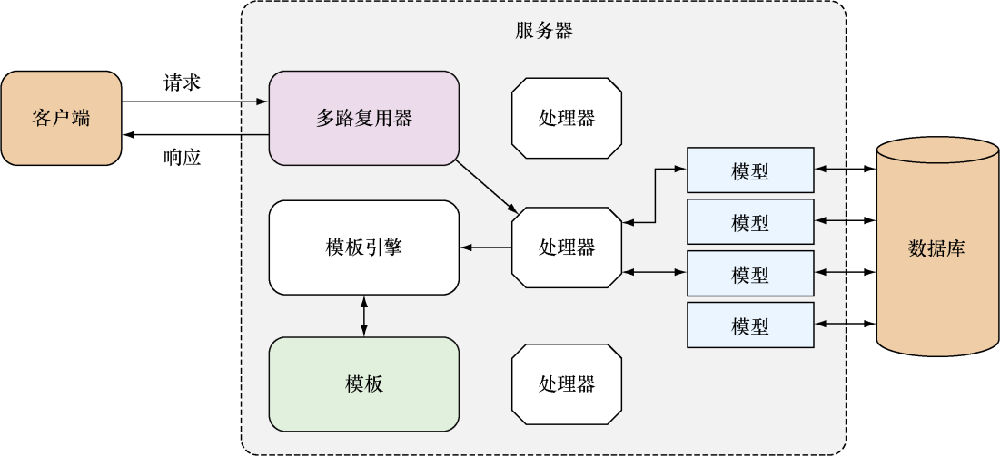

### 2.9　Web应用运作流程回顾

在本章的各节中，我们对一个Go Web应用的不同组成部分进行了初步的了解和观察。图2-9对整个应用的工作流程进行了介绍，其中包括：

（1）客户端向服务器发送请求；

（2）多路复用器接收到请求，并将其重定向到正确的处理器；

（3）处理器对请求进行处理；

（4）在需要访问数据库的情况下，处理器会使用一个或多个数据结构，这些数据结构都是根据数据库中的数据建模而来的；

（5）当处理器调用与数据结构有关的函数或者方法时，这些数据结构背后的模型会与数据库进行连接，并执行相应的操作；

（6）当请求处理完毕时，处理器会调用模板引擎，有时候还会向模板引擎传递一些通过模型获取到的数据；

（7）模板引擎会对模板文件进行语法分析并创建相应的模板，而这些模板又会与处理器传递的数据一起合并生成最终的HTML；

（8）生成的HTML会作为响应的一部分回传至客户端。

<b class="my_markdown">图2-9　Web应用工作流程概览</b>

主要的步骤大概就是这些。在接下来的几章中，我们会更加深入地学习这一工作流程，并进一步了解该流程涉及的各个组件。

