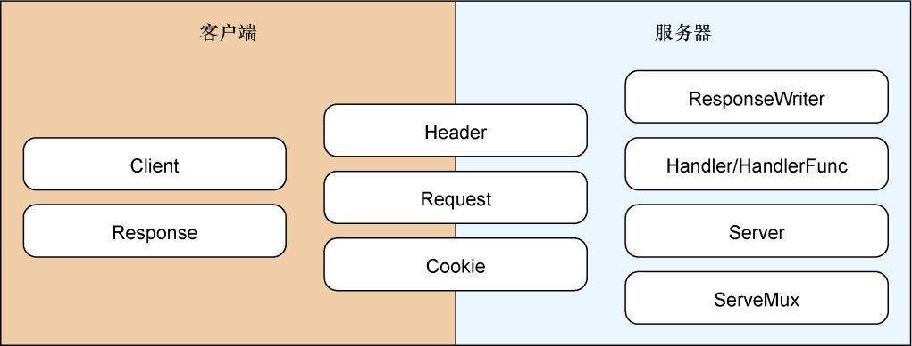

### 3.1　Go的net/http标准库

在进行Web应用开发的时候，使用成熟并且复杂的Web应用框架通常会使开发变得更加迅速和简便，但这也意味着开发者必须接受框架自身的一套约定和模式。虽然很多框架都认为自己提供的约定和模式是最佳实践（best practice），但是如果开发者没有正确地理解这些最佳实践，那么对最佳实践的应用就可能会发展为货物崇拜编程（cargo cult programming）：开发者如果不了解这些约定和模式的用法，就可能会在不必要甚至有害的情况下盲目地使用它们。

货物崇拜编程

> 第二次世界大战期间，盟军为了对战事提供支援，在太平洋的多个岛屿上设立了空军基地，以空投的方式向部队以及支援部队的岛民投送了大量生活用品以及军事设备，从而极大地改善了部队以及岛民的生活，岛民也因此第一次看到了人工生产的衣物、罐头食品以及其他物品。在战争结束之后，这些空军基地便被废弃了，货物空投自然也停止了。此时，岛民做了一件非常符合其本性的事情——他们把自己打扮成空管员、士兵以及水手，使用机场上的指挥棒挥舞着着陆信号，进行地面阅兵演习，试图让飞机继续空投货物，货物崇拜一词也因此而诞生。
> 尽管货物崇拜程序员并没有像岛民一样挥舞指挥棒，但他们却大量地复制和粘贴从StackOverflow这类网站上找来的代码，这些代码虽然能够运行，但是他们却对这些代码的工作原理一点也不了解。这样做的结果是，他们通常无法扩展和修改这些代码。与此类似，货物崇拜程序员通常会在既不了解框架为什么使用特定的模式或约定，也不知道框架做了何种取舍的情况下，盲目地使用Web框架。

举个例子来说，因为HTTP是一种无连接协议（connection-less protocol），通过这种协议发送给服务器的请求对服务器之前处理过的请求一无所知，所以应用程序才会以cookie的方式在客户端实现数据持久化，并以会话的方式在服务器上实现数据持久化，而不了解这一点的人是很难理解为什么要在不同连接之间使用cookie和会话实现信息持久化的。为了降低使用cookie和会话带来的复杂性，Web应用框架通常都会提供一个统一的接口（uniform interface），用于在连接之间实现持久化。这样做的结果是，很多新手程序员都会想当然地假设在连接之间进行持久化唯一要做的就是使用框架提供的接口。但是由于这类接口通常都是根据框架自身的习惯制定的，因此不同框架提供的接口可能会有所不同。更糟糕的是，不同的框架可能会提供一些名字相同的接口，但是这些同名接口之间的实现却又千差万别、各不相同，因此给开发者带来不必要的困惑。通过这个例子可以看出，使用框架进行Web应用开发意味着将框架与应用进行绑定，之后无论是将应用迁移至另一个框架，还是对应用进行扩展，又或者为应用添加新的特性，都需要对框架本身有深入的了解，在某些情况下可能还需要对框架进行定制。

本书的目的并不是让大家抛弃框架、约定和模式——一个好的框架通常是快速构建可扩展且健壮的Web应用的最好方法，但理解那些隐藏在框架之下的底层概念和基础设施也是非常重要的。只要对框架的实现原理有了正确的认识，我们就可以更加清晰地了解到这些约定和模式是如何形成的，从而避免陷阱、理清思路，不再盲目地使用模式。

对Go语言来说，隐藏在框架之下的通常是 `net/http` 和 `html/template` 这两个标准库，本章和接下来的第4章将介绍 `net/http` 库，而之后的第5章将介绍 `html/template` 库。

如图3-1所示， `net/http` 标准库可以分为客户端和服务器两个部分，库中的结构和函数有些只支持客户端和服务器这两者中的一个，而有些则同时支持客户端和服务器：

+ `Client` 、 `Response` 、 `Header` 、 `Request` 和 `Cookie` 对客户端进行支持；
+ `Server` 、 `ServeMux` 、 `Handler/HandleFunc` 、 `ResponseWriter` 、 `Header` 、 `Request` 和 `Cookie` 则对服务器进行支持。

本章接下来将会展示如何把 `net/http` 标准库用作服务器以及如何使用Go语言接收客户端发送的HTTP请求。在之后的第4章，我们还会继续使用 `net/http` 标准库，但焦点会放在如何处理请求上面。

在本书中，我们主要关注的是如何使用 `net/http` 标准库的服务器功能而非客户端功能。

<b class="my_markdown">图3-1　 `net/http` 标准库的各个组成部分</b>

