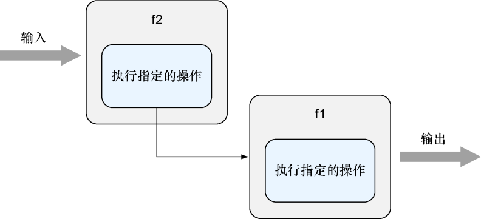
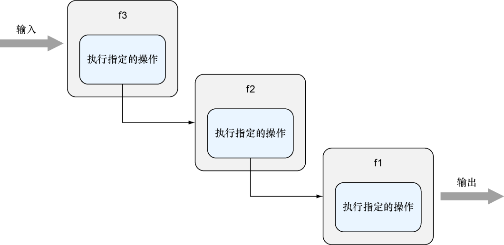

### 3.3.4　串联多个处理器和处理器函数

尽管Go语言并不是一门函数式编程语言，但它也拥有一些函数式编程语言的特性，如函数类型、匿名函数和闭包。正如前面的代码所示，在Go语言里面，程序可以将一个函数传递给另一个函数，又或者通过标识符去引用一个具名函数。这意味着，程序可以像图3-3展示的那样，将函数 `f1` 传递给另一个函数 `f2` ，然后在函数 `f2` 执行完某些操作之后调用 `f1` 。


<center class="my_markdown"><b class="my_markdown">图3-3　串联起多个处理器</b></center>

来看一个完整的例子：假设我们想要在每个处理器被调用时，在某个地方记录下相应的调用信息。为此，我们可以在处理器里面添加一些额外的代码，又或者像第2章那样，将这些记录代码重构成一个工具函数，然后让每个处理器都去调用这个工具函数。虽然实现上面提到的两种方法并不困难，但引入额外代码的做法会给程序的编写带来麻烦，并导致处理器需要包含与处理请求无关的代码。

诸如日志记录、安全检查和错误处理这样的操作通常被称为横切关注点（cross-cutting concern），虽然这些操作非常常见，但是为了防止代码重复和代码依赖问题，我们又不希望这些操作和正常的代码搅和在一起。为此，我们可以使用串联（chaining）技术分隔代码中的横切关注点。代码清单3-10展示了一个串联多个处理器的例子。

代码清单3-10　串联两个处理器函数

```go
package main
import (
　　"fmt"
　　"net/http"
　　"reflect"
　　"runtime"
)
func hello(w http.ResponseWriter, r *http.Request) {
　　fmt.Fprintf(w, "Hello!")
}
func log(h http.HandlerFunc) http.HandlerFunc {
　　return func(w http.ResponseWriter, r *http.Request) {
　　　　name := runtime.FuncForPC(reflect.ValueOf(h).Pointer()).Name()
　　　　fmt.Println("Handler function called - " + name)
　　　　h(w, r)
　　}
}
func main() {
　　server := http.Server{
　　　　Addr: "127.0.0.1:8080",
　　}
　　http.HandleFunc("/hello", log(hello))
　　server.ListenAndServe()
}
```

除处理器函数 `hello` 之外，这个代码清单还包含了一个 `log` 函数。 `log` 函数接受一个 `HandlerFunc` 类型的函数作为参数，然后返回另一个 `HandlerFunc` 类型的函数作为值。因为 `hello` 函数就是一个 `HandlerFunc` 类型的函数，所以代码 `log(hello)` 实际上就是将 `hello` 函数发送至 `log` 函数之内，换句话说，这段代码串联起了 `log` 函数和 `hello` 函数。

`log` 函数的返回值是一个匿名函数，因为这个匿名函数接受一个 `ResponseWriter` 和一个 `Request` 指针作为参数，所以它实际上也是一个 `HandlerFunc` 。在匿名函数内部，程序首先会获取被传入的 `HandlerFunc` 的名字，然后再调用这个 `HandlerFunc` 。作为结果，如果我们使用浏览器访问地址http://localhost:8080/hello，那么浏览器页面将显示以下信息：

```go
Handler function called – main.hello
```

就像搭积木一样，既然我们可以串联起两个函数，那么自然也可以串联起更多函数。串联多个函数可以让程序执行更多动作，这种做法有时候也称为管道处理（pipeline processing），如图3-4所示。


<center class="my_markdown"><b class="my_markdown">图3-4　串联更多处理器</b></center>

举个例子，如果我们还有一个 `protect` 函数，它会在调用传入的处理器之前验证用户的身份：

```go
func protect(h http.HandlerFunc) http.HandlerFunc {
　　return func(w http.ResponseWriter, r *http.Request) {
　　　 . . .　❶
　　　 h(w, r)
　　}
}
```

❶ 为了节省篇幅，这里省略了一段用于检测用户登录情况的代码

那么我们只需要把 `protect` 函数跟之前的函数串联在一起，就可以正常使用这个函数了：

```go
http.HandleFunc("/hello", protect(log(hello)))
```

你可能已经注意到了，虽然我们一直讨论的都是如何串联处理器，但代码清单3-10实际上却是在串联处理器函数。不过正如代码清单3-11所示，串联处理器的方法实际上和串联处理器函数的方法是非常相似的。

代码清单3-11　串联多个处理器

```go
package main
import (
　　"fmt"
　　"net/http"
)
type HelloHandler struct{}
func (h HelloHandler) ServeHTTP (w http.ResponseWriter, r *http.Request) {
　　fmt.Fprintf(w, "Hello!")
}
func log(h http.Handler) http.Handler {
　　return http.HandlerFunc (func(w http.ResponseWriter, r *http.Request) {
　　　　fmt.Printf("Handler called - %T\n", h)
　　　　h.ServeHTTP (w, r)
　　})
}
func protect(h http.Handler) http.Handler {
　　return http.HandlerFunc (func(w http.ResponseWriter, r *http.Request) {
　　　   . . .　❶
　　　　h.ServeHTTP (w, r)
　　})
}
func main() {
　　server := http.Server{
　　　　Addr: "127.0.0.1:8080",
　　}
　　hello := HelloHandler{}
　　http.Handle("/hello", protect(log(hello)))
　　server.ListenAndServe()
}
```

❶ 为了节省篇幅，这里省略了一段用于检测用户登录情况的代码

让我们来观察一下代码清单3-11和代码清单3-10有什么区别。代码清单3-11中的 `Hello Handler` 在前面的代码清单中已经展示过，它跟代码清单3-10中的 `hello` 函数一样，都位于串联链的末尾。至于 `log` 函数则不再接受和返回 `HandlerFunc` 类型的函数，而是接受并返回 `Handler` 类型的处理器：

```go
func log(h http.Handler) http.Handler {
　　return http.HandlerFunc (func(w http.ResponseWriter, r *http.Request) {
　　　　fmt.Printf("Handler called - %T\n", h)
　　　　h.ServeHTTP (w, r)
　　})
}
```

`log` 函数和 `protect` 函数现在不再返回匿名函数，而是使用 `HandlerFunc` 直接将匿名函数转换成一个 `Handler` ，然后返回这个 `Handler` 。程序现在也不再直接执行处理器函数了，而是调用处理器的 `ServeHTTP` 函数。最后的一点变化是，程序现在绑定的是处理器而不是处理器函数：

```go
hello := HelloHandler{}
http.Handle("/hello", protect(log(hello)))
```

除了以上提到的区别之外，两个程序的其余代码基本上都是相同的。

串联处理器和处理器函数是一种非常常见的惯用法，很多Web应用框架都使用了这一技术。

