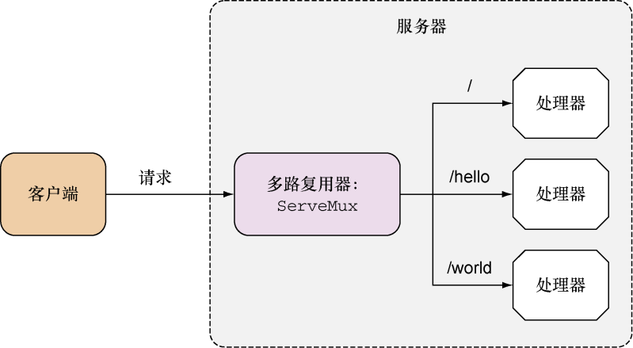
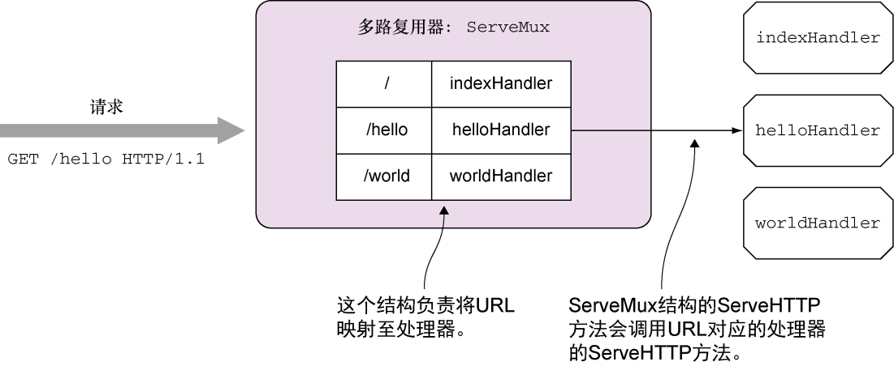

### 3.3.5　ServeMux和DefaultServeMux

本章和前一章都对 `ServeMux` 和 `DefaultServeMux` 进行了介绍。 `ServeMux` 是一个HTTP请求多路复用器，它负责接收HTTP请求并根据请求中的URL将请求重定向到正确的处理器，如图3-5所示。

<b class="my_markdown">图3-5　通过多路复用器将请求转发给各个处理器</b>

`ServeMux` 结构包含了一个映射，这个映射会将URL映射至相应的处理器。正如之前所说，因为 `ServeMux` 结构也实现了 `ServeHTTP` 方法，所以它也是一个处理器。当 `ServeMux` 的 `ServeHTTP` 方法接收到一个请求的时候，它会在结构的映射里面找出与被请求URL最为匹配的URL，然后调用与之相对应的处理器的 `ServeHTTP` 方法，如图3-6所示。

<b class="my_markdown">图3-6　多路复用器的工作原理</b>

在介绍完 `ServeMux` 之后，让我们来了解一下 `DefaultServeMux` 。因为 `ServeMux` 是一个结构而不是一个接口，所以 `DefaultServeMux` 并不是 `ServeMux` 的实现。 `Default-ServeMux` 实际上是 `ServeMux` 的一个实例，并且所有引入了 `net/http` 标准库的程序都可以使用这个实例。当用户没有为 `Server` 结构指定处理器时，服务器就会使用 `DefaultServeMux` 作为 `ServeMux` 的默认实例。

此外，因为 `ServeMux` 也是一个 `处理器` ，所以用户也可以在有需要的情况下对其实例实施处理器串联。

在上面的几个例子中，被请求的URL  `/hello` 完美地匹配了与多路复用器绑定的URL，但如果浏览器访问的是 `/random` 或者 `/hello/there` ，那么服务器又会返回什么响应呢？

这个问题的答案跟我们绑定URL的方法有关：如果我们像图3-6那样绑定根URL（ `/` ），那么匹配不成功的URL将会根据URL的层级进行下降，并最终降落在根URL之上。当浏览器访问 `/random` 的时候，因为服务器无法找到负责处理这个URL的处理器，所以它会把这个URL交给根URL的处理器处理（对于图中所示的例子来说，就是使用 `indexHandler` 来处理这个URL）。

那么服务器又是如何处理 `/hello/there` 的呢？根据最小惊讶原则（The Principle of Least Surprise），因为程序已经为 `/hello` 绑定了处理器，所以在默认情况下，程序似乎应该使用 `helloHandler` 处理 `/hello/there` 。但是对图3-6所示的例子来说，服务器实际上会使用 `indexHandler` 去处理对 `/hello/there` 的请求。

最小惊讶原则

> 最小惊讶原则，也称最小意外原则，是设计包括软件在内的一切事物的一条通用规则，它指的是我们在进行设计的时候，应该做那些合乎常理的事情，使事物的行为总是显而易见、始终如一并且合乎情理。
> 举个例子，如果我们在一扇门的旁边放置一个按钮，那么人们就会认为这个按钮与这扇门有关，比如，按下按钮门铃会响或者门会自动打开，等等。但是，如果这个按钮被按下时会关掉走廊的灯光，它就违反了最小惊讶原则，因为这一行为不符合人们对这个按钮的预期。

产生这种行为的原因在于程序在绑定 `helloHandler` 时使用的URL是 `/hello` 而不是 `/hello/` 。如果被绑定的URL不是以 `/` 结尾，那么它只会与完全相同的URL匹配；但如果被绑定的URL以 `/` 结尾，那么即使请求的URL只有前缀部分与被绑定URL相同， `ServeMux` 也会认定这两个URL是匹配的。

这也就是说，如果与 `helloHandler` 处理器绑定的URL是 `/hello/` 而不是 `/hello` ，那么当浏览器请求 `/hello/there` 的时候，服务器在找不到与之完全匹配的处理器时，就会退而求其次，开始寻找能够与 `/hello/` 匹配的处理器，并最终找到 `helloHandler` 处理器。

