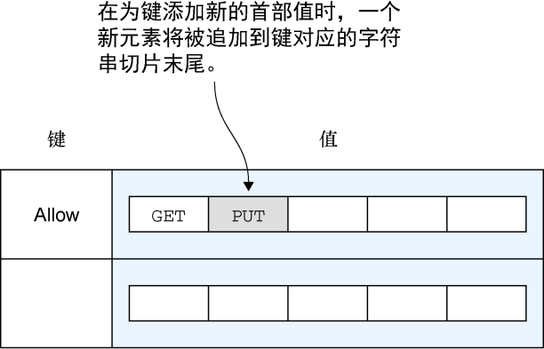
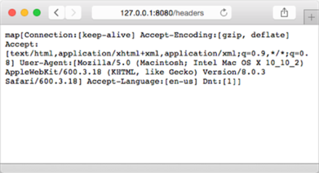

### 4.1.3　请求首部

请求和响应的首部都使用 `Header` 类型描述，这种类型使用一个映射来表示HTTP首部中的多个键值对。 `Header` 类型拥有4种基本方法，这些方法可以根据给定的键执行添加、删除、获取和设置值等操作。

一个 `Header` 类型的实例就是一个映射，这个映射的键为字符串，而键的值则是由任意多个字符串组成的切片。为 `Header` 类型设置首部以及添加首部都是非常简单的，但了解这两种操作之间的区别有助于更好地理解 `Header` 类型的构造：在对 `Header` 执行设置操作时，给定键的值首先会被设置成一个空白的字符串切片，然后该切片中的第一个元素会被设置成给定的首部值；而在对 `Header` 执行添加操作时，给定的首部值会被添加到字符串切片已有元素的后面，如图4-1所示。


<center class="my_markdown"><b class="my_markdown">图4-1　一个首部就是一个映射，这个映射的键为字符串，值为字符串切片</b></center>

代码清单4-2展示了读取请求首部的方法。

代码清单4-2　读取请求首部

```go
package main
import (
　　"fmt"
　　"net/http"
)
func headers(w http.ResponseWriter, r *http.Request) {
　　h := r.Header
　　fmt.Fprintln(w, h)
}
func main() {
　　server := http.Server{
　　　　Addr: "127.0.0.1:8080",
　　}
　　http.HandleFunc("/headers", headers)
　　server.ListenAndServe()
}
```

这个代码清单中展示的服务器跟我们在第3章看到过的服务器基本上是一样的，唯一的区别在于这个服务器会把请求的首部打印出来。图4-2展示了在OS X系统的Safari浏览器上访问这个服务器的结果。


<center class="my_markdown"><b class="my_markdown">图4-2　在浏览器上展示的首部打印结果</b></center>

如果想要获取的是某个特定的首部，而不是请求的所有首部，那么可以把服务器中的

```go
h := r.Header
```

替换成

```go
h := r.Header["Accept-Encoding"]
```

这样一来，程序就会得到 `"Accept-Encoding"` 键的首部值：

```go
[gzip, deflate]
```

除此之外，我们还可以使用以下语句：

```go
h := r.Header.Get("Accept-Encoding")
```

并得到以下结果：

```go
gzip, deflate
```

注意以上两条语句之间的区别：直接引用  `Header` 将得到一个字符串切片，而在 `Header` 上调用 `Get` 方法将返回字符串形式的首部值，其中多个首部值将使用逗号分隔。

