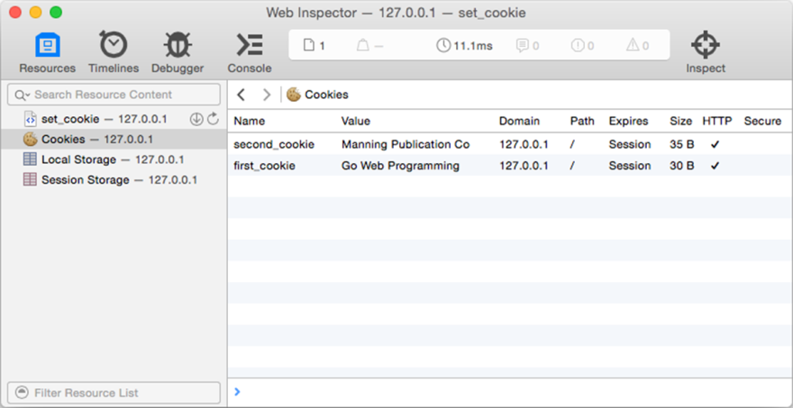

### 4.4.2　将cookie发送至浏览器

`Cookie` 结构的 `String` 方法可以返回一个经过序列化处理的cookie，其中 `Set-Cookie` 响应首部的值就是由这些序列化之后的cookie组成的。代码清单4-13展示了如何使用 `String` 方法去序列化cookie，以及如何将这些序列化之后的cookie发送至客户端。

代码清单4-13　向浏览器发送cookie

```go
package main
import (
　　"net/http"
)
func setCookie(w http.ResponseWriter, r *http.Request) {
　　c1 := http.Cookie{
　　　　Name:　　 "first_cookie",
　　　　Value:　　"Go Web Programming",
　　　　HttpOnly: true,
　　}
　　c2 := http.Cookie{
　　　　Name:　　 "second_cookie",
　　　　Value:　　"Manning Publications Co",
　　　　HttpOnly: true,
　　}
　　w.Header().Set("Set-Cookie", c1.String())
　　w.Header().Add("Set-Cookie", c2.String())
}
func main() {
　　server := http.Server{
　　　　Addr: "127.0.0.1:8080",
　　}
　　http.HandleFunc("/set_cookie", setCookie)
　　server.ListenAndServe()
}
```

这段代码首先使用 `Set` 方法添加第一个cookie，然后再使用 `Add` 方法添加第二个cookie。现在，打开浏览器并访问http://127.0.0.1:8080/set_cookie，如果一切正常，你将在浏览器的Web Inspector（审查器）中看到图4-3所示的cookie。（图中展示的是Safari浏览器附带的Web Inspector，但无论使用的是什么浏览器，在相应工具中看到的cookie和这里展示的应该都是一样的。）


<center class="my_markdown"><b class="my_markdown">图4-3　使用Safari浏览器的Web Inspector查看之前设置的cookie</b></center>

除了 `Set` 方法和 `Add` 方法之外，Go语言还提供了一种更为快捷方便的cookie设置方法，那就是使用 `net/http` 库中的 `SetCookie` 方法。作为例子，代码清单4-14展示了如何使用 `SetCookie` 方法实现与代码清单4-13相同的设置操作，其中加粗展示的部分就是修改了的代码。

代码清单4-14　使用 `SetCookie` 方法设置cookie

```go
func setCookie(w http.ResponseWriter, r *http.Request) {
　　c1 := http.Cookie{
　　　　Name:　　 "first_cookie",
　　　　Value:　　"Go Web Programming",
　　　　HttpOnly: true,
　　}
　　c2 := http.Cookie{
　　　　Name: "second_cookie",
　　　　Value: "Manning Publications Co",
　　　　HttpOnly: true,
　　}
　　http.SetCookie(w, &c1)
　　http.SetCookie(w, &c2)
}
```

这两种cookie设置方式区别并不大，唯一需要注意的是，在使用 `SetCookie` 方法设置cookie时，传递给方法的应该是指向 `Cookie` 结构的指针，而不是 `Cookie` 结构本身。

