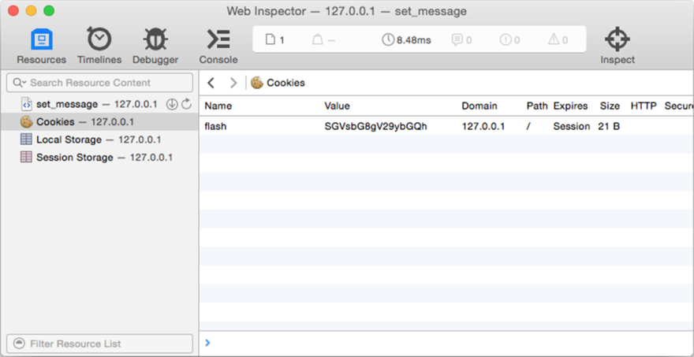

### 4.4.4　使用cookie实现闪现消息

本书的第2章曾经介绍过如何使用cookie管理用户登录会话，在对cookie有了更多了解之后，现在是时候来考虑一下怎样把cookie应用到更多地方了。

为了向用户报告某个动作的执行情况，应用程序有时候会向用户展示一条简短的通知消息，比如说，如果一个用户尝试在论坛上发表一篇帖子，但是这篇帖子因为某种原因而发表失败了，那么论坛应该向这个用户展示一条帖子发布失败的消息。根据本书之前提到过的最小惊讶原则，这种通知消息应该出现在用户当前所在的页面，但是在通常情况下，用户在访问这个页面时却不应该看到这样的消息。因此，程序实际上要做的是在某个条件被满足时，才在页面上显示一条临时出现的消息，这样用户在刷新页面之后就不会再看见相同的消息了——我们把这种临时出现的消息称为闪现消息（flash message）。

实现闪现消息的方法有很多种，但最常用的方法是把这些消息存储在页面刷新时就会被移除的会话cookie里面，代码清单4-17展示了如何使用Go语言实现这一方法。

代码清单4-17　使用Go的cookie实现闪现消息

```go
package main
import (
　　"encoding/base64"
　　"fmt"
　　"net/http"
　　"time"
)
func setMessage(w http.ResponseWriter, r *http.Request) {
　　msg := []byte("Hello World!")
　　c := http.Cookie{
　　　　Name: "flash",
　　　　Value: base64.URLEncoding.EncodeToString(msg),
　　}
　　http.SetCookie(w, &c)
}
func showMessage(w http.ResponseWriter, r *http.Request) {
　　c, err := r.Cookie("flash")
　　if err != nil {
　　　　if err == http.ErrNoCookie {
　　　　　　fmt.Fprintln(w, "No message found")
　　　　}
　　} else {
　　　　rc := http.Cookie{
　　　　　　Name: "flash",
　　　　　　MaxAge: -1,
　　　　　　Expires: time.Unix(1, 0),
　　　　}
　　　　http.SetCookie(w, &rc)
　　　　val, _ := base64.URLEncoding.DecodeString(c.Value)
　　　　fmt.Fprintln(w, string(val))
　　}
}
func main() {
　　server := http.Server{
　　　　Addr: "127.0.0.1:8080",
　　}
　　http.HandleFunc("/set_message", setMessage)
　　http.HandleFunc("/show_message", showMessage)
　　server.ListenAndServe()
}
```

这段代码创建了 `setMessage` 和 `showMessage` 两个处理器函数，并分别把它们与路径 `/set_message` 以及 `/show_message` 进行绑定。首先，让我们来看看 `setMessage` 函数，它的定义非常简单直接，如代码清单4－18所示。

代码清单4-18　设置消息

```go
func setMessage(w http.ResponseWriter, r *http.Request) {
　　msg := []byte("Hello World!")
　　c := http.Cookie{
　　　　Name: "flash",
　　　　Value: base64.URLEncoding.EncodeToString(msg),
　　}
　　http.SetCookie(w, &c)
}
```

`setMessage` 处理器函数的定义跟之前展示过的 `setCookie` 处理器函数的定义非常相似，主要的区别在于 `setMessage` 对消息使用了Base64URL编码，以此来满足响应首部对cookie值的URL编码要求。在设置cookie时，如果cookie的值没有包含诸如空格或者百分号这样的特殊字符，那么不对它进行编码也是可以的；但是因为在发送闪现消息时，消息本身通常会包含诸如空格这样的字符，所以对cookie的值进行编码就成了一件必不可少的事情了。

现在再来看看 `showMessage` 函数的定义：

```go
func showMessage(w http.ResponseWriter, r *http.Request) {
　　c, err := r.Cookie("flash")
　　if err != nil {
　　　　if err == http.ErrNoCookie {
　　　　　　fmt.Fprintln(w, "No message found")
　　　　}
　　} else {
　　　　rc := http.Cookie{
　　　　　　Name: "flash",
　　　　　　MaxAge: -1,
　　　　　　Expires: time.Unix(1, 0),
　　　　}
　　　　http.SetCookie(w, &rc)
　　　　val, _ := base64.URLEncoding.DecodeString(c.Value)
　　　　fmt.Fprintln(w, string(val))
　　}
}
```

这个函数首先会尝试获取指定的cookie，如果没有找到该cookie，它就会把变量 `err` 设置成一个 `http.ErrNoCookie` 值，并向浏览器返回一条 `“` No message found `”` 消息。如果找到了这个cookie，那么它必须完成以下两个操作：

（1）创建一个同名的cookie，将它的 `MaxAge` 值设置为负数，并且将 `Expires` 值也设置成一个已经过去的时间；

（2）使用 `SetCookie` 方法将刚刚创建的同名cookie发送至客户端。

初看上去，这两个操作的目的似乎是要替换已经存在的cookie，但实际上，因为新cookie的 `MaxAge` 值为负数，并且 `Expires` 值也是一个已经过去的时间，所以这样做实际上就是要完全地移除这个cookie。在设置完新cookie之后，程序会对存储在旧cookie中的消息进行解码，并通过响应返回这条消息。

现在，让我们实际运行这个服务器，然后打开浏览器并访问地址http://localhost:8080/set_ message。如果一切顺利，你将在WebInspector中看到图4-4所示的cookie。


<center class="my_markdown"><b class="my_markdown">图4-4　在Safari浏览器附带的WebInspector中查看已被编码的闪现消息</b></center>

注意，因为图中cookie的值已经被Base64 URL编码过了，所以它初看上去就像乱码一样。不过我们只要使用浏览器访问http://localhost:8080/show_message，就可以看到解码之后的真正的消息：

```go
Hello World!
```

如果你现在再去看WebInspector，就会发现之前设置的cookie已经消失了：通过设置同名的cookie，程序成功地使用新cookie代替了旧cookie；与此同时，因为新cookie的 `MaxAge` 值为负数，并且它的 `Expires` 值也是一个已经过去的时间，这相当于命令浏览器删除这个cookie，所以这个新设置的cookie也被移除了。

现在，如果刷新网页，或者再次访问http://localhost:8080/show_message，你将看到以下消息：

```go
No message found
```

本章沿着上一章的脚步，介绍了 `net/http` 在Web应用开发方面提供的服务器端功能，而接下来的一章将对Web应用的另一个主要组成部分——模板——进行介绍，我们将会了解到Go语言的模板以及模板引擎，并学会如何使用它们为客户端生成响应。

