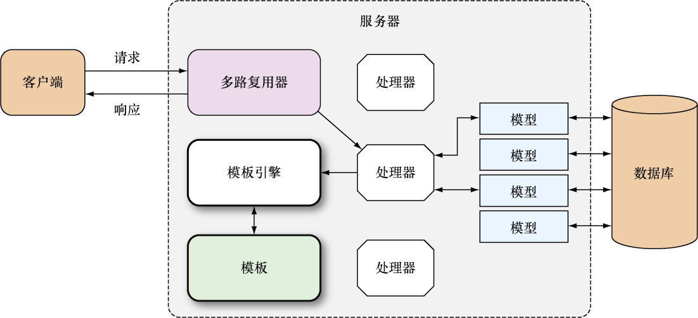

### 5.2　Go的模板引擎

跟其他大多数模板引擎一样，Go语言的模板引擎也是介于无逻辑模板引擎和嵌入逻辑模板引擎之间的一种模板引擎。在Web应用里面，模板引擎通常由处理器负责触发。作为例子，图5-2展示了处理器调用Go模板引擎的流程：处理器首先调用模板引擎，接着以模板文件列表的方式向模板引擎传入一个或多个模板，然后再传入模板需要用到的动态数据；模板引擎在接收到这些参数之后会生成出相应的HTML，并将这些文件写入到 `ResponseWriter` 里面，然后由 `ResponseWriter` 将HTTP响应返回给客户端。


<center class="my_markdown"><b class="my_markdown">图5-2　Go模板引擎在Web应用中的作用示意图</b></center>

Go的模板都是文本文档（其中Web应用的模板通常都是HTML），它们都嵌入了一些称为动作（action）的指令。从模板引擎的角度来说，模板就是嵌入了动作的文本（这些文本通常包含在模板文件里面），而模板引擎则通过分析并执行这些文本来生成出另外一些文本。Go语言拥有通用模板引擎库 `text/template` ，它可以处理任意格式的文本，除此之外，Go语言还拥有专门为HTML格式而设的模板引擎库 `html/template` 。模板中的动作默认使用两个大括号 `{{` 和 `}}` 包围，如果用户有需要，也可以通过模板引擎提供的方法自行指定其他定界符（delimiter）。本章稍后将对动作做更详细的介绍，在此之前，让我们先来看一下代码清单5-1展示的这个非常简单的模板。

代码清单5-1　一个简单的模板

```go
<!DOCTYPE html>
<html>
　<head>
　　<meta http-equiv="Content-Type" content="text/html; charset=utf-8">
　　<title>Go Web Programming</title>
　</head>
　<body>
　　{{ . }}
　</body>
</html>
```

代码清单5-1展示的模板来源于一个名为 `tmpl.html` 的模板文件。用户可以拥有任意多个模板文件，并且这些模板文件可以使用任意后缀名，但它们的类型必须是可读的文本格式。因为上面这段模板的输出将是一个HTML文件，所以我们使用了 `.html` 作为模板文件的后缀名。

注意，模板中被两个大括号包围的点（ `.` ）是一个动作，它指示模板引擎在执行模板时，使用一个值去替换这个动作本身。

使用Go的Web模板引擎需要以下两个步骤：

（1）对文本格式的模板源进行语法分析，创建一个经过语法分析的模板结构，其中模板源既可以是一个字符串，也可以是模板文件中包含的内容；

（2）执行经过语法分析的模板，将 `ResponseWriter` 和模板所需的动态数据传递给模板引擎，被调用的模板引擎会把经过语法分析的模板和传入的数据结合起来，生成出最终的HTML，并将这些HTML传递给 `ResponseWriter` 。

代码清单5-2展示了一个简单而且具体的模板引擎使用例子。

代码清单5-2　在处理器函数中触发模板引擎

```go
package main
import (
　　"net/http"
　　"html/template"
)
func process(w http.ResponseWriter, r *http.Request) {
　　t, _ := template.ParseFiles("tmpl.html")
　　t.Execute(w, "Hello World!")
}
func main() {
　　server := http.Server{
　　　　Addr: "127.0.0.1:8080",
　　}
　　http.HandleFunc("/process", process)
　　server.ListenAndServe()
}
```

代码清单5-2展示的服务器代码跟之前展示过的服务器代码非常相似，主要的区别在于这次的服务器使用了一个名为 `process` 的处理器函数，而模板引擎就是由这个函数负责触发的。 `process` 函数首先使用 `ParseFiles` 函数对模板文件 `tmpl.html` 进行语法分析， `ParseFiles` 函数在执行完毕之后将返回一个 `Template` 类型的已分析模板和一个错误作为结果，不过为了保持代码的简洁，我们这里暂时把这个错误忽略了：

```go
t, _ := template.ParseFiles("tmpl.html")
```

在此之后， `process` 函数会调用 `Execute` 方法，将数据应用（apply）到模板里面——在这个例子中，数据就是字符串 `"Hello World!"` ：

```go
t.Execute(w, "Hello World!")
```

`ResponseWriter` 和数据会一起被传入 `Execute` 方法中，这样一来，模板引擎在生成HTML之后就可以把该HTML传给 `ResponseWriter` 了。另外需要注意的是，因为这个服务器在指定模板位置时并没有给出模板文件的绝对路径，所以我们在运行这个服务器的时候，需要把模板文件和服务器的二进制文件放到同一个目录里面。

以上展示的就是模板引擎的最基本用法，正如你所料，除了 `.` 之外，Go的模板引擎还提供了其他动作供用户使用，本章将在稍后的内容中对这些动作做进一步的介绍。

