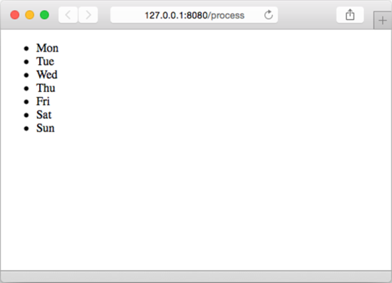

### 5.3.2　迭代动作

迭代动作可以对数组、切片、映射或者通道进行迭代，而在迭代循环的内部，点（ `.` ）则会被设置为当前被迭代的元素，就像这样：

```go
{{ range array }}
　Dot is set to the element {{ . }}
{{ end }}
```

代码清单5-5展示了一个使用迭代动作的例子。

代码清单5-5　迭代动作示例

```go
<!DOCTYPE html>
<html>
　<head>
　　<meta http-equiv="Content-Type" content="text/html; charset=utf-8">
　　<title>Go Web Programming</title>
　</head>
　<body>
　　<ul>
　　{{ range . }}
　　　<li>{{ . }}</li>
　　{{ end}}
　　</ul>
　</body>
</html>
```

下面是负责调用这个模板的处理器：

```go
func process(w http.ResponseWriter, r *http.Request) {
　　t, _ := template.ParseFiles("tmpl.html")
　　daysOfWeek := []string{"Mon", "Tue", "Wed", "Thu", "Fri", "Sat", "Sun"}
　　t.Execute(w, daysOfWeek)
}
```

这段代码创建了一个切片，并在切片里面包含了周一到周日的英文缩写，然后将它传递给模板。接着，这个切片会被传递至语句 `{{ range . }}中` 的 `.` 里面，然后由 `range` 动作对这个切片中的各个元素进行迭代。

迭代循环中的 `{{ . }}` 代表的是当前被迭代的切片元素，图5-3展示了浏览器展示的迭代结果。


<center class="my_markdown"><b class="my_markdown">图5-3　使用迭代动作实现迭代</b></center>

代码清单5-6展示了迭代动作的一个变种，这个变种允许用户在被迭代的数据结构为空时，显示一个备选的（fallback）结果。

代码清单5-6　带有备选结果的迭代动作

```go
<html>
　<head>
　　<meta http-equiv="Content-Type" content="text/html; charset=utf-8">
　　<title>Go Web Programming</title>
　</head>
　<body>
　　<ul>
　　{{ range . }}
　　　<li>{{ . }}</li>
　　{{ else }}
　　　<li> Nothing to show </li>
　　{{ end}}
　　</ul>
　</body>
</html>
```

模板里面介于 `{{ else }}` 和 `{{ end }}` 之间的内容将在点（ `.` ）为 `nil` 时显示。在这个例子中，被显示的将是文本“Nothing to show”。

