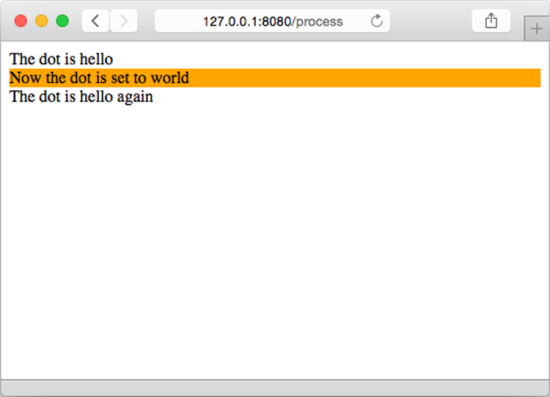
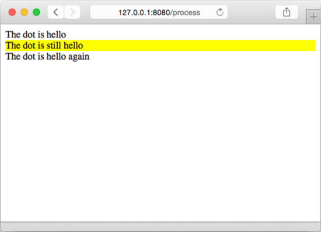

### 5.3.3　设置动作

设置动作允许用户在指定的范围之内为点（ `.` ）设置值。比如，在以下代码中：

```go
{{ with arg }}
　Dot is set to arg
{{ end }}
```

介于 `{{ with arg }}` 和 `{{ end }}` 之间的 `点` 将被设置为参数 `arg` 的值。再次修改的 `tmpl.html` 文件如代码清单5-7所示，这是一个更为具体的例子。

代码清单5-7　对点进行设置

```go
<html>
　<head>
　　<meta http-equiv="Content-Type" content="text/html; charset=utf-8">
　　<title>Go Web Programming</title>
　</head>
　<body>
　　<div>The dot is {{ . }}</div>
　　<div>
　　{{ with "world"}}
　　　Now the dot is set to {{ . }}
　　{{ end }}
　　</div>
　　<div>The dot is {{ . }} again</div>
　</body>
</html>
```

至于调用这个模板的处理器则会将字符串 `"hello"` 传递给模板：

```go
func process(w http.ResponseWriter, r *http.Request) {
　　t, _ := template.ParseFiles("tmpl.html")
　　t.Execute(w,"hello")
}
```

这样一来，位于 `{{ with "world" }}` 之前的点就会因为处理器传入的值而被设置成 `hello` ，而位于 `{{ with "world" }}` 和 `{{ end }}` 之间的点则会被设置成 `world` ；但是，在语句 `{{ end }}` 执行完毕之后，点的值又会重新被设置成 `hello` ，如图5-4所示。


<center class="my_markdown"><b class="my_markdown">图5-4　使用设置动作对点（ `.` ）进行设置</b></center>

跟迭代动作一样，设置动作也拥有一个能够提供备选方案的变种：

```go
{{ with arg }}
　Dot is set to arg
{{ else }}
　Fallback if arg is empty
{{ end }}
```

代码清单5-8展示了这一变种的使用方法。

代码清单5-8　在设置点的时候提供备选方案

```go
<html>
　<head>
　　<meta http-equiv="Content-Type" content="text/html; charset=utf-8">
　　<title>Go Web Programming</title>
</head>
<body>
　<div>The dot is {{ . }}</div>
　<div>
　{{ with "" }}
　　Now the dot is set to {{ . }}
　{{ else }}
　　The dot is still {{ . }}
　{{ end }}
　　</div>
　　<div>The dot is {{ . }} again</div>
　</body>
</html>
```

因为传给 `with` 动作的参数为空字符串 `""` ，所以模板将显示 `{{ else }}` 语句之后的内容；此外，因为 `with` 动作并没有修改点（ `.` ）的值，所以模板打印出来的仍然是处理器传入的值 `"hello"` 。执行这个新模板不需要对处理器或者服务器进行任何修改，也不需要重启服务器，只要刷新一下浏览器，就会看到图5-5所示的结果。


<center class="my_markdown"><b class="my_markdown">图5-5　在设置点（ `.` ）时提供备选方案</b></center>

