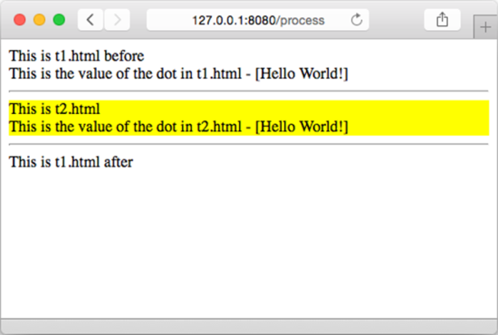

### 5.3.4　包含动作

包含动作（include action）允许用户在一个模板里面包含另一个模板，从而构建出嵌套的模板。包含动作的格式为 `{{ template "name" }}` ，其中 `name` 参数为被包含模板的名字。

代码清单5-9展示了一个使用包含动作的例子，在这个例子中，模板 `t1.html` 包含了模板 `t2.html` 。

代码清单5-9　模板 `t1.html`

```go
<!DOCTYPE html>
<html lang="en">
　<head>
　　<meta charset="utf-8">
　　<meta http-equiv="X-UA-Compatible" content="IE=9">
　　<title>Go Web Programming</title>
　</head>
　<body>
　　<div> This is t1.html before</div>
　　<div>This is the value of the dot in t1.html - [{{ . }}]</div>
　　<hr/>
　　{{ template "t2.html" }}
　　<hr/>
　　<div> This is t1.html after</div>
　</body>
</html>
```

正如代码所示，模板文件的名字将被用作模板的名字。记住，如果用户在创建模板的时候没有为模板指定名字，那么Go语言在命名模板时将沿用模板文件的名字及扩展名。

代码清单5-10展示了被包含的模板 `t2.html` ，这个模板是一段HTML代码片段。

代码清单5-10　模版 `t2.html`

```go
<div style="background-color: yellow;">
　This is t2.html<br/>
　This is the value of the dot in t2.html - [{{ . }}]
</div>
```

代码清单5-11展示了使用以上两个模板的处理器。

代码清单5-11　调用嵌套模板的处理器

```go
func process(w http.ResponseWriter, r *http.Request) {
　　t, _ := template.ParseFiles("t1.html", "t2.html")
　　t.Execute(w, "Hello World!")
}
```

跟之前展示的代码不同，在执行嵌套模板时，我们必须对涉及的所有模板文件都进行语法分析。牢记这一点是非常重要的，忘记对必要的模板文件进行语法分析将导致程序出现不正确的结果。

因为上面的代码并没有为模板设置名字，所以模板集合中的模板将沿用模板文件的名字。正如之前所说， `ParseFiles` 函数的第一个参数是具有特殊作用的：在进行语法分析时，用户给定的第一个模板文件将成为主模板（main template），当用户对模板集合调用 `Execute` 方法时，主模板将被执行。

图5-6展示了服务器在执行上述模板之后向浏览器返回的结果。

如图5-6所示，模板 `t1.html` 中的点（ `.` ）被传入的 `"Hello World!"` 准确无误地替换掉了，并且模板 `t2.html` 的内容也出现在了语句 `{{ template "t2.html" }}` 所在的位置。因为模板 `t1.html` 并没有把字符串 `"Hello World!"` 也传递给被嵌套的模板 `t2.html` ，所以 `t2.html` 中的点的打印结果为空字符串。为了向被嵌套的模板传递数据，用户可以使用包含动作的变种 `{{ template "name" arg }}` ，其中 `arg` 就是用户想要传递给被嵌套模板的数据，代码清单5-12展示了这个变种的具体使用方法。


<center class="my_markdown"><b class="my_markdown">图5-6　嵌套模板的输出结果</b></center>

代码清单5-12　通过参数将模板 `t1.html` 中的数据传递给被嵌套的模板 `t2.html`

```go
<html>
　<head>
　　<meta charset="utf-8">
　　<meta http-equiv="X-UA-Compatible" content="IE=9">
　　<title>Go Web Programming</title>
　</head>
　<body>
　　<div> This is t1.html before</div>
　　<div>This is the value of the dot in t1.html - [{{ . }}]</div>
　　<hr/>
　　{{ template "t2.html" . }}
　　<hr/>
　　<div> This is t1.html after</div>
　</body>
</html>
```

这个模板唯一的改动就是在 `t1.html` 里面将点传递给了 `t2.html` 。现在，如果我们再次执行这个模板，它将产生图5-7所示的结果。


<center class="my_markdown"><b class="my_markdown">图5-7　将数据传递给被嵌套的模板</b></center>

本章稍后将再次回顾嵌套模板，并介绍一种没有在本节中展示的动作——定义动作。虽然使用动作可以给程序员带来方便，但是本节介绍的都是初级的模板用法，它们并不能最大限度地发挥模板的威力。为了解决这个问题，本章接下来将介绍参数、变量和管道等高级模板用法。

