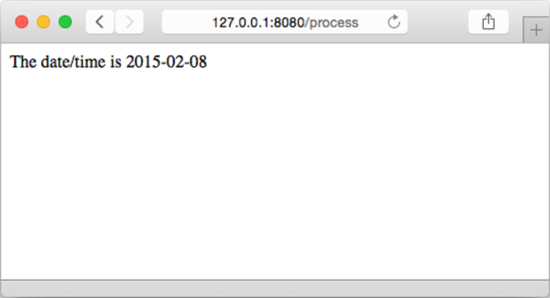

### 5.5　函数

正如之前所说，Go函数也可以用作模板的参数：Go模板引擎内置了一些非常基础的函数，其中包括为 `fmt.Sprint` 的不同变种创建的几个别名函数（ `fmt` 包的文档详细地列出了这些别名函数），并且用户不仅可以使用模板引擎内置的函数，还可以自行定义自己想要的函数。

需要注意的是，Go的模板引擎函数都是受限制的：尽管这些函数可以接受任意多个参数作为输入，但它们只能返回一个值，或者返回一个值和一个错误。

为了创建一个自定义模板函数，用户需要：

（1）创建一个名为 `FuncMap` 的映射，并将映射的键设置为函数的名字，而映射的值则设置为实际定义的函数；

（2）将 `FuncMap` 与模板进行绑定。

让我们来看一个创建自定义函数的具体例子。在编写Web应用的时候，用户常常需要将时间对象或者日期对象转换为ISO8601格式的时间字符串或者日期字符串，又或者将ISO8601格式的字符串转换为相应的对象。但遗憾的是，我们正在使用的库并没有内置类似的转换函数，所以我们就需要像代码清单5-14展示的那样，自行创建这些函数。

代码清单5-14　创建模板自定义函数

```go
package main
import (
　　"net/http"
　　"html/template"
　　"time"
)
func formatDate(t time.Time) string {
　　layout := "2006-01-02"
　　return t.Format(layout)
}
func process(w http.ResponseWriter, r *http.Request) {
　　funcMap := template.FuncMap { "fdate": formatDate }
　　t := template.New("tmpl.html").Funcs(funcMap)
　　t, _ = t.ParseFiles("tmpl.html")
　　t.Execute(w, time.Now())
}
func main() {
　　server := http.Server{
　　　　Addr: "127.0.0.1:8080",
　　}
　　http.HandleFunc("/process", process)
　　server.ListenAndServe()
}
```

这段程序首先定义了一个名为 `formatDate` 的函数，它接受一个 `Time` 结构作为输入，然后以“年-月-日”的形式返回一个ISO8601格式的字符串。

在之后的处理器中，程序创建了一个变量名为 `funcMap` 的 `FuncMap` 结构，并使用这个结构将名字 `fdate` 映射至 `formatDate` 函数。接着，程序使用 `template.New` 函数创建了一个名为 `tmpl.html` 的模板。因为 `template.New` 函数会返回被创建的模板，所以程序直接以串联的方式调用模板的 `Funcs` 方法，并将前面创建的 `funcMap` 传递给模板。这样一来， `funcMap` 与模板的绑定就完成了，于是程序接下来就跟往常一样，对模板文件 `tmpl.html` 进行语法分析。最后，程序调用模板的 `Execute` 方法，并将 `ResponseWriter` 以及当前时间传递给它。

再次提醒，在调用 `ParseFiles` 函数时，如果用户没有为模板文件中的模板定义名字，那么函数将使用模板文件的名字作为模板的名字。与此同时，在调用 `New` 函数创建新模板的时候，用户必须传入一个模板名字，如果用户给定的模板名字跟前面分析模板时通过文件名提取的模板名字不相同，那么程序将返回一个错误。

在看过了处理器的相关代码之后，现在让我们来看看如何在 `tmpl.html` 模板中使用前面定义的函数，具体的方法如代码清单5-15所示。

代码清单5-15　通过管道使用自定义函数

```go
<html>
　<head>
　　<meta http-equiv="Content-Type" content="text/html; charset=utf-8">
　　<title>Go Web Programming</title>
　</head>
　<body>
　　<div>The date/time is {{ . | fdate }}</div>
　</body>
</html>
```

用户可以通过几种不同的方式使用自定义函数。比如，代码清单5-15就展示了如何通过模板的管道特性，将当前时间由管道传递至 `fdate` 函数，并借此产生图5-8所示的输出。


<center class="my_markdown"><b class="my_markdown">图5-8　使用自定义函数格式化日期或时间</b></center>

除此之外，我们也可以像调用普通函数一样，将点（ `.` ）作为参数传递给 `fdate` 函数，具体做法如代码清单5-16所示。

代码清单5-16　通过传递参数的方式使用自定义函数

```go
<html>
　<head>
　　<meta http-equiv="Content-Type" content="text/html; charset=utf-8">
　　<title>Go Web Programming</title>
　</head>
　<body>
　　<div>The date/time is {{ fdate . }}</div>
　</body>
</html>
```

以上两种调用方式会产生相同的结果，但使用管道比直接调用函数要强大和灵活得多。如果用户定义了多个函数，那么他就可以通过管道将一个函数的输出传递给另一个函数作为输入，从而以不同的方式组合使用这些函数；尽管普通的函数调用也能够做到这一点，但使用管道可以产生更简单且更可读的代码。

