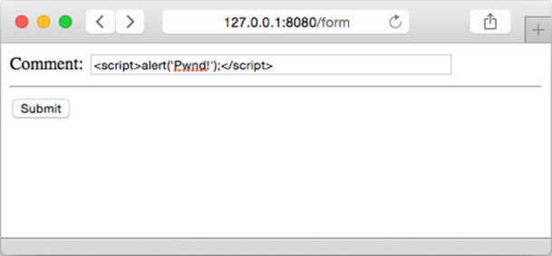
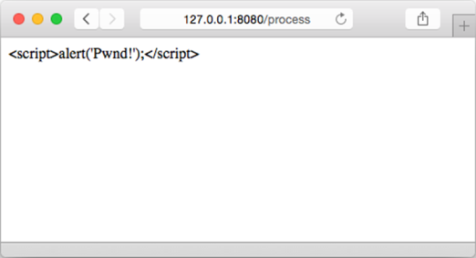

### 5.6.1　防御XSS攻击

持久性XSS漏洞（persistent XSS vulnerability）是一种常见的XSS攻击方式，这种攻击是由于服务器将攻击者存储的数据原原本本地显示给其他用户所致的。举个例子，如果有一个存在持久性XSS漏洞的论坛，它允许用户在论坛上面发布帖子或者回复，并且其他用户也可以阅读这些帖子以及回复，那么攻击者就可能会在他发布的内容中引入带有 `<script>` 标签的代码。因为论坛即使在内容带有 `<script>` 标签的情况下，仍然会原原本本地向用户显示这些内容，所以用户将在毫不知情的情况下，使用自己的权限去执行攻击者发布的恶意代码。预防这一攻击的常见方法就是在显示或者存储用户传入的数据之前，对数据进行转义。但正如很多漏洞以及bug一样，持久性XSS漏洞往往会由于人为的因素而出现。

为了说明如何防御持久性XSS漏洞，我们需要用到一些HTML表单数据。这一次，比起直接将数据硬编码到处理器里面，更好的选择是使用第4章学到的HTML表单知识，创建一个代码清单5-19所示的HTML表单。这个表单允许我们向Web应用发送数据，并将其存储在 `form.html` 文件中。

代码清单5-19　用于实施XSS攻击的表单

```go
<html>
　<head>
　　<meta http-equiv="Content-Type" content="text/html; charset=utf-8">
　　<title>Go Web Programming</title>
　</head>
　<body>
　　<form action="/process" method="post">
　　　Comment: <input name="comment" type="text">
　　 <hr/>
　　 <button id="submit">Submit</button>
　　</form>
　</body>
</html>
```

接着，为了处理来自HTML表单的数据，我们需要对处理器做相应的修改，如代码清单5-20所示。

代码清单5-20　测试XSS攻击

```go
package main
import (
　　"net/http"
　　"html/template"
)
func process(w http.ResponseWriter, r *http.Request) {
　　t, _ := template.ParseFiles("tmpl.html")
　　t.Execute(w, r.FormValue("comment"))
}
func form(w http.ResponseWriter, r *http.Request) {
　　t, _ := template.ParseFiles("form.html")
　　t.Execute(w, nil)
}
func main() {
　　server := http.Server{
　　　　Addr: "127.0.0.1:8080",
　　}
　　http.HandleFunc("/process", process)
　　http.HandleFunc("/form", form)
　　server.ListenAndServe()
}
```

最后，为了让XSS攻击的测试结果可以更好地显示出来，我们需要修改 `tmpl.html` 模板文件，如代码清单5-21所示。

代码清单5-21　修改后的 `tmpl.html` 模板

```go
<html>
　<head>
　　<meta http-equiv="Content-Type" content="text/html; charset=utf-8">
　　<title>Go Web Programming</title>
　</head>
　<body>
　　<div>{{ . }}</div>
　</body>
</html>
```

现在，编译并启动修改后的服务器，然后访问http://127.0.0.1:8080/form。接着像图5-9所示的那样，将以下内容输入到表单的文本框里面，然后按下Submit按钮：

```go
<script>alert('Pwnd!');</script>
```

对于那些不过滤用户输入并且在Web页面上直接显示用户输入的模板引擎来说，执行图5-9所示的操作将会显示一条提示信息，这也意味着攻击者可以让网站上的其他用户执行任意可能的攻击代码。与此相反，正如我们之前提到的那样，即使程序员忘了对用户的输入进行过滤，Go的模板引擎也会在显示用户输入时将其转换为转义之后的HTML，以此来避免可能会出现的问题，图5-10证实了这一点。


<center class="my_markdown"><b class="my_markdown">图5-9　用于实施XSS攻击的表单</b></center>


<center class="my_markdown"><b class="my_markdown">图5-10　多谢Go的模板引擎，原本会导致漏洞的用户输入已经被转义了</b></center>

查看这个页面的源代码将会看到以下结果：

```go
<html>
　<head>
　　<meta http-equiv="Content-Type" content="text/html; charset=utf-8">
　　<title>GoWebProgramming</title>
　</head>
　<body>
　　<div><script>alert(&#39;Pwnd!&#39;);</script></div>
　</body>
</html>
```

上下文感知功能不仅能够自动对HTML进行转义，它还能够防止基于JavaScript、CSS甚至URL的XSS攻击。那么这是否意味着我们只要使用Go的模板引擎就可以无忧无虑地进行开发了呢？并非如此，上下文感知虽然很方便，但它并非灵丹妙药，而且有不少方法可以绕开上下文感知。实际上，如果需要，用户是可以完全不使用上下文感知特性的。

