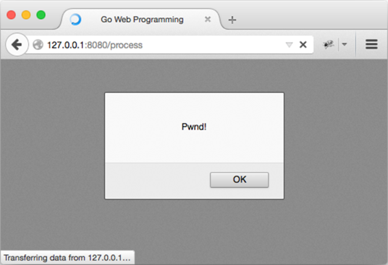

### 5.6.2　不对HTML进行转义

如果真的想要允许用户输入HTML代码或者JavaScript代码，并在显示内容时执行这些代码，可以使用Go提供的“不转义HTML”机制：只要把不想被转义的内容传给 `template.HTML` 函数，模板引擎就不会对其进行转义。作为例子，让我们对之前展示过的处理器做一些小修改：

```go
func process(w http.ResponseWriter, r *http.Request) {
　　t, _ := template.ParseFiles("tmpl.html")
　　t.Execute(w, template.HTML(r.FormValue("comment")))
}
```

注意，在这个修改后的处理器函数中，程序通过类型转换（typecast）将表单中的评论值转换成了 `template.HTML` 类型。

现在，重新编译并运行这个服务器，然后再次尝试实施XSS攻击。攻击产生的结果将根据用户使用的浏览器而定，如果用户使用的是Chrome、Safari、IE8或以上版本的IE浏览器，那么什么都不会发生——用户将看到一个空白的页面；但如果用户使用的是Firefox，那么用户将会看到图5-11所示的画面。

因为IE、Chrome和Safari在默认情况下都能够防御某些特定类型的XSS攻击，所以我们的XSS攻击在这3个浏览器上都没有能够成功实施；与此相反，因为Firefox并不具备内置的XSS防御功能，所以我们在Firefox浏览器上成功实施了XSS攻击。

在需要时，用户也可以通过发送一个最初由微软公司为IE浏览器创建的特殊HTTP响应首部X-XSS-Protection来让浏览器关闭内置的XSS防御功能，就像这样：

```go
func process(w http.ResponseWriter, r *http.Request) {
　　w.Header().Set("X-XSS-Protection", "0")
　　t, _ := template.ParseFiles("tmpl.html")
　　t.Execute(w, template.HTML(r.FormValue("comment")))
}
```


<center class="my_markdown"><b class="my_markdown">图5-11　XSS攻击成功</b></center>

现在，如果再次尝试实施XSS攻击，那么你将会在IE、Chrome和Safari上看到与Firefox相同的攻击效果。

