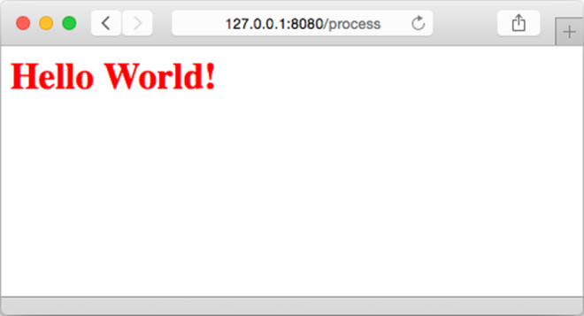

### 5.7　嵌套模板

本章到目前为止已经介绍了Go模板引擎的不少特性，在继续了解更多特性之前，我们需要先学习一下如何在Web应用中使用布局。

所谓的布局（layout），指的是Web设计中可以重复应用在多个页面上的固定模式。为了构建协调一致的用户界面，Web应用常常需要展示一些相似的页面，因此Web应用也会经常用到布局。比如说，很多Web应用都拥有相应的头部菜单，以及提供服务器状态、版权声明、联系方式等附加信息的尾部栏，而其他一些Web应用可能会在屏幕的左侧提供导航栏又或者多级导航菜单。不难猜出，这些布局实际上都可以使用嵌套模板实现。

前面的小节曾经介绍过如何使用包含动作实现嵌套模板，但使用这种方法来开发复杂的Web应用，不仅需要将大量代码硬编码到处理器里面，还需要创建大量的模板文件，而引发这一问题的原因跟我们使用模板的方式有关。

正如之前所说，我们可以通过包含动作，在一个模板里面包含另一个模板：

```go
{{ template "name" . }}
```

其中动作的参数 `name` 就是被包含模板的名字，并且这个名字还是一个字符串常量。这意味着如果我们继续像之前一样，使用文件名作为模板名，那么因为每个页面都拥有它们各自的布局模板文件，所以程序最终将无法拥有任何可共用的公共布局，而这种做法跟构建布局的想法正好是相悖的。比如说，对于代码清单5-22所示的模板文件，我们就不能把它用作公共的布局模板文件。

代码清单5-22　无效的模板布局文件

```go
<html>
　<head>
　　<meta http-equiv="Content-Type" content="text/html; charset=utf-8">
　　<title>Go Web Programming</title>
　</head>
　<body>
　　{{ template "content.html" }}
　</body>
</html>
```

出现这种问题的根源在于我们实际上并没有以正确的方式使用Go模板引擎。尽管我们可以让每个模板文件都只定义一个模板，并将模板文件的名字用作模板的名字，但实际上，我们也可以通过定义动作（define action），在模板文件里面显式地定义模板，就像代码清单5-23所示的那样。

代码清单5-23　显式地定义一个模板

```go
{{ define "layout" }}
<html>
　<head>
　　<meta http-equiv="Content-Type" content="text/html; charset=utf-8">
　　<title>Go Web Programming</title>
　</head>
　<body>
　　{{ template "content" }}
　</body>
</html>
{{ end }}
```

这个文件以一个 `{{ define "layout" }}` 标签作开头，并以一个 `{{ end }}` 标签结尾，而介于这两个标签之间的内容就是 `layout` 模板的定义。与此同时，通过使用另一个定义动作，我们还可以在这个文件里面再多创建一个模板。换句话说，我们可以像代码清单5-24所示的那样，在同一个模板文件里面定义多个不同的模板。

代码清单5-24　在一个模板文件里面定义多个模板

```go
{{ define "layout" }}
<html>
　<head>
　　<meta http-equiv="Content-Type" content="text/html; charset=utf-8">
　　<title>Go Web Programming</title>
　</head>
　<body>
　　{{ template "content" }}
　</body>
</html>
{{ end }}
{{ define "content" }}
Hello World!
{{ end }}
```

代码清单5-25展示了处理器使用这些模板的方法。

代码清单5-25　使用显式定义的模板

```go
func process(w http.ResponseWriter, r *http.Request) {
　　t, _ := template.ParseFiles("layout.html")
　　t.ExecuteTemplate(w, "layout", "")
}
```

分析模板的方法跟之前介绍过的一样，但是这次在执行模板的时候，程序需要显式地使用 `ExecuteTemplate` 方法，并把待执行的 `layout` 模板的名字用作方法的第二个参数。因为 `layout` 模板嵌套了 `content` 模板，所以程序只需要执行 `layout` 模板就可以在浏览器中得到 `content` 模板产生的 `Hello World!` 输出了。通过使用cURL获取模板输出的实际HTML文件，我们将看到以下结果：

```go
> curl -i http://127.0.0.1:8080/process
HTTP/1.1 200 OK
Date: Sun, 08 Feb 2015 14:09:15 GMT
Content-Length: 187
Content-Type: text/html; charset=utf-8
<html>
　<head>
　　<meta http-equiv="Content-Type" content="text/html; charset=utf-8">
　　<title>Go Web Programming</title>
　</head>
　<body>
Hello World!
　</body>
</html>
```

用户除可以在同一个模板文件里面定义多个不同的模板之外，还可以在不同的模板文件里面定义同名的模板。作为例子，让我们首先移除 `layout.html` 文件中现有的 `content` 模板定义，然后分别在代码清单5-26和代码清单5-27所示的 `red_hello.html` 文件和 `blue_hello.html` 文件中重新定义 `content` 模板。

代码清单5-26　 `red_hello.html`

```go
{{ define "content" }}
<h1 style="color: red;">Hello World!</h1>
{{ end }}
```

代码清单5-27　 `blue_hello.html`

```go
{{ define "content" }}
<h1 style="color: blue;">Hello World!</h1>
{{ end }}
```

代码清单5-28展示了修改之后的处理器，它向我们演示了应该如何使用在不同模板文件中定义的两个 `content` 模板。

代码清单5-28　处理器使用在不同模板文件中定义的同名模板

```go
func process(w http.ResponseWriter, r *http.Request) {
　　rand.Seed(time.Now().Unix())
　　var t *template.Template
　　if rand.Intn(10) > 5 {
　　　　t, _ = template.ParseFiles("layout.html", "red_hello.html")
　　} else {
　　　　t, _ = template.ParseFiles("layout.html", "blue_hello.html")
　　}
　　t.ExecuteTemplate(w, "layout", "")
}
```

这个处理器会根据生成的随机数，决定对 `red_hello.html` 和 `blue_hello.html` 这两个模板文件中的哪一个进行语法分析。当处理器像之前一样执行包含了 `content` 模板的 `layout` 模板时，被随机选中的那个模板文件中定义的 `content` 模板就会被执行。因为 `red_hello.html` 和 `blue_hello.html` 这两个模板文件都定义了 `content` 模板，所以它们中的哪一个被随机选中了进行语法分析，被分析文件中定义的 `content` 模板就会被执行。换句话说，我们可以在维持“ `layout` 模板包含 `content` 模板”这一关系不变的情况下，通过对不同的模板文件进行语法分析来达到改变输出结果的目的。

现在，如果我们重新编译并启动修改后的服务器，然后通过浏览器对其进行访问，那么我们将会随机看到蓝色或者红色的 `Hello World!` 输出，就像图5-12所示的那样。


<center class="my_markdown"><b class="my_markdown">图5-12　能够随机切换内容的模板</b></center>

