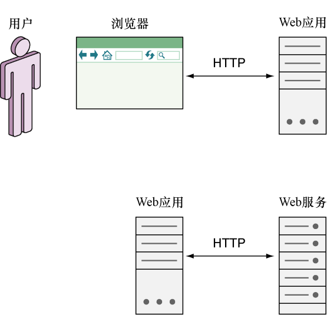

### 7.1　Web服务简介

通过Go语言编写的Web服务向其他Web服务或应用提供服务和数据，是Go语言的一种常见的用法。所谓的Web服务，一言以蔽之，就是一种与其他软件程序进行交互的软件程序。这也就是说，Web服务的终端用户（end user）不是人类，而是软件程序。正如“Web服务”这一名字所暗示的那样，这种软件程序是通过HTTP进行通信的，如图7-1所示。

<b class="my_markdown">图7-1　Web应用与Web服务的不同之处</b>

有趣的是，虽然Web应用并没有一个确切的定义，但Web服务的定义却可以在W3C工作组发布的《Web服务架构》（Web Service Architecture）文档中找到：

> Web服务是一个软件系统，它的目的是为网络上进行的可互操作机器间交互（interoperable machine-to-machine interaction）提供支持。每个Web服务都拥有一套自己的接口，这些接口由一种名为Web服务描述语言（web service description language，WSDL）的机器可处理格式描述。其他系统需要根据Web服务的描述，使用SOAP消息与Web服务交互。为了与其他Web相关标准实现协作，SOAP消息通常会被序列化为XML并通过HTTP传输。
> ——《Web服务架构》，2004年2月11日

从这一定义来看，似乎所有Web服务都应该基于SOAP来实现，但实际中却存在着多种不同类型的Web服务，其中包括基于SOAP的、基于REST的以及基于XML-RPC的，而基于REST的和基于SOAP的Web服务又是其中最为流行的。企业级系统大多数都是基于SOAP的Web服务实现的，而公开可访问的Web服务则更青睐基于REST的Web服务，本章稍后将会对此进行讨论。

基于SOAP的Web服务和基于REST的Web服务都能够完成相同的功能，但它们各自也拥有不同的长处。基于SOAP的Web服务出现的时间较早，W3C工作组已经对其进行了标准化，与之相关的文档和资料也非常丰富。除此之外，很多企业都对基于SOAP的Web服务提供了强有力的支持，并且基于SOAP的Web服务还拥有数量颇丰的扩展可用（因为这些扩展的名字绝大多数都是像WS-Security和WS-Addressing这样以WS为前缀的，所以这些扩展被统称为WS-*）。基于SOAP的服务不仅健壮、能够使用WSDL进行明确的描述、拥有内置的错误处理机制，而且还可以通过UUDI（Universal Description, Discovery, and Integration，统一描述、发现和集成）（一种目录服务）规范发布。

在拥有以上众多优点的同时，SOAP的缺点也是非常明显的：它不仅笨重，而且过于复杂。SOAP的XML报文可能会变得非常冗长，导致难以调试，使用户只能通过其他工具对其进行管理，而基于SOAP的Web服务可能会因为额外的资源损耗而无法高效地运行。此外，WSDL虽然在客户端和服务器之间提供了坚实的契约，但这种契约有时候也会变成一种累赘：为了对Web服务进行更新，用户必须修改WSDL，而这种修改又会引起SOAP客户端发生变化，最终导致Web服务的开发者即使在进行最细微的修改时，也不得不使用版本锁定（version lock-in）以防止发生意外。

跟基于SOAP的Web服务比起来，基于REST的Web服务就显得灵活多了。REST本身并不是一种结构，而是一种设计理念。很多基于REST的Web服务都会使用像JSON这样较为简单的数据格式而不是XML，从而使Web服务可以更高效地运行，并且基于REST的Web服务实现起来通常会比基于SOAP的Web服务简单得多。

基于SOAP的Web服务和基于REST的Web服务的另一个区别在于，前者是功能驱动的，而后者是数据驱动的。基于SOAP的Web服务往往是RPC（Remote Procedure Call，远程过程调用）风格的；但是，正如之前所说，基于REST的Web服务关注的是资源，而HTTP方法则是对这些资源执行操作的动词。

ProgrammableWeb是一个流行的API检测网站，它会对互联网上公开可用的API进行检测。在编写本书的时候，ProgrammableWeb的数据库搜集了12 987个公开可用的API，其中2 061个（占比16%）为基于SOAP的API，而6 967个（占比54%）为基于REST的API<a class="my_markdown" href="['#anchor71']">[1]</a>。可惜的是，因为企业很少会对外发布与内部Web服务有关的信息，所以想要调查清楚各种Web服务在企业中的使用情况是非常困难的。

为了满足不同的需求，很多开发者和公司最终还是会同时使用基于SOAP的Web服务和基于REST的Web服务。在这种情况下，SOAP将用于实现内部应用的企业集成（enterprise integration），而REST则用于服务外部以及第三方的开发者。这一策略的优势在于，它最大限度地利用了REST（速度快并且构建简单）以及SOAP（安全并且健壮）这两种技术的优点。

