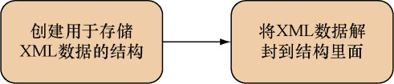
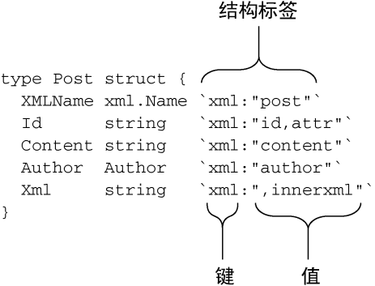
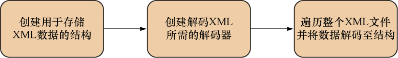

### 7.4.1　分析XML

因为分析XML是刚开始接触XML时经常会做的一件事，所以我们就以学习如何分析XML为开始。在Go语言里面，用户首先需要将XML的分析结果存储到一些结构里面，然后通过访问这些结构来获取XML记录的数据。下面是分析XML时常见的两个步骤：

（1）创建一些用于存储XML数据的结构；

（2）使用 `xml.Unmarshal` 将XML数据解封（unmarshal）到结构里面，如图7-2所示。


<center class="my_markdown"><b class="my_markdown">图7-2　使用Go对XML进行分析：将XML解封至结构</b></center>

代码清单7-1展示了一个简单的XML文件 `post.xml` 。

代码清单7-1　一个简单的XML文件 `post.xml`

```go
<?xml version="1.0" encoding="utf-8"?>
<post id="1">
　<content>Hello World!</content>
　<author id="2">Sau Sheong</author>
</post>
```

代码清单7-2展示了分析这个XML所需的代码，这些代码存储在文件 `xml.go` 里。

代码清单7-2　对XML进行分析

```go
package main
import (
　"encoding/xml"
　"fmt"
　"io/ioutil"
　"os"
)
type Post struct {　　 //#A    ❶
　XMLName xml.Name `xml:"post"`
　Id　　　string　 `xml:"id,attr"`
　Content string　 `xml:"content"`
　Author　Author　 `xml:"author"`
　Xml　　 string　 `xml:",innerxml"`
}
type Author struct {
　Id　 string `xml:"id,attr"`
　Name string `xml:",chardata"`
}
func main() {
　xmlFile, err := os.Open("post.xml")
　if err != nil {
　　fmt.Println("Error opening XML file:", err)
　　return
　}
　defer xmlFile.Close()
　xmlData, err := ioutil.ReadAll(xmlFile)
　if err != nil {
　　fmt.Println("Error reading XML data:", err)
　　return
　}
    var post Post   
　xml.Unmarshal(xmlData, &post)   ❷
　fmt.Println(post)
}
```

❶ 定义一些结构，用于表示数据

❷ 将XML 数据解封到结构里面

分析程序定义了用于表示数据的 `Post` 结构和 `Author` 结构。因为程序想要在获取作者信息的同时也获取作者信息所在元素的 `id` 属性，所以程序使用了单独的 `Author` 结构来表示帖子的作者，但并没有使用单独的 `Content` 结构来表示帖子的内容。如果我们不打算获取作者信息的 `id` 属性，也可以定义一个下面这样的 `Post` 结构，并直接使用字符串来表示帖子的作者信息（代码中的加粗行）：

```go
type Post struct {
　XMLName xml.Name `xml:"post"`
　Id　　　string　 `xml:"id,attr"`
　Content string　 `xml:"content"`
　Author string　　`xml:"author"`
　Xml string　　　 `xml: ",innerxml"`
}

```

`Post` 结构中每个字段的定义后面都带有一段使用反引号（`）包围的信息，这些信息被称为结构标签（struct tag），Go语言使用这些标签来决定如何对结构以及XML元素进行映射，如图7-3所示。


<center class="my_markdown"><b class="my_markdown">图7-3　结构标签用于定义XML和结构之间的映射</b></center>

结构标签是一些跟在字段后面，使用字符串表示的键值对：它的键是一个不能包含空格、引号（ `"` ）或者冒号（ `:` ）的字符串，而值则是一个被双引号（ `""` ）包围的字符串。在处理XML时，结构标签的键总是为 `xml` 。

为什么使用反引号来包围结构标签

> 因为Go语言使用双引号（ `""` ）和反引号（ ``）` 来包围字符串，使用单引号（ `'` ）来包围rune（一种用于表示Unicode码点的 `int32` 类型），并且因为结构标签内部已经使用了双引号来包围键的值，所以为了避免进行转义，Go语言就使用了反引号来包围结构标签。

出于创建映射的需要， `xml` 包要求被映射的结构以及结构包含的所有字段都必须是公开的，也就是，它们的名字必须以大写的英文字母开头。以上面展示的代码为例，结构的名字必须为 `Post` 而不能是 `post` ，至于字段的名字则必须为 `Content` 而不能是 `content` 。

下面是XML结构标签的其中一些使用规则。

（1）通过创建一个名字为 `XMLName` 、类型为 `xml.Name` 的字段，可以将XML元素的名字存储在这个字段里面（在一般情况下，结构的名字就是元素的名字）。

（2）通过创建一个与XML元素属性同名的字段，并使用' `xml:"<name>,attr"` '作为该字段的结构标签，可以将元素的 `<name>` 属性的值存储到这个字段里面。

（3）通过创建一个与XML元素标签同名的字段，并使用 `'xml:",chardata"'` 作为该字段的结构标签，可以将XML元素的字符数据存储到这个字段里面。

（4）通过定义一个任意名字的字段，并使用 `'xml:",innerxml"'` 作为该字段的结构标签，可以将XML元素中的原始XML存储到这个字段里面。

（5）没有模式标志（如 `,attr` 、 `,chardata` 或者 `,innerxml` ）的结构字段将与同名的XML元素匹配。

（6）使用 `'xml:"a>b>c"'` 这样的结构标签可以在不指定树状结构的情况下直接获取指定的XML元素，其中 `a` 和 `b` 为中间元素，而 `c` 则是想要获取的节点元素。

要一下子了解这么多规则并不容易，特别是对最后几条规则来说更是如此，所以我们最好还是来看一些实际应用这些规则的例子。

代码清单7-3给出了表示帖子XML元素的 `post` 变量及其对应的 `Post` 结构。

代码清单7-3　用于表示帖子的简单的XML元素

```go
<post id="1">
　<content>Hello World!</content>
　<author id="2">Sau Sheong</author>
</post>
```

而下面是 `post` 元素对应的 `Post` 结构：

```go
type Post struct {
　XMLName xml.Name `xml:"post"`
　Id　　　string　 `xml:"id,attr"`
　Content string　 `xml:"content"`
　Author　Author　 `xml:"author"`
　Xml　　 string　 `xml:",innerxml"`
}
```

分析程序定义了与XML元素 `post` 同名的 `Post` 结构，虽然这种做法非常常见，但是在某些时候，结构的名字与XML元素的名字可能并不相同，这时用户就需要一种方法来获取元素的名字。为此， `xml` 包提供了一种机制，使用户可以通过定义一个名为 `XMLName` 、类型为 `xml.Name` 的字段，并将该字段映射至元素自身来获取XML元素的名字。在 `Post` 结构的例子中，这一映射就是通过 `'xml:"post"'` 结构标签来完成的。根据规则1——“使用 `XMLName` 字段存储元素的名字”，分析程序将元素的名字 `post` 存储到了 `Post` 结构的 `XMLName` 字段里面。

XML元素 `post` 拥有一个名为 `id` 的属性，根据规则2——“使用结构标签 ` `xml:"<name>,`` ``attr"```</code>存储属性的值”，分析程序通过结构标签<code>` xml:"id,attr"`` 将 `id` 属性的值存储到了 `Post` 结构的 `Id` 字段里面。

`post` 元素包含了一个 `content` 子元素，这个子元素没有属性，但它包含了字符数据 `Hello World!` ，根据规则5——“没有模式标志的结构字段将与同名的XML元素进行匹配”，分析程序通过结构标签 `'xml:"content"'` 将 `content` 子元素包含的字符数据存储到了 `Post` 结构的 `Content` 字段里面。

根据规则4——“使用结构标签 `'xml:",innerxml"'` 可以获取原始XML”，分析程序定义了一个 `Xml` 字段，并使用 `'xml:",innerxml"'` 作为该字段的结构标签，以此来获得被 `post` 元素包含的原始XML：

```go
<content>Hello World!</content>
<author id="2">Sau Sheong</author>
```

子元素 `author` 拥有 `id` 属性，并且包含字符数据 `Sau Sheong` ，为了正确地构建映射，分析程序专门定义了 `Author` 结构：

```go
type Author struct {
　Id　　string `xml:"id,attr"`
　Name　string `xml:",chardata"`
}
```

根据规则5， `author` 子元素被映射到了带有 `'xml:"author"'` 结构标签的 `Author` 字段。在 `Author` 结构中，属性 `id` 的值被映射到了带有 `'xml:"id,attr"'` 结构标签的 `Id` 字段，而字符数据 `Sau Sheong` 则被映射到了带有 `'xml:",chardata"'` 结构标签的 `Name` 字段。

俗话说，百闻不如一见。在详细了解了整个分析程序之后，接下来就让我们实际运行一下这个程序。在终端里面执行以下命令：

```go
go run xml.go
```

如果一切正常，这一命令应该会返回以下结果：

```go
{{ post} 1 Hello World! {2 Sau Sheong}
　<content>Hello World!</content>
　<author id="2">Sau Sheong</author>
}
```

让我们逐一地分析这些结果。首先，因为 `post` 变量是 `Author` 结构的一个实例，所以整个结果都被包围在了一对大括号（ `{}` ）里面。 `post` 结构的第一个字段是另一个类型为 `xml.Name` 的结构，这个结构在结果中表示为 `{ post }` 。在此之后展示的数字 `1` 为 `Id` 字段的值，而 `"Hello World!"` 则是 `Content` 字段的值。再之后展示的是存储在 `Author` 结构里面的内容， `{2 Sau Sheong}` 。结果最后展示的是XML元素 `post` 内部包含的原始XML。

前面的内容列举了规则1至规则5的使用示例，现在让我们来看看规则6是如何运作的。规则6声称，使用结构标签 `'xml:"a>b>c"'，` 可以在不指定树状结构的情况下，越过中间元素 `a` 和 `b` 直接访问节点元素 `c` 。

代码清单7-4展示的是另一个XML示例，这个XML也存储在名为 `post.xml` 的文件中。

代码清单7-4　带有嵌套元素的XML文件

```go
< ?xml version="1.0" encoding="utf-8"?>
< post id="1">
　< content>Hello World!< /content>
　< author id="2">Sau Sheong< /author>
　< comments>
　　< comment id="1">
　　　< content>Have a great day!< /content>
　　　< author id="3">Adam< /author>
　　< /comment>
　　< comment id="2">
　　　< content>How are you today?< /content>
　　　< author id="4">Betty< /author>
　　< /comment>
　< /comments>
< /post>
```

这个XML文件的前半部分内容跟之前展示的XML文件是相同的，而加粗显示的则是新出现的代码，这些新代码定义了一个名为 `comments` 的XML子元素，并且这个元素本身也包含多个 `comment` 子元素。这一次，分析程序需要获取帖子的评论列表，但为此专门创建一个 `Comments` 结构可能会显得有些小题大做了。为了简化实现代码，分析程序将根据规则6对 `comments` 这个XML子元素进行跳跃式访问。代码清单7-5展示了经过修改的 `Post` 结构，修改后的 `Post` 结构带有新增的字段以及实现跳跃式访问所需的结构标签。

代码清单7-5　带有 `comments` 结构字段的 `Post` 结构

```go
type Post struct {
　XMLName　xml.Name　`xml:"post"`
　Id　　　 string　　`xml:"id,attr"`
　Content　string　　`xml:"content"`
　Author　 Author　　`xml:"author"`
　Xml　　　string　　`xml:",innerxml"`
　Comments []Comment `xml:"comments>comment"`
}
```

正如代码中的加粗行所示，分析程序为了获取帖子的评论列表，在 `Post` 结构中增加了类型为 `Comment` 结构切片的 `Comments` 字段，并通过结构标签 `'xml:"comments>comment"'` 将这个字段映射至名为 `comment` 的XML子元素。根据规则6，这一结构标签将允许分析程序跳过XML中的 `comments` 元素，直接访问 `comment` 子元素。

`Comment` 结构和 `Post` 结构非常相似，它的具体定义如下：

```go
type Comment struct {
　Id　　　string `xml:"id,attr"`
　Content string `xml:"content"`
　Author　Author `xml:"author"`
}
```

在定义了进行语法分析所需的结构以及映射关系之后，现在是时候将XML数据解封到这些结构里面了。因为负责执行解封操作的 `Unmarshal` 函数只接受字节切片（也就是字符串）作为参数，所以分析程序首先要做的就是将XML文件转换为字符串，这一操作可以通过以下代码来实现（在执行这些代码时，XML文件必须与Go文件处于同一目录之下）：

```go
xmlFile, err := os.Open("post.xml")
if err != nil {
　fmt.Println("Error opening XML file:", err)
　return 
}
defer xmlFile.Close()
xmlData, err := ioutil.ReadAll(xmlFile)
if err != nil {
　fmt.Println("Error reading XML data:", err)
　return 
}
```

在将XML文件的内容读取到 `xmlData` 变量里面之后，分析程序可以通过执行以下代码来解封XML数据：

```go
var post Post
xml.Unmarshal(xmlData, &post)
```

如果你曾经使用其他编程语言分析过XML，那么你应该会知道，这种做法虽然能够很好地处理体积较小的XML文件，但是却无法高效地处理以流（stream）方式传输的XML文件以及体积较大的XML文件。为了解决这个问题，我们需要使用 `Decoder` 结构来代替 `Unmarshal` 函数，通过手动解码XML元素的方式来解封XML数据，这个过程如图7-4所示。


<center class="my_markdown"><b class="my_markdown">图7-4　使用Go分析XML：将XML解码至结构</b></center>

代码清单7-6展示了如何使用 `Decoder` 分析前面提到的XML文件。

代码清单7-6　使用 `Decoder` 分析XML

```go
　package main
　import (
　　"encoding/xml"
　　"fmt"
　　"io"
　　"os"
　)
　type Post struct {
　　XMLName　xml.Name　`xml:"post"`
　　Id　　　 string　　`xml:"id,attr"`
　　Content　string　　`xml:"content"`
　　Author　 Author　　`xml:"author"`
　　Xml　　　string　　`xml:",innerxml"`
　　Comments []Comment `xml:"comments>comment"`
　}
　type Author struct {
　　Id　 string `xml:"id,attr"`
　　Name string `xml:",chardata"`
　}
　type Comment struct {
　　Id　　　string `xml:"id,attr"`
　　Content string `xml:"content"`
　　Author　Author `xml:"author"`
　}
　func main() {
　　xmlFile, err := os.Open("post.xml")
　　if err != nil {
　　　fmt.Println("Error opening XML file:", err)
　　　return
　　}
　　defer xmlFile.Close()
　   decoder := xml.NewDecoder(xmlFile)  ❶
　　for {  ❷
　　t, err := decoder.Token()  ❸
　　　if err == io.EOF {
　　　　break
　　　}
　　　if err != nil {
　　　　fmt.Println("Error decoding XML into tokens:", err)
　　　　return
　　　}
　　    switch se := t.(type) {  ❹
　　　case xml.StartElement:
　　　　if se.Name.Local == "comment" {
　　　　　var comment Comment
　　　　　decoder.DecodeElement(&comment, &se)  ❺
　　　　}
　　　}
　　}
　}
```

❶ 根据给定的XML 数据生成相应的解码器

❷ 每迭代一次解码器中的所有XML 数据

❸ 每进行一次迭代，就从解码器里面获取一个token

❹ 检查token 的类型

❺ 将XML 数据解码至结构

虽然这段代码只演示了如何解码 `comment` 元素，但这种解码方式同样可以应用于XML文件中的其他元素。这个新的分析程序会通过 `Decoder` 结构，一个元素接一个元素地对XML进行解码，而不是像之前那样，使用 `Unmarshal` 函数一次将整个XML解封为字符串。

对XML进行解码首先需要创建一个 `Decoder` ，这一点可以通过调用 `NewDecoder` 并向其传递一个 `io.Reader` 来完成。在上面展示的代码清单中，程序就把 `os.Open` 打开的 `xmlFile` 文件传递给了 `NewDecoder` 。

在拥有了解码器之后，程序就会使用 `Token` 方法来获取XML流中的下一个token：在这种情景下，token实际上就是一个表示XML元素的接口。为了从解码器里面取出所有token，程序使用一个无限 `for` 循环包裹起了从解码器里面获取token的相关动作。当解码器包含的所有token都已被取出时， `Token` 方法将返回一个表示文件数据或数据流已被读取完毕的 `io.EOF` 结构作为结果，并将返回值中的 `err` 变量的值设置为 `nil` 。

分析程序从解码器里取出token之后会对该token进行检查以确认其是否为 `StartElement` ，也就是，判断该token是否为XML元素的起始标签。如果是的话，那么程序会继续对这个token进行检查，看它是否就是XML中的 `comment` 元素。在确认了自己遇到的是 `comment` 元素之后，程序就会将整个token解码至 `Comment` 结构，从而得到与解封XML元素相同的结果。

因为手动解码XML文件需要做更多工作，所以这种方法并不适用于处理小型的XML文件。但如果程序面对的是流式XML数据，或者体积非常庞大的XML文件，那么解码将是从XML里提取数据唯一可行的办法。

在结束本小节并转向讨论如何创建XML之前，还有一点需要说明一下，那就是：本节介绍的分析规则只是XML分析规则的一部分，如果你想要更详细地了解这些规则，可以去查看 `xml` 库的文档，或者直接阅读 `xml` 库的源码。

