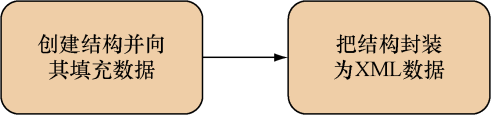
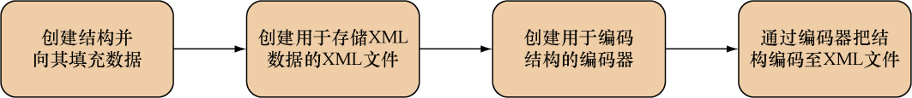

### 7.4.2　创建XML

在上一节中，我们花了不少时间学习如何分析XML，幸运的是，因为创建XML正好就是分析XML的逆操作，所以上一节介绍的知识在本节也是适用的。在上一节中，我们学习的是怎样把XML解封到结构里面，而这一节我们要学习的则是怎样把Go结构封装（marshal）至XML；同样，上一节我们学习的是怎样把XML解码至Go结构，而本节我们要学习的则是怎样把Go结构编码至XML，这个过程如图7-5所示。


<center class="my_markdown"><b class="my_markdown">图7-5　使用Go创建XML：创建结构并将其封装至XML</b></center>

首先让我们来看看封装操作是如何进行的。代码清单7-7展示了文件 `xml.go` 包含的代码，这些代码会创建一个名为 `post.xml` 的XML文件。

代码清单7-7　使用 `Marshal` 函数生成XML文件

```go
package main
import (
　"encoding/xml"
　"fmt"
　"io/ioutil"
)
type Post struct {
　XMLName xml.Name `xml:"post"`
　Id　　　string　 `xml:"id,attr"`
　Content string　 `xml:"content"`
　Author　Author　 `xml:"author"`
}
type Author struct {
　Id　 string `xml:"id,attr"`
　Name string `xml:",chardata"`
}
func main() {
　post := Post{
　Id:　　　"1",
　　Content: " Hello World!", ❶
　　Author: Author{
　　　Id:　 "2",
　　　Name: "Sau Sheong",
　　},
　}
 output, err := xml.Marshal(&post)
 if err != nil {  ❷
　　fmt.Println("Error marshalling to XML:", err)
　　return
　}
　err = ioutil.WriteFile("post.xml", output, 0644)
　if err != nil {
　　fmt.Println("Error writing XML to file:", err)
　　return
　}
}
```

❶创建结构并向里面填充数据

❷ 把结构封装为由字节切片组成的XML 数据

正如代码所示，封装XML和解封XML时使用的结构以及结构标签是完全相同的：封装操作只不过是把处理过程反转了过来，然后根据结构创建相应的XML罢了。封装程序首先需要创建表示帖子的 `post` 结构，并向结构里面填充数据，然后只要调用 `Marshal` 函数，就可以根据 `Post` 结构创建相应的XML了。作为例子，下面就是 `Marshal` 函数根据 `Post` 结构创建出的XML数据，这些数据包含在了 `post.xml` 文件里面：

```go
<post id="1"><content>Hello World!</content><author id="2">Sau Sheong</author></post>
```

虽然样子并不是特别好看，但函数生成出来的的的确确就是一段XML。如果想要让程序生成更好看的XML，那么可以使用 `MarshalIndent` 函数代替 `Marshal` 函数：

```go
output, err := xml.MarshalIndent(&post, "", "\t")
```

`MarshalIndent` 函数跟 `Marshal` 函数一样，都接受一个指向结构的指针作为自己的第一个参数，但除此之外， `MarshalIndent` 函数还接受两个额外的参数，这两个参数分别用于指定添加到每个输出行前面的前缀以及缩进，其中缩进的数量会随着元素的嵌套层次增加而增加。在处理相同的 `Post` 结构时， `MarshalIndent` 函数将产生以下更为美观的输出：

```go
<post id="1">
　<content>Hello World!</content>
　<author id="2">Sau Sheong</author>
</post>
```

因为这段XML缺少了XML声明，所以从格式上来说这段XML并不完全正确。虽然 `xml` 库不会自动为 `Marshal` 或者 `MarshalIndent` 生成的XML添加XML声明，但用户可以很轻易地通过 `xml.Header` 常量将XML声明添加到封装输出之前：

```go
err = ioutil.WriteFile("post.xml", []byte(xml.Header + string(output)), 0644)
```

通过把 `xml.Header` 添加到输出结果之前，并将这些内容全部写入 `post.xml` 文件，我们就得到了一段带有XML声明的XML：

```go
<?xml version="1.0" encoding="UTF-8"?>
<post id="1">
　　<content>Hello World!</content>
　　<author id="2">Sau Sheong</author>
</post>
```

正如我们可以手动将XML解码到Go结构里面一样，我们同样可以手动将Go结构编码到XML里面，图7-6展示了这个过程，代码清单7-8则展示了一个简单的编码示例。


<center class="my_markdown"><b class="my_markdown">图7-6　使用Go创建XML：通过使用编码器来将结构编码至XML</b></center>

代码清单7-8　手动将Go结构编码至XML

```go
　package main
　import (
　　"encoding/xml"
　　"fmt"
　　"os"
　)
　type Post struct {
　　XMLName xml.Name `xml:"post"`
　　Id　　　string　 `xml:"id,attr"`
　　Content string　 `xml:"content"`
　　Author　Author　 `xml:"author"`
　}
　type Author struct {
　　Id　 string `xml:"id,attr"`
　　Name string `xml:",chardata"`
　}
   func main() {
　　post := Post{
　　　Id:　　　"1",  ❶
　　　Content: "Hello World!",
　　Author: Author{
　　　Id:　 "2",
　　　Name: "Sau Sheong",
　　},
   }
　xmlFile, err := os.Create("post.xml")  ❷
　if err != nil {
　　fmt.Println("Error creating XML file:", err)
　　return
　}
　encoder := xml.NewEncoder(xmlFile)  ❸
　encoder.Indent("", "\t")
　err = encoder.Encode(&post)  ❹
　if err != nil {
　　fmt.Println("Error encoding XML to file:", err)
　　return
　}
}
```

❶ 创建结构并向里面填充数据

❷ 创建用于存储数据的XML 文件

❸ 根据给定的XML 文件，创建出相应的编码器

❹ 把结构编码至文件

跟之前一样，程序首先创建了将要被编码的 `Post` 结构，接着通过 `os.Create` 创建出了将要写入的XML文件，然后使用 `NewEncoder` 函数创建了一个包裹着XML文件的编码器。在设置好相应的前缀和缩进之后，程序就会使用编码器的 `Encode` 方法对传入的 `Post` 结构进行编码，最终创建出包含以下内容的 `post.xml` 文件：

```go
<post id="1">
　<content>Hello World!</content>
　<author id="2">Sau Sheong</author>
</post>
```

通过这一节的学习，读者应该已经了解了如何分析和创建XML。需要注意的是，本节讨论的只是分析和创建XML的基础知识，如果想要知道关于这方面的更多信息，可查看相应的文档以及源码（别担心，阅读源码并没有想象中那么可怕）。

