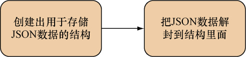

### 7.5.1　分析JSON

分析JSON的步骤和分析XML的步骤基本相同——分析程序首先要做的就是把JSON的分析结果存储到一些结构里面，然后通过访问这些结构来提取数据。下面是分析JSON的两个常见步骤（这个过程如图7-7所示）：


<center class="my_markdown"><b class="my_markdown">图7-7　使用Go分析JSON：创建结构并将JSON解封到结构里面</b></center>

（1）创建一些用于包含JSON数据的结构；

（2）通过 `json.Unmarshal` 函数，把JSON数据解封到结构里面。

跟映射XML相比，把结构映射至JSON要简单得多，后者只有一条通用的规则：对于名字为 `<name>` 的JSON键，用户只需要在结构里创建一个任意名字的字段，并将该字段的结构标签设置为 `'json:"<name>"'，` 就可以把JSON键 `<name>` 的值存储到这个字段里面。接下来，就让我们来看一个实际的例子。

代码清单7-9展示了一个名为 `post.json` 的JSON文件，我们接下来就要对这个文件进行分析。因为这个JSON文件包含的数据跟之前分析的XML文件包含的数据是相同的，所以这些数据对你来说应该不会感到陌生。

代码清单7-9　要分析的JSON文件

```go
　{
　　"id" : 1,
　　"content" : "Hello World!",
　　"author" : {
　　　"id" : 2,
　　　"name" : "Sau Sheong"
　　},
　　"comments" : [
　　　{
　　　　"id" : 3,
　　　　"content" : "Have a great day!",
　　　　"author" : "Adam"
　　　},
　　　{
　　　　"id" : 4,
　　　　"content" : "How are you today?",
　　　　"author" : "Betty"
　　　}
　　]
　}
```

代码清单7-10展示了 `json.go文件` 包含的代码，这些代码会分析 `post.json` 文件，并将其包含的JSON数据解封至相应的结构。需要注意的是，除了结构标签之外，这个程序使用的结构跟之前分析XML时使用的结构并无不同。

代码清单7-10　JSON分析程序

```go
package main
import (
　"encoding/json"
　"fmt"
　"io/ioutil"
　"os"
)
type Post struct {
　Id　　　 int　　　 `json:"id"`  ❶
　Content　string　　`json:"content"`
　Author　 Author　　`json:"author"`
　Comments []Comment `json:"comments"`
}
type Author struct {
　Id　 int　　`json:"id"`
　Name string `json:"name"`
}
type Comment struct {
　Id　　　int　　`json:"id"`
　Content string `json:"content"`
　Author　string `json:"author"`
}
func main() {
　jsonFile, err := os.Open("post.json")
　if err != nil {
　　fmt.Println("Error opening JSON file:", err)
　　return
　}
　defer jsonFile.Close()
　jsonData, err := ioutil.ReadAll(jsonFile)
　if err != nil {
　　fmt.Println("Error reading JSON data:", err)
　　return
　}
　var post Post
　json.Unmarshal(jsonData, &post)  ❷
　fmt.Println(post)
}
```

❶ 定义一些结构，用于表示数据

❷ 将JSON 数据解封至结构

为了将JSON键 `id` 的值映射到 `Post` 结构的 `Id` 字段，程序将该字段的结构标签设置成了 `'json:"id"'，` 这种设置基本上就是将结构映射至JSON数据所需完成的全部工作。跟分析XML时一样，分析程序通过切片来嵌套多个结构，从而使一篇帖子可以包含零个或多个评论。除此之外，JSON的解封操作也跟XML的解封操作一样，都可以通过调用 `Unmarshal` 函数来完成。

我们可以通过执行以下命令来运行这个JSON分析程序：

```go
go run json.go
```

如果一切正常，应该会看到以下结果：

```go
{1 Hello World! {2 Sau Sheong} [{3 Have a great day! Adam} {4 How are you today? Betty}]}
```

跟分析XML时一样，用户除了可以使用 `Unmarshal` 函数来解封JSON，还可以使用 `Decoder` 手动地将JSON数据解码到结构里面，以此来处理流式的JSON数据，图7-8以及代码清单7-11展示了这个过程的具体实现。


<center class="my_markdown"><b class="my_markdown">图7-8　使用Go分析JSON：将JSON解码至结构</b></center>

代码清单7-11　使用 `Decoder` 对JSON进行语言分析

```go
jsonFile, err := os.Open("post.json")
if err != nil {
　fmt.Println("Error opening JSON file:", err)
　return
}
defer jsonFile.Close()
decoder := json.NewDecoder(jsonFile)  ❶
for {  ❷
　var post Post
　err := decoder.Decode(&post)  ❸
　if err == io.EOF {
　　break
　}
　if err != nil {
　　fmt.Println("Error decoding JSON:", err)
　　return
　}
　fmt.Println(post)
}
```

❶ 根据给定的JSON 文件，创建出相应的解码器

❷ 遍历JSON 文件，直到遇见EOF 为止

❸ 将JSON 数据解码至结构

通过调用 `NewDecoder` 并传入一个包含JSON数据的 `io.Reader` ，程序创建出了一个新的解码器。在把指向 `Post` 结构的引用传递给解码器的 `Decode` 方法之后，被传入的结构就会填充上相应的数据，然后这些数据就可以为程序所用了。当所有JSON数据都被解码完毕时， `Decode` 方法将会返回一个 `EOF` ，而程序则会在检测到这个 `EOF` 之后退出 `for` 循环。

我们可以通过执行以下命令来运行这个JSON解码器：

```go
go run json.go
```

如果一切正常，将会看到以下结果：

```go
{1 Hello World! {2 Sau Sheong} [{1 Have a great day! Adam} {2 How are you today? Betty}]}
```

最后，在面对JSON数据时，我们可以根据输入决定使用 `Decoder` 还是 `Unmarshal` ：如果JSON数据来源于 `io.Reader` 流，如 `http.Request` 的 `Body` ，那么使用 `Decoder` 更好；如果JSON数据来源于字符串或者内存的某个地方，那么使用 `Unmarshal` 更好。

