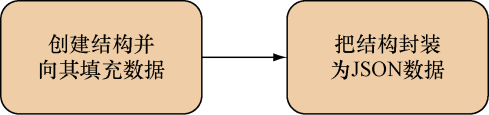
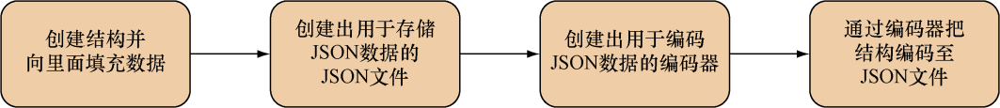

### 7.5.2　创建JSON

正如上一个小节所示，分析JSON的方法和分析XML的方法是非常相似的。同样地，如图7-9所示，创建JSON的方法和创建XML的方法也是相似的。


<center class="my_markdown"><b class="my_markdown">图7-9　使用Go创建JSON：创建结构并将其封装为JSON数据</b></center>

代码清单7-12展示了把Go结构封装为JSON数据的具体代码。

代码清单7-12　将结构封装为JSON

```go
　package main
　import (
　　"encoding/json"
　　"fmt"
　　"io/ioutil"
 )
　type Post struct {  ❶
　　Id　　　 int　　　 `json:"id"`
　　Content　string　　`json:"content"`
　　Author　 Author　　`json:"author"`
　　Comments []Comment `json:"comments"`
　}
　type Author struct {
　　Id　 int　　`json:"id"`
　　Name string `json:"name"`
　}
　type Comment struct {
　　Id　　　int　　`json:"id"`
　　Content string `json:"content"`
　　Author　string `json:"author"`
　}
　func main() {
　　post := Post{
　　　Id:　　　1,
　　　Content: "Hello World!",
　　　Author: Author{
　　　　Id:　 2,
　　　　Name: "Sau Sheong",
　　},
　　Comments: []Comment{
　　　Comment{
　　　　Id:　　　3,
　　　　Content: "Have a great day!",
　　　　Author:　"Adam",
　　　},
　　　Comment{
　　　　Id:　　　4,
　　　　Content: "How are you today?",
　　　　Author:　"Betty",
　　　},
　　},
 }
　output, err := json.MarshalIndent(&post, "", "\t\t")  ❷
　if err != nil {
　　fmt.Println("Error marshalling to JSON:", err)
　　return
　}
　err = ioutil.WriteFile("post.json", output, 0644)
　if err != nil {
　　fmt.Println("Error writing JSON to file:", err)
　　return
　}
}
```

❶ 创建结构并向里面填充数据

❷ 把结构封装为由字节切片组成的JSON 数据

跟处理XML时的情况一样，这个封装程序使用的结构和之前分析JSON时使用的结构是相同的。程序首先会创建一些结构，然后通过调用 `MarshalIndent` 函数将结构封装为由字节切片组成的JSON数据（ `json` 库的 `MarshalIndent` 函数和 `xml` 库的 `MarshalIndent` 函数的作用是类似的）。最后，程序会将封装所得的JSON数据存储到指定的文件中。

正如我们可以通过编码器手动创建XML一样，我们也可以通过编码器手动将Go结构编码为JSON数据，图7-10展示了这个过程。


<center class="my_markdown"><b class="my_markdown">图7-10　使用Go创建JSON数据：通过编码器把结构编码为JSON</b></center>

代码清单7-13展示了 `json.go文件` 中包含的代码，这些代码可以根据给定的Go结构创建相应的JSON文件。

代码清单7-13　使用 `Encoder` 把结构编码为JSON

```go
package main
import (
　"encoding/json"
　"fmt"
　"io"
　"os"
)
type Post struct {  ❶
　Id　　　 int　　　　`json:"id"`
　Content　string　　 `json:"content"`
　Author　 Author　　 `json:"author"`
　Comments []Comment　`json:"comments"`
}
type Author struct {
　Id　 int　　`json:"id"`
　Name string `json:"name"`
}
type Comment struct {
　Id　　　int　　`json:"id"`
　Content string `json:"content"`
　Author　string `json:"author"`
}
func main() {
　post := Post{
　　Id:　　　1,
　　Content: "Hello World!",
　　Author: Author{
　　　Id:　 2,
　　　Name: "Sau Sheong",
　　},
　　Comments: []Comment{
　　　Comment{
　　　　Id:　　　3,
　　　　Content: "Have a great day!",
　　　　Author: "Adam",
　　　},
　　　Comment{
　　　　Id:　　　4,
　　　　Content: "How are you today?",
　　　　Author: "Betty",
　　　},
　　},
　},
　jsonFile, err := os.Create("post.json")  ❷
　if err != nil {
　　fmt.Println("Error creating JSON file:", err)
　　return
 }
    encoder := json.NewEncoder(jsonFile)  ❸
　err = encoder.Encode(&post)
    if err != nil {   ❹
　　fmt.Println("Error encoding JSON to file:", err)
　　return
　}
}
```

❶ 创建结构并向里面填充数据

❷ 创建用于存储数据的JSON 文件

❸ 根据给定的JSON文件创建出相应的编码器

❹ 把结构编码到JSON文件里面

跟之前一样，程序会创建一个用于存储JSON数据的JSON文件，并通过把这个文件传递给 `NewEncoder` 函数来创建一个编码器。接着，程序会调用编码器的 `Encode` 方法，并向其传递一个指向 `Post` 结构的引用。在此之后， `Encode` 方法会从结构里面提取数据并将其编码为JSON数据，然后把这些JSON数据写入创建编码器时给定的JSON文件里面。

关于分析和创建XML和JSON的介绍到这里就结束了。虽然最近这两节介绍的内容可能会因为模式相似而显得有些乏味，但这些基础知识对于接下来的一节学习如何创建Go Web服务是不可或缺的，因此花时间学习和掌握这些知识是非常值得的。

