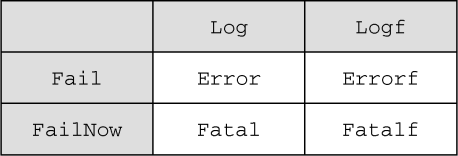

### 8.2　使用Go进行单元测试

顾名思义，单元测试（unit test），就是一种为验证单元的正确性而设置的自动化测试，一个单元就是程序中的一个模块化部分。一般来说，一个单元通常会与程序中的一个函数或者一个方法相对应，但这并不是必须的。程序中的一个部分能否独立地进行测试，是评判这个部分能否被归纳为“单元”的一个重要指标。一个单元通常会接受数据作为输入并返回相应的输出，而单元测试用例要做的就是向单元传入数据，然后检查单元产生的输出是否符合预期。单元测试通常会以测试套件（test suite）的形式运行，后者是为了验证特定行为而创建的单元测试用例集合。

Go的单元测试会按照功能分组，并放置在以 `_test.go` 为后缀的文件当中。作为例子，我们接下来要考虑的是如何对代码清单8-1所示的 `main.go文件` 中的 `decode` 函数进行测试。

代码清单8-1　一个JSON数据解码程序

```go
package main
import (
　"encoding/json"
　"fmt"
　"os"
)
type Post struct {
　Id　　　 int　　　 `json:"id"`
　Content　string　　`json:"content"`
　Author　 Author　　`json:"author"`
　Comments []Comment `json:"comments"`
}
type Author struct {
　Id　 int　　`json:"id"`
　Name string `json:"name"`
}
type Comment struct {
　Id　　　int　　`json:"id"`
　Content string `json:"content"`
　Author　string `json:"author"`
}
func decode(filename string) (post Post, err error) {  ❶
　 jsonFile, err := os.Open(filename)  ❶
　if err != nil {  ❶
　　fmt.Println("Error opening JSON file:", err)  ❶
　　return  ❶
　}  ❶
 defer jsonFile.Close()  ❶
　decoder := json.NewDecoder(jsonFile)  ❶
　err = decoder.Decode(&post)  ❶
　if err != nil {  ❶
　　fmt.Println("Error decoding JSON:", err)  ❶
　　return  ❶
　} ❶
　return ❶
} ❶
func main() { ❶
　_, err := decode("post.json")  ❶
　if err != nil {
　　fmt.Println("Error:", err)
　}
}
```

❶ 将负责解码的代码重构到单独的解码函数中

这个程序复用了之前在代码清单7-8和代码清单7-9中展示过的JSON解码程序，但是它并没有像旧程序那样把所有逻辑都放到 `main` 函数里面，而是将旧程序中负责打开文件并对其进行解码的部分重构到了单独的 `decode` 函数里面，然后再在 `main` 函数中调用 `decode` 函数。需要注意的是，虽然程序员在大部分时间里关注的都是如何编写代码从而实现特性并交付功能，但写出可测试的代码同样也是非常重要的。为了做到这一点，程序员通常需要在编写程序之前对程序的设计进行思考，并把测试看作是软件开发的重要一环，本章稍后将对这一点进行更详细的说明。

代码清单8-2展示了我们将要解码的JSON文件，它跟第7章中被解码的JSON文件是完全一样的。

代码清单8-2　被解码的 `post.json` 文件

```go
{
　"id" : 1,
　"content" : "Hello World!",
　"author" : {
　　"id" : 2,
　　"name" : "Sau Sheong"
　},
　"comments" : [
　　{
　　　"id" : 3,
　　　"content" : "Have a great day!",
　　　"author" : "Adam"
　　},
　　{
　　　"id" : 4,
　　　"content" : "How are you today?",
　　　"author" : "Betty"
　　}
　]
}
```

代码清单8-3展示了负责测试 `main.go文件` 的 `main_test.go文件` 。

代码清单8-3　对 `main.go` 进行测试的 `main_test.go` 文件

```go
 package main ❶
import (
　"testing"
)
func TestDecode(t *testing.T) {
　post, err := decode("post.json")  ❷
　if err != nil {
　　t.Error(err)
　}
　if post.Id != 1 {  ❸
　　t.Error("Wrong id, was expecting 1 but got", post.Id)  ❸
　}  ❸
　if post.Content != "Hello World!" {  ❸
　　t.Error("Wrong content, was expecting 'Hello World!' but got",
　　➥post.Content)
　}
}
func TestEncode(t *testing.T) {
　t.Skip("Skipping encoding for now")  ❹
}
```

❶ 测试文件与被测试的源代码文件位于同一个包内

❷ 调用被测试的函数

❸ 检查结果是否和预期的一样，如果不一样就显示一条出错信息

❹ 暂时跳过对编码函数的测试

这个测试文件与被测试的源码文件位于同一个包内，它唯一导入并使用的包为 `testing` 包。函数 `TestDecode` 是一个测试用例，它代表的是对 `decode` 函数的单元测试。 `TestDecode` 接受一个指向 `testing.T` 结构的指针作为参数，该结构是 `testing` 包中两个主要结构之一，当被测试函数的输出结果未如预期时，用户就可以使用这个结构来产生相应的失败（failure）以及错误（error）。

`testing.T` 结构拥有几个非常有用的函数：

+ `Log` ——将给定的文本记录到错误日志里面，与 `fmt.Println` 类似；
+ `Logf` ——根据给定的格式，将给定的文本记录到错误日志里面，与 `fmt.Printf` 类似；
+ `Fail` ——将测试函数标记为“已失败”，但允许测试函数继续执行；
+ `FailNow` ——将测试函数标记为“已失败”并停止执行测试函数。

除以上4个函数之外， `testing.T` 结构还提供了图8-1所示的一些便利函数（convenience function），这些便利函数都是由以上4个函数组合而成的。


<center class="my_markdown"><b class="my_markdown">图8-1　 `testing.T` 结构提供的各个函数，每个格子都表示一个函数，其中位于白色格子内的函数为便利函数，它们由位于灰色格子内的函数组合而成。例如， `Error` 函数是 `Log` 函数和 `Fail` 函数的组合函数，它在被调用时，会先调用 `Log` 函数，然后再调用 `Fail` 函数</b></center>

在图8-1中，组合函数 `Error` 将会先后调用 `Log` 函数和 `Fail` 函数，而组合函数 `Fatal` 则会先后调用 `Log` 函数和 `FailNow` 函数。

在测试函数 `TestDecode` 内部，程序会正常地调用 `decode` 函数，然后对函数返回的结果进行检查。如果函数返回的结果和预期的结果不一致，那么程序就可以根据情况调用 `Fail` 、 `FailNow` 、 `Error` 、 `Errorf` 或者 `Fatalf` 等函数。正如之前所说， `Fail` 函数在把一个测试用例标记为“已失败”之后，会允许这个测试用例继续执行，但 `FailNow` 函数则会更严格一些——它在把一个测试用例标记为“已失败”之后会立即退出，不再执行这个测试用例的剩余代码。无论是 `Fail` 还是 `FailNow` ，它们都只会对自己所处的测试用例产生影响，比如，在上面的例子中， `TestDecode` 调用的 `Error` 函数就只会对 `TestDecode` 本身产生影响。

为了运行 `TestDecode` 测试用例，我们需要在测试文件 `main_test.go` 所在的目录中执行以下命令：

```go
go test
```

这条命令会执行当前目录中名字以 `_test.go` 为后缀的所有文件。当我们在名为 `unit_testing` 的目录中执行这个命令时，它将产生以下结果：

```go
PASS
ok　　unit_testing　0.004s
```

可惜的是，这个结果并没有给出多少有用的信息。为此，我们可以使用具体（verbose）标志 `-v` 来获得更详细的信息，并通过覆盖率标志 `-cover` 来获知测试用例对代码的覆盖率：

```go
go test –v -cover
```

执行这条命令将得到以下结果：

```go
=== RUN TestDecode
--- PASS: TestDecode (0.00s)
=== RUN TestEncode
--- SKIP: TestEncode (0.00s)
　main_test.go:23: Skipping encoding for now
PASS
coverage: 46.7% of statements
ok　　unit_testing　0.004s
```

