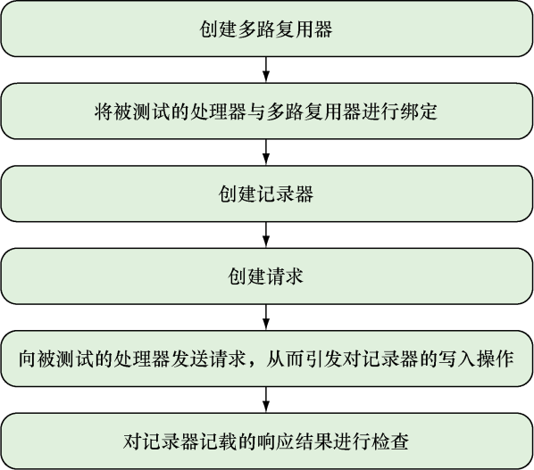

### 8.3　使用Go进行HTTP测试

因为这是一本关于Web编程的书，所以我们除了要学习如何测试普通的Go程序，还需要学习如何测试Go Web应用。测试Go Web应用的方法有很多，但是在这一节中，我们只考虑如何使用Go对Web应用的处理器进行单元测试。

对Go Web应用的单元测试可以通过 `testing/httptest` 包来完成。这个包提供了模拟一个Web服务器所需的设施，用户可以利用 `net/http` 包中的客户端函数向这个服务器发送HTTP请求，然后获取模拟服务器返回的HTTP响应。

为了演示 `httptest` 包的使用方法，我们会复用之前在7.14节展示过的简单Web服务。正如之前所说，这个简单Web服务只拥有一个名为 `handleRequest` 的处理器，它会根据请求使用的HTTP方法，将请求多路复用到相应的处理器函数。举个例子，如果 `handleRequest` 接收到的是一个HTTP  `GET` 请求，那么它会把该请求多路复用到 `handleGet` 函数，代码清单8-8展示了这两个函数的具体定义。

代码清单8-8　负责多路复用请求的处理器以及负责处理请求的 `GET` 处理器函数

```go
func handleRequest(w http.ResponseWriter, r *http.Request) {   ❶
　var err error
　switch r.Method { ❷
 case "GET":
　　err = handleGet(w, r)
　case "POST":
　　err = handlePost(w, r)
　case "PUT":
　　err = handlePut(w, r)
　case "DELETE":
　　err = handleDelete(w, r)
　}
　if err != nil {
　　http.Error(w, err.Error(), http.StatusInternalServerError)
　　return
　}
}
func handleGet(w http.ResponseWriter, r *http.Request) (err error) {
　id, err := strconv.Atoi(path.Base(r.URL.Path))
　if err != nil {
　　return
　}
　post, err := retrieve(id)
　if err != nil {
　　return
　}
　output, err := json.MarshalIndent(&post, "", "\t\t")
　if err != nil {
　　return
　}
　w.Header().Set("Content-Type", "application/json")
　w.Write(output)
　return
}
```

❶ handleRequest 将根据请求使用的HTTP 方法对其进行多路复用

❷ 根据请求使用的HTTP 方法，调用相应的处理器 函数

代码清单8-9展示了一个通过HTTP  `GET` 请求对简单Web服务进行单元测试的例子，而图8-2则展示了这个程序的整个执行过程。

代码清单8-9　使用GET请求进行测试

```go
package main
import (
　"encoding/json"
　"net/http"
　"net/http/httptest"
　"testing"
)
func TestHandleGet(t *testing.T) {
　mux := http.NewServeMux()  ❶
　mux.HandleFunc("/post/", handleRequest) ❷
　writer := httptest.NewRecorder() ❸
　request, _ := http.NewRequest("GET", "/post/1", nil) ❹
　mux.ServeHTTP(writer, request) ❺
　if writer.Code != 200 { ❻
　　t.Errorf("Response code is %v", writer.Code)
　}
　var post Post
　json.Unmarshal(writer.Body.Bytes(), &post)
　if post.Id != 1 {
　　t.Error("Cannot retrieve JSON post")
　}
}
```

❶ 创建一个用于运行测试的多路复用器

❷ 绑定想要测试的处理器

❸ 创建记录器，用于获取服务器返回的HTTP 响应

❹ 为被测试的处理器创建相应的请求

❺ 向被测试的处理器发送请求

❻ 对记录器记载的响应结果进行检查

因为每个测试用例都会独立运行并启动各自独有的用于测试的Web服务器，所以程序需要创建一个多路复用器并将  `handleRequest`  处理器与其进行绑定。除此之外，为了获取服务器返回的HTTP响应，程序使用 `httptest.New`  Recorder函数创建了一个 `ResponseRecorder` 结构，这个结构可以把响应存储起来以便进行后续的检查。

与此同时，程序还需要调用 `http.NewRequest` 函数，并将请求使用的HTTP方法、被请求的URL以及可选的HTTP请求主体传递给该函数，从而创建一个HTTP请求（在第3章和第4章，我们讨论的是如何分析一个HTTP请求，而创建HTTP请求正好就是分析HTTP请求的逆操作）。


<center class="my_markdown"><b class="my_markdown">图8-2　使用Go的 `httptest` 包进行HTTP测试的具体步骤</b></center>

程序在创建出相应的记录器以及HTTP请求之后，就会使用 `ServeHTTP` 把它们传递给多路复用器。多路复用器 `handleRequest` 在接收到请求之后，就会把请求转发给 `handleGet` 函数，然后由 `handleGet` 函数对请求进行处理，并最终返回一个HTTP响应。跟一般服务器不同的是，模拟服务器的多路复用器不会把处理器返回的响应发送至浏览器，而是会把响应推入响应记录器里面，从而使测试程序可以在之后对响应的结果进行验证。测试程序最后的几行代码非常容易看懂，它们要做的就是对响应进行检查，看看处理器返回的结果是否跟预期的一样，并在出现意料之外的结果时，像普通的单元测试那样抛出一个错误。

因为这些操作看上去都非常简单，所以不妨让我们再来看另一个例子——代码清单8-10展示了如何为 `PUT` 请求创建一个测试用例。

代码清单8-10　对 `PUT` 请求进行测试

```go
func TestHandlePut(t *testing.T) {
　mux := http.NewServeMux()
　mux.HandleFunc("/post/", handleRequest)
　writer := httptest.NewRecorder()
　json := strings.NewReader(`{"content":"Updated post","author":"Sau
　Sheong"}`)
　request, _ := http.NewRequest("PUT", "/post/1", json)
　mux.ServeHTTP(writer, request)
　if writer.Code != 200 {
　　t.Errorf("Response code is %v", writer.Code)
　}
}
```

正如代码所示，这次的测试用例除了需要向请求传入JSON数据，跟之前展示的测试用例并没有什么特别大的不同。除此之外你可能会注意到，上述两个测试用例出现了一些完全相同的代码。为了保持代码的简洁性，我们可以把一些重复出现的测试代码以及其他测试夹具（fixture）代码放置到一个预设函数（setup function）里面，然后在运行测试之前执行这个函数。

Go的 `testing` 包允许用户通过 `TestMain` 函数，在进行测试时执行相应的预设（setup）操作或者拆卸（teardown）操作。一个典型的 `TestMain` 函数看上去是下面这个样子的：

```go
func TestMain(m *testing.M) {
　setUp()
　code := m.Run()
　tearDown()
　os.Exit(code)
}
```

`setUp` 函数和 `tearDown` 函数分别定义了测试在预设阶段以及拆卸阶段需要执行的工作。需要注意的是， `setUp` 函数和 `tearDown` 函数是为所有测试用例设置的，它们在整个测试过程中只会被执行一次，其中 `setUp` 函数会在所有测试用例被执行之前执行，而 `tearDown` 函数则会在所有测试用例都被执行完毕之后执行。至于测试程序中的各个测试用例，则由 `testing.M` 结构的 `Run` 方法负责调用，该方法在执行之后将返回一个退出码（exit code），用户可以把这个退出码传递给 `os.Exit` 函数。

代码清单8-11展示了测试程序使用 `TestMain` 函数之后的样子。

代码清单8-11　使用 `httptest` 包的 `TestMain` 函数

```go
package main
import (
　"encoding/json"
　"net/http"
　"net/http/httptest"
　"os"
　"strings"
　"testing"
)
var mux *http.ServeMux
var writer *httptest.ResponseRecorder
func TestMain(m *testing.M) {
　setUp()
　code := m.Run()
　os.Exit(code)
}
func setUp() {
　mux = http.NewServeMux()
　mux.HandleFunc("/post/", handleRequest)
　writer = httptest.NewRecorder()
}
func TestHandleGet(t *testing.T) {
　request, _ := http.NewRequest("GET", "/post/1", nil)
　mux.ServeHTTP(writer, request)
　if writer.Code != 200 {
　　t.Errorf("Response code is %v", writer.Code)
　}
　var post Post
　json.Unmarshal(writer.Body.Bytes(), &post)
　if post.Id != 1 {
　　t.Errorf("Cannot retrieve JSON post")
　}
}
func TestHandlePut(t *testing.T) {
　json := strings.NewReader(`{"content":"Updated post","author":"Sau
　Sheong"}`)
　request, _ := http.NewRequest("PUT", "/post/1", json)
　mux.ServeHTTP(writer, request)
　if writer.Code != 200 {
　　t.Errorf("Response code is %v", writer.Code)
　}
}
```

更新后的测试程序把每个测试用例都会用到的全局变量放到了 `setUp` 函数中，这一修改不仅让测试用例函数变得更加紧凑，而且还把所有与测试用例有关的预设操作都集中到了一起。但是，因为这个程序在测试之后不需要进行任何收尾工作，所以它没有配置相应的拆卸函数：当所有测试用例都运行完毕之后，测试程序就会直接退出。

上面展示的代码只测试了Web服务的多路复用器以及处理器，但它并没有测试Web服务的另一个重要部分。你也许还记得，在本书的第7章中，我们曾经从Web服务中抽离出了数据层，并将所有数据操作代码都放置到了 `data.go文件` 中。因为测试 `handleGet` 函数需要调用 `Post` 结构的 `retrieve` 函数，而测试 `handlePut` 函数则需要调用 `Post` 结构的 `retrieve` 函数以及 `update` 函数，所以上述测试程序在对简单Web服务进行单元测试时，实际上是在对数据库中的数据执行获取操作以及修改操作。

因为被测试的操作涉及依赖关系，所以上述单元测试实际上并不是独立进行的，为了解决这个问题，我们需要用到下一节介绍的技术。

