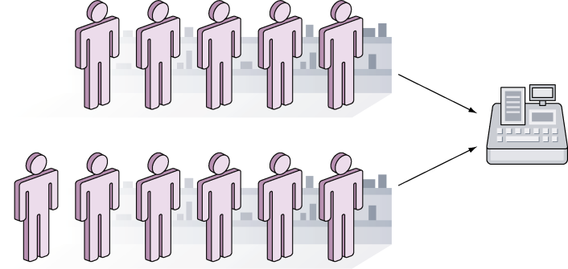
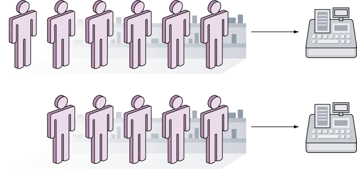

### 9.1　并发与并行的区别

并发（concurrency）指的是两个或多个任务在同一时间段内启动、运行并结束，并且这些任务可能会互动。以并发形式执行的多个任务会同时存在，这跟顺序执行每次只会存在一个任务的情况正好相反。并发是一个非常庞大且复杂的主题，本章将会简单介绍这一主题。

并行与并发是两个看上去相似但实际上却截然不同的概念，因为并发和并行都可以同时运行多个任务，所以很多人都把这两个概念混淆了。对于并发来说，多个任务并不需要同时开始或者同时结束——这些任务的执行过程在时间上是相互重叠的。并发执行的多个任务会被调度，并且它们会通过通信分享数据并协调执行时间（不过这种通信并不是必需的）。

在并行（parallelism）中，多个任务将同时启动并执行。并行通常会把一个大任务分割成多个更小的任务，然后通过同时执行这些小任务来提高性能。并行通常需要独立的资源（如CPU），而并发则会使用和分享相同的资源。因为并行考虑的是同时启动和执行多个任务，所以它在直觉上会更易懂一些。并行，正如它的名字所昭示的那样，是一系列相互平行、不会重叠的处理过程。

> 并发指的是同时处理多项任务，而并行指的是同时执行多项任务。
> ——Rob Pike，Go语言的作者之一

理解并发的另一种方法是把它看作超市里的两条结账通道，但这两条通道上的顾客需要在一个收银台排队等候，并轮流使用这个收银台结账，如图9-1所示。

<b class="my_markdown">图9-1　并发——两条结账通道，但是只有一个收银台</b>

另一方面，并行同样拥有两条结账通道，只是每条通道都有一个对应的收银台为顾客服务，如图9-2所示。

<b class="my_markdown">图9-2　并行——两条结账通道，每条都对应一个收银台</b>

尽管并发和并行在概念上并不相同，但它们并不相互排斥，比如Go语言就可以创建出同时具有并发和并行这两种特征的程序。为了让并行程序可以同时运行多个任务，Go语言的用户需要将环境变量 `GOMAXPROCS` 的值设置成大于 `1` 。在Go 1.5版本之前， `GOMAXPROCS` 默认会被设置为 `1` ，但是从Go 1.5版本开始， `GOMAXPROCS` 默认将被设置为系统可用的CPU数量。但是，并发程序可以在单个CPU上运行，至于程序包含的多个任务则会通过调度独立地运行，本章稍后就会出现一个这样的例子。需要注意的是，尽管Go语言可以用于创建并行程序，但这门语言在设计时考虑的更多是并发而不是并行。

Go语言通过goroutine和通道这两个主要组件来为并发提供支持，在接下来几节中，我们将会看到使用goroutine、通道以及一些标准库来构建并发程序的具体方法。

