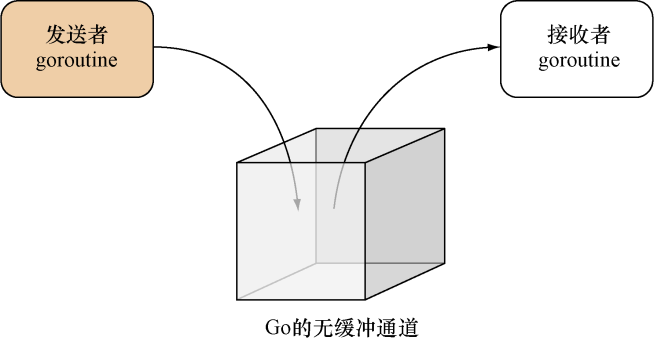

### 9.3　通道

在前一节，我们学习了如何通过 `go` 关键字，把普通函数转换为goroutine以便让其独立运行，并在9.2.2节学习了如何通过等待组来同步独立运行的多个goroutine。在这一节，我们将要学习的是，如何使用通道在多个不同的goroutine之间通信。

通道就像是一个箱子，不同的goroutine可以通过这个箱子与其他goroutine通信：如果一个goroutine想要把一项信息传递给另一个goroutine，那么它就必须把该信息放置到箱子里，然后另一个goroutine则负责从箱子里取出被放置的信息，就像图9-3所示的那样。


<center class="my_markdown"><b class="my_markdown">图9-3　把Go的无缓冲通道看作是一个箱子</b></center>

通道（channel）是一种带有类型的值（typed value），它可以让不同的goroutine互相通信。通道用 `make` 函数创建，该函数在被调用之后将返回一个指向底层数据结构的引用作为结果值。比如，以下代码就展示了如何创建一个由整数组成的通道：

```go
ch := make(chan int)
```

`make` 函数默认创建的都是无缓冲通道（unbuffered channel），如果用户在创建通道时，向 `make` 函数提供了可选的第三个整数参数，那么 `make` 函数将创建出一个带有给定大小的有缓冲通道（buffered channel）。比如说，以下代码就会创建出一个大小为10的整数有缓冲通道：

```go
ch := make(chan int, 10)
```

无缓冲通道是同步的，它就像是一个每次只能容纳一件物体的箱子：当一个goroutine把一项信息放入无缓冲通道之后，除非有某个goroutine把这项信息取走，否则其他goroutine将无法再向这个通道放入任何信息。这也意味着，如果一个goroutine想要向一个已经包含了某项信息的无缓冲通道再放入一项信息，那么这个goroutine将被阻塞并进入休眠状态，直到该通道变空为止。

同样地，如果一个goroutine尝试从一个并没有包含任何信息的无缓冲通道中取出一项信息，那么这个goroutine将会被阻塞并进入休眠状态，直到通道不再为空为止。

将信息放入通道的语法是非常直观的，比如，通过执行以下语句，我们可以把数字 `1` 放入通道 `ch` 里面：

```go
ch <- 1
```

从通道里面取出信息的语法同样非常直观，比如，通过执行以下语句，我们可以从通道 `ch` 里面移除一个值，并将该值赋值给变量 `i` ：

```go
i := <- ch
```

通道可以是定向的（directional）。在默认情况下，通道将以双向的（bidirectional）形式运作，用户既可以把值放入通道，也可以从通道取出值；但是，通道也可以被限制为只能执行发送操作（send-only）或者只能执行接收操作（receive-only）。比如，以下语句就展示了如何创建一个只能执行发送操作的字符串通道：

```go
ch := make(chan <- string)
```

而以下语句则展示了如何创建一个只能执行接收操作的字符串通道：

```go
ch := make(<-chan string)
```

用户除了可以直接创建定向的通道之外，还可以把一个双向通道转变为定向通道，我们将会在本章的末尾看到一个这样的例子。

