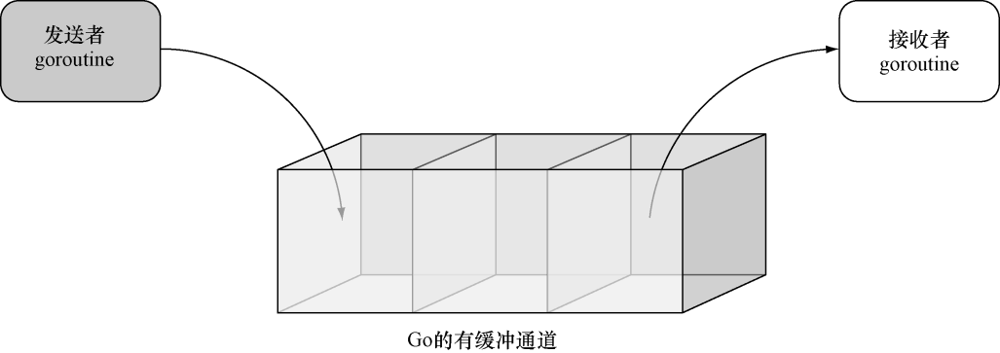

### 9.3.3　有缓冲通道

无缓冲通道或者说同步通道（synchronous channel）使用起来非常简单，而与之相对的有缓冲通道则更复杂一些，后者是一种异步的、先进先出消息队列。如图9-4所示，有缓冲通道就像是一个能够容纳多个同类信息的大箱子：一个goroutine可以持续地向箱子里面推入信息，并且在箱子被填满之前，推入信息的goroutine都不会被阻塞；同样地，一个goroutine可以按照信息被推入的顺序，持续地从箱子里取出信息，并且在箱子被掏空之前，取出信息的goroutine都不会被阻塞。


<center class="my_markdown"><b class="my_markdown">图9-4　将Go的有缓冲通道看作是一个箱子</b></center>

接下来，就让我们看看有缓冲通道在投掷器和捕捉器的例子中是如何运作的。为此，我们需要对代码清单9-8中，以下这个创建无缓冲通道的语句进行修改：

```go
c := make(chan int)
```

让它转而创建一个大小为3的有缓冲通道：

```go
c := make(chan int, 3)
```

运行修改后的程序，我们将得到以下结果：

```go
Threw　>> 0
Threw　>> 1
Threw　>> 2
Caught << 0
Caught << 1
Caught << 2
Threw　>> 3
Threw　>> 4
Caught << 3
Caught << 4
```

从输出结果可以看到，投掷器将一直向通道推入数字，直到通道被填满并将其阻塞为止，而捕捉器则会按顺序从通道里取出被推入的数字。如果你在解决某个问题的时候，只有有限数量的工作进程可用，并且你打算限制传入请求的数量，那么有缓冲通道将是一种非常合适的工具。

