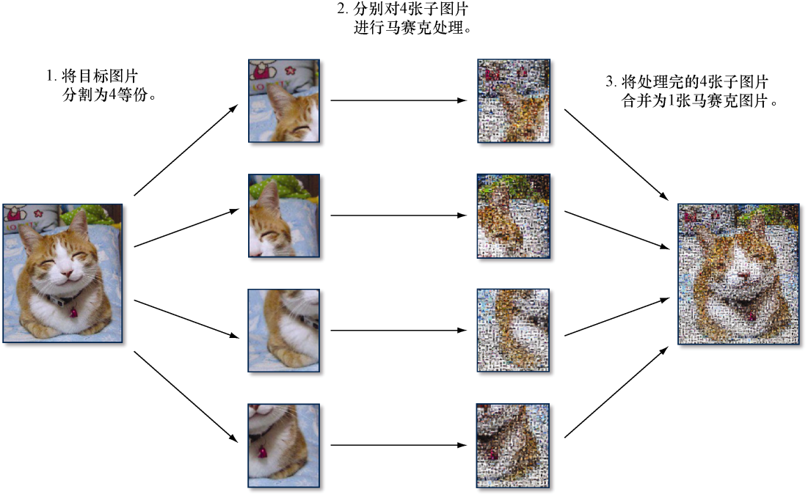
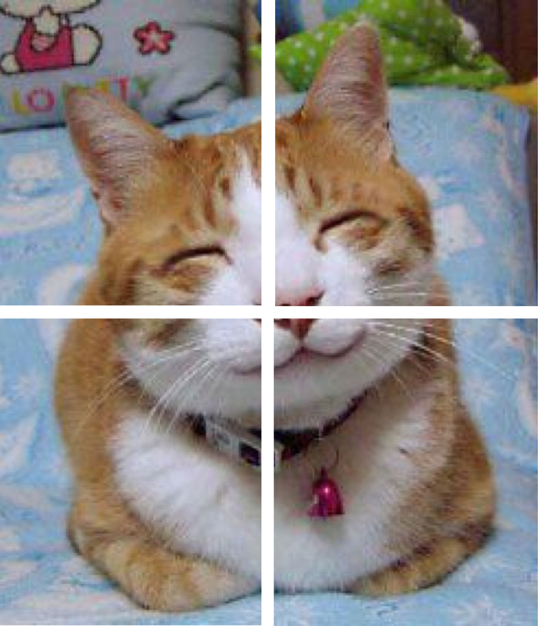
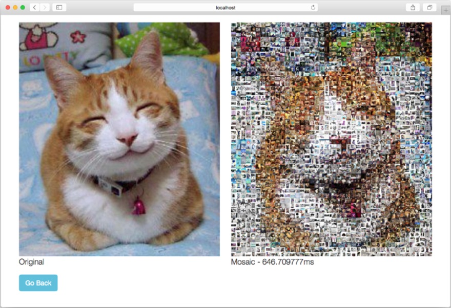
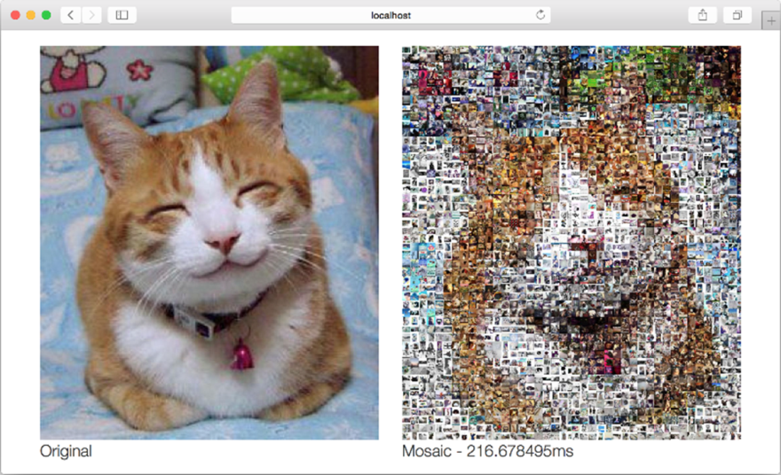

### 9.4.3　并发版马赛克图片生成Web应用

并发的一个常见用途是提高性能。上一节展示的Web应用在为151 KB大小的JPEG图片创建马赛克图片时需要耗费2.25 s，它的性能并不值得称道，但我们可以通过并发来提高它的性能。具体来说，我们将使用以下算法来构建一个并发版本的马赛克图片生成Web应用：

（1）将用户上传的目标图片分割为4等份；

（2）同时对被分割的4张子图片进行马赛克处理；

（3）将处理完的4张子图片重新合并为1张马赛克图片。

图9-6以图示的方式描述了上述步骤。


<center class="my_markdown"><b class="my_markdown">图9-6　能够更快地生成马赛克图片的并发算法</b></center>

需要注意的是，这个算法并不是提高性能的唯一方法，也不是实现并发版本的唯一方法，但它是一个相对来说比较简单直接的方法。

为了实现这个并发算法，我们需要对 `mosaic` 处理器函数做一些修改。之前展示的程序只有 `mosaic` 这一个创建马赛克图片的处理器函数，但是对并发版的Web应用来说，我们需要从 `mosaic` 函数中分离出 `cut` 和 `combine` 这两个独立的函数，然后再在 `mosaic` 函数中调用它们。代码清单9-18展示了修改后的 `mosaic` 函数。

代码清单9-18　并发版的 `mosaic` 处理器函数

```go
func mosaic(w http.ResponseWriter, r *http.Request) {
　t0 := time.Now()
　r.ParseMultipartForm(10485760) // max body in memory is 10MB
　file, _, _ := r.FormFile("image")
　defer file.Close()
　tileSize, _ := strconv.Atoi(r.FormValue("tile_size"))
　original, _, _ := image.Decode(file)
　bounds := original.Bounds()
　db := cloneTilesDB()
　c1 := cut(original, &db, tileSize, bounds.Min.X, bounds.Min.Y,
　➥bounds.Max.X/2, bounds.Max.Y/2)❶
　c2 := cut(original, &db, tileSize, bounds.Max.X/2, bounds.Min.Y,
　➥bounds.Max.X, bounds.Max.Y/2)❶
　c3 := cut(original, &db, tileSize, bounds.Min.X, bounds.Max.Y/2,
　➥bounds.Max.X/2, bounds.Max.Y)❶
　c4 := cut(original, &db, tileSize, bounds.Max.X/2, bounds.Max.Y/2,
　➥bounds.Max.X, bounds.Max.Y)❶
　c := combine(bounds, c1, c2, c3, c4) ❷
　buf1 := new(bytes.Buffer)
　jpeg.Encode(buf1, original, nil)
　originalStr := base64.StdEncoding.EncodeToString(buf1.Bytes())
　t1 := time.Now()
　images := map[string]string{
　　"original": originalStr,
　　"mosaic":　 <-c,
　　"duration": fmt.Sprintf("%v ", t1.Sub(t0)),
　}
　t, _ := template.ParseFiles("results.html")
　t.Execute(w, images)
}
```

❶ 以扇形散开方式分割图片以便单独进行处理

❷ 以扇形聚拢方式将多个子图片合并成一个完整的图片

`cut` 函数会以扇形散开（fan-out）模式将目标图片分割为多个子图片，如图9-7所示。


<center class="my_markdown"><b class="my_markdown">图9-7　将目标图片分割为4等份</b></center>

用户上传的目标图片将被分割为4等份以便独立处理。注意，在 `mosaic` 函数里，程序调用的都是普通函数而不是goroutine，这是因为程序的并发部分存在于被调用函数的内部： `cut` 函数会在内部以goroutine方式执行一个匿名函数，而这个匿名函数则会返回一个通道作为结果。

需要注意的是，因为我们正在尝试将一个程序转换为相应的并发版本，而并发程序通常都需要同时运行多个goroutine，所以如果程序需要在这些goroutine之间共享一些资源，那么针对这些资源的修改将有可能会导致竞争条件出现。

竞争条件

> 如果一个程序在执行时依赖于特定的顺序或时序，但是又无法保证这种顺序或时序，此时就会存在竞争条件（race condition）。竞争条件的存在将导致程序的行为变得飘忽不定而且难以预测。
> 竞争条件通常出现在那些需要修改共享资源的并发程序当中。当有两个或多个进程或线程同时去修改一项共享资源时，最先访问资源的那个进程/线程将得到预期的结果，而其他进程/线程则不然。最终，因为程序无法判断哪个进程/线程最先访问了资源，所以它将无法产生一致的行为。
> 虽然竞争条件一般都不太好发现，但修复一个已判明的竞争条件通常来说并不是一件难事。

本节介绍的马赛克图片生成Web应用同样也拥有共享资源：用户在将目标图片上传至Web应用之后， `nearest`  函数就会从瓷砖图片数据库中寻找与之最为匹配的瓷砖图片，并从数据库中移除被选中的图片以防相同的图片重复出现。这就意味着，如果多个 `cut` 函数中的goroutine同时找到了同一瓷砖图片作为最佳匹配结果，就会产生一个竞争条件。

为了消除这一竞争条件，我们可以使用一种名为互斥（mutual exclusion，简称“mutex”）的技术，该技术可以将同一时间内访问临界区（critical section）的进程数量限制为一个。对马赛克图片生成Web应用来说，我们需要在 `nearest` 函数中实现互斥，以此来保证同一时间内只能有一个goroutine对瓷砖图片数据库进行修改。

为了满足这一点，程序需要用到Go标准库 `sync` 包中的 `Mutex` 结构。首先要做的是定义一个 `DB` 结构，并在该结构中封装实际的瓷砖图片数据库以及 `mutex` 标志，具体如代码清单9-19所示。

代码清单9-19　 `DB` 结构

```go
type DB struct {
　mutex *sync.Mutex
　store map[string][3]float64
}
```

接着，如代码清单9-20所示，将 `nearest` 函数修改为 `DB` 结构的一个方法。

代码清单9-20　 `nearest` 方法

```go
func (db *DB) nearest(target [3]float64) string {
　var filename string
　db.mutex.Lock() ❶
　smallest := 1000000.0
　for k, v := range db.store {
　　dist := distance(target, v)
　　if dist < smallest {
　　　filename, smallest = k, dist
　　}
　}
　delete(db.store, filename)
　db.mutex.Unlock() ❷
　return filename
}
```

❶ 通过加锁设置mutex 标志

❷ 通过解锁移除mutex 标志

需要注意的是，因为在从数据库里移除被选中的图片之前，多个goroutine还是有可能会把相同的瓷砖图片设置为最佳的匹配结果，所以只锁住 `delete` 函数是无法移除竞争条件的，因此修改后的 `nearest` 函数将把寻找最佳匹配瓷砖图片的整个区域（section）都锁住。

代码清单9-21展示了 `cut` 函数的具体代码。

代码清单9-21　 `cut` 函数

```go
func cut(original image.Image, db *DB, tileSize, x1, y1, x2, y2 int) <-chan
　    image.Image { ❶
　c := make(chan image.Image) ❷
　sp := image.Point{0, 0}
　go func() { ❸
　　newimage := image.NewNRGBA(image.Rect(x1, y1, x2, y2))
　　for y := y1; y < y2; y = y + tileSize {
　　　for x := x1; x < x2; x = x + tileSize {
　　　　r, g, b, _ := original.At(x, y).RGBA()
　　　　color := [3]float64{float64(r), float64(g), float64(b)}
　　　　nearest := db.nearest(color) ❹
　　　　file, err := os.Open(nearest)
　　　　if err == nil {
　　　　　img, _, err := image.Decode(file)
　　　　　if err == nil {
　　　　　　t := resize(img, tileSize)
　　　　　　tile := t.SubImage(t.Bounds())
　　　　　　tileBounds := image.Rect(x, y, x+tileSize, y+tileSize)
　　　　　　draw.Draw(newimage, tileBounds, tile, sp, draw.Src)
　　　　　} else {
　　　　　　fmt.Println("error:", err)
　　　　　}
　　　　} else {
　　　　　fmt.Println("error:", nearest)
　　　　}
　　　　file.Close()
　　　}
　　}
　　c <- newimage.SubImage(newimage.Rect)
　}()
　return c
}
```

❶ 把指向 DB 结构的引用传递给DB结构，而不是仅仅传入一个映射

❷ 这个通道将作为函数的执行结果返回给调用者

❸ 创建匿名的goroutine

❹ 调用DB 结构的nearest 方法来获取最匹配的瓷砖图片

并发版的马赛克图片生成Web应用跟原来的非并发版本拥有相同的逻辑：它首先在 `cut` 函数里创建一个通道，并启动一个匿名goroutine来计算将要被发送至该通道的马赛克处理结果，接着再把这个通道返回给 `cut` 函数的调用者。这样一来， `cut` 函数创建的通道就会立即返回给 `mosaic` 处理器函数，而通道对应的马赛克子图片则会在处理完毕之后被发送至通道。另外需要注意的是，虽然  `cut`  函数创建的是一个双向通道，但是如果需要，我们也可以在返回这个通道之前，通过类型转换（typecast）将它转换成一个只能接收信息的单向通道。

在把用户上传的目标图片分割为4等份并将它们分别转换为马赛克图片的一部分之后，程序接下来就会调用代码清单9-22所示的 `combine` 函数，通过扇形聚拢（fan-in）模式，将4张子图片重新合并成1张完整的马赛克图片。

代码清单9-22　 `combine` 函数

```go
func combine(r image.Rectangle, c1, c2, c3, c4 <-chan image.Image)
<-chan string {
　c := make(chan string) ❶
　go func() { ❷
　　var wg sync.WaitGroup ❸
　　img:= image.NewNRGBA(r)
　　copy := func(dst draw.Image, r image.Rectangle,
src image.Image, sp image.Point) {
　　　draw.Draw(dst, r, src, sp, draw.Src)
　　　wg.Done() ❹
　　}
  　 wg.Add(4)  ❺
　　var s1, s2, s3, s4 image.Image
　　var ok1, ok2, ok3, ok4 bool
　　for { ❻
　　　select { ❼
　　　case s1, ok1 = <-c1:
　　　　go copy(img, s1.Bounds(), s1,
　　　　　image.Point{r.Min.X, r.Min.Y})
　　　case s2, ok2 = <-c2:
　　　　go copy(img, s2.Bounds(), s2,
image.Point{r.Max.X / 2, r.Min.Y})
　　　case s3, ok3 = <-c3:
　　　　go copy(img, s3.Bounds(), s3,
image.Point{r.Min.X, r.Max.Y/2})
　　　case s4, ok4 = <-c4:
　　　　go copy(img, s4.Bounds(), s4,
image.Point{r.Max.X / 2, r.Max.Y / 2})
　　　}
　　　if (ok1 && ok2 && ok3 && ok4) { ❽
　　　　break
　　　}
　　}
   　 wg.Wait()  ❾
　　 buf2 := new(bytes.Buffer)
　　jpeg.Encode(buf2, img, nil)
　　c <- base64.StdEncoding.EncodeToString(buf2.Bytes())
　}()
　return c
}
```

❶ 这个函数将返回一个通道作为执行结果

❷ 创建一个匿名goroutine

❸ 使用等待组去同步各个子图片的复制操作

❹ 每复制完一张子图片，就对计数器执行一次减一操作

❺ 把等待组计数器的值设置为4

❻ 在一个无限循环里面等待所有复制操作完成

❼ 等待各个通道的返回值

❽ 当所有通道都被关闭之后，跳出循环

❾ 阻塞直到所有子图片的复制操作都执行完毕为止

跟  `cut`  函数一样，合并多张子图片的主要逻辑也放到了匿名goroutine中，并且这些goroutine同样会创建并返回一个只能执行接收操作的通道作为结果。这样一来，程序就可以在编码目标图片的同时，对马赛克图片的4个部分进行合并。

在 `combine` 函数创建的匿名goroutine里，程序会构建另一个匿名函数，并将其赋值给变量 `copy` 。 `copy` 函数之后同样会以goroutine方式运行，并将给定的马赛克子图片复制到最终的马赛克图片中。与此同时，因为程序无法得知以goroutine方式运行的 `copy` 函数将于何时结束，所以它使用了等待组来同步这些复制操作。程序首先创建一个 `WaitGroup` 变量 `wg` ，并使用 `Add` 方法将计数器的值设置为 `4` 。之后，每当一个复制操作执行完毕的时候， `copy` 函数都会调用 `Done` 方法，把等待组计数器的值减1。最后，程序把一个 `Wait` 方法调用放在了最终生成的马赛克图片的编码操作之前，以此来保证程序只会在所有复制goroutine都已执行完毕，并且程序已经拥有了完整的最终马赛克图片之后，才会开始对图片进行编码。

一个需要注意的地方是， `combine` 函数接受的输入包含了4个来自 `cut` 函数的通道，这些通道包含了马赛克图片的各个组成部分，并且程序不知道这些部分何时才会通过通道传输过来。虽然程序可以按顺序一个接一个从这些通道里接收信息，但这种做法并不符合并发程序的风格。为此，程序使用了 `select` 方法，以先到先服务的方式来接收这些通道发送的信息。

这样做的结果是，程序会在一个无限循环里面进行迭代，并且每次迭代都会使用 `select` 去获取其中一个已就绪通道传送的子图片（如果同时有多个子图片可用，那么Go将随机选择其中一个），然后以goroutine方式执行 `copy` 函数，将接收到的子图片复制到最终生成的马赛克图片当中。因为程序使用了多值格式（multivalue format）来接收通道的返回值，而通道的第二个返回值（即 `ok1` 、 `ok2` 、 `ok3` 和 `ok4` ）可以说明程序是否已经成功地接收了各个通道传送的子图片，所以在无限循环的末尾，程序会通过检测这些返回值来决定是否跳出循环。

因为程序在接收到所有子图片之后，还需要在4个goroutine里分别复制这些子图片，而这些复制操作的完成时间是不确定的。为了解决这个问题，程序会调用之前定义的等待组变量 `wg` 的 `Wait` 方法，对最终生成的马赛克图片的编码操作进行阻塞，直到上述复制操作全部执行完毕为止。

现在，我们终于拥有了一个并发版的马赛克图片生成Web应用，接下来是时候运行一下它了。首先，假设程序位于 `mosaic_concurrent` 目录当中，那么在使用 `go build` 构建该程序之后，我们可以通过执行以下命令，使用单个CPU去运行它：

```go
GOMAXPROCS=1 ./mosaic_concurrent
```

如果一切正常，将会看到图9-8所示的结果，生成这个结果时使用的目标图片以及瓷砖图片跟之前运行非并发版本时是完全一样的。

由于并发版程序在将4张子图片合并成1张完整的马赛克图片的时候，没有对子图片的毛边进行平滑处理，所以如果你仔细对比就会发现，这次生成的马赛克图片跟之前非并发版本生成的马赛克图片是有一点细微区别的（从彩色显示的电子书上会更为明显地看出这一点）。尽管生成的马赛克图片有些细微的不同，但并发版程序的性能提升是非常明显的——非并发版的马赛克图片生成Web应用处理相同的目标图片耗费了2.25 s，而并发版本只耗费了646 μs，后者的性能比前者提高了几乎有4倍之多。


<center class="my_markdown"><b class="my_markdown">图9-8　并发版的马赛克照片生成Web应用</b></center>

初看上去，我们所做的似乎只是将一个函数分割成4个独立运行的goroutine，以此来实现一个并发版本的Web程序，但如果我们再进一步，以并行的方式去运行这个程序，结果又会如何呢？

别忘了，在前面的程序中，我们不仅将一个运行非常耗时的处理器函数分割成了几个独立运行的 `cut` 函数goroutine，而且我们还在 `combine` 函数里使用多个goroutine来独立地组合马赛克图片的各个部分。每当一个 `cut` 函数完成了它的工作之后，它就会将处理的结果发送给与之对应的 `combine` 函数，而后者则会将这一结果复制到最终生成的马赛克图片当中。

除此之外，别忘了，在前面运行非并发版本和并发版本的马赛克图片生成Web应用时，我们都只使用了一个CPU。正如之前所说，并发不是并行——本节前面的内容已经展示了如何将一个简单的算法分解为相应的并发版本，其中不涉及任何并行计算：尽管这些goroutine能够以并发方式运行，但是因为只有一个CPU可用，所以这些goroutine实际上并没有以并行的方式运行。

为了让故事有一个圆满的结局，现在我们可以通过执行以下命令，以并行的方式，在多个CPU以及进程上运行并发版的马赛克图片生成Web应用：

```go
./mosaic_concurrent
```

图9-9展示了上述命令的执行结果。

正如结果中打印的时间所示，并行运行的并发程序比单纯的并发程序又获得了大约3倍的性能提升，具体时间从原来的646 μs减少到了现在的216 μs！如果我们把这一结果跟最初的非并发版本所需的2.25 s相比，那么新程序的性能提升足有10倍之多。

对马赛克图片生成Web应用来说，非并发版本跟并发版本使用的图片处理算法是完全相同的。实际上，两个版本的 `mosaic.go` 源码文件差别并不大，它们之间的主要区别在于是否使用了并发特性，这是提高程序性能的关键。


<center class="my_markdown"><b class="my_markdown">图9-9　使用8个CPU运行并发版的马赛克图片生成Web应用</b></center>

完成了马赛克图片生成Web应用之后，在接下来的一章，我们要考虑的就是如何部署Web应用和Web服务了。

