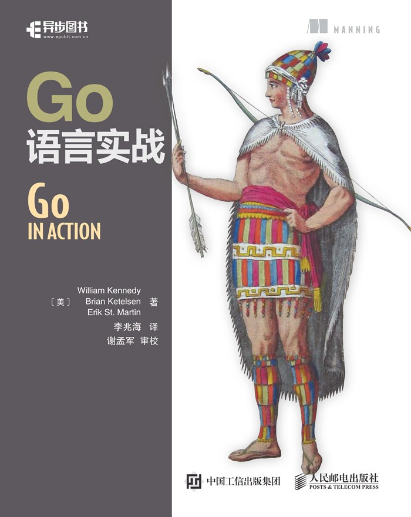

# 版权信息

书名：Go语言实战

ISBN：978-7-115-44535-3

**本书由人民邮电出版社发行数字版。版权所有，侵权必究。**

您购买的人民邮电出版社电子书仅供您个人使用，未经授权，不得以任何方式复制和传播本书内容。

我们愿意相信读者具有这样的良知和觉悟，与我们共同保护知识产权。

如果购买者有侵权行为，我们可能对该用户实施包括但不限于关闭该帐号等维权措施，并可能追究法律责任。

•　著　　　　[美] William Kennedy Brian Ketelsen Erik St. Martin

译　　　　李兆海

审　　校　谢孟军

责任编辑　杨海玲

•　人民邮电出版社出版发行　　北京市丰台区成寿寺路11号

邮编　100164 　电子邮件　315@ptpress.com.cn

网址　<a class="my_markdown" href="['http://www.ptpress.com.cn']">http://www.ptpress.com.cn</a>

•　读者服务热线：(010)81055410

反盗版热线：(010)81055315

