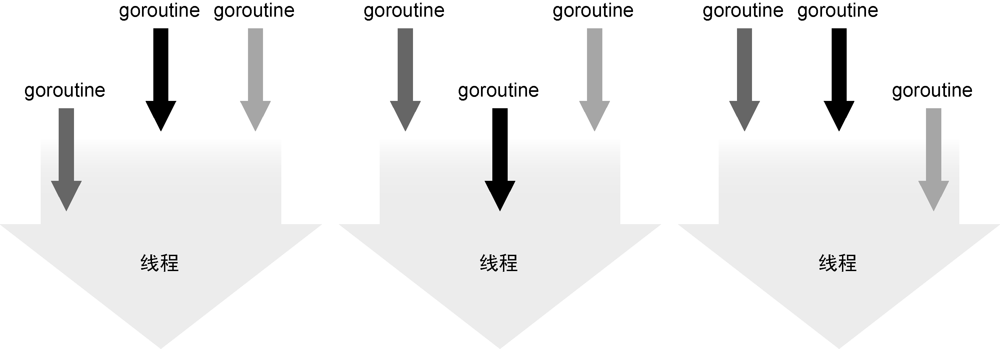
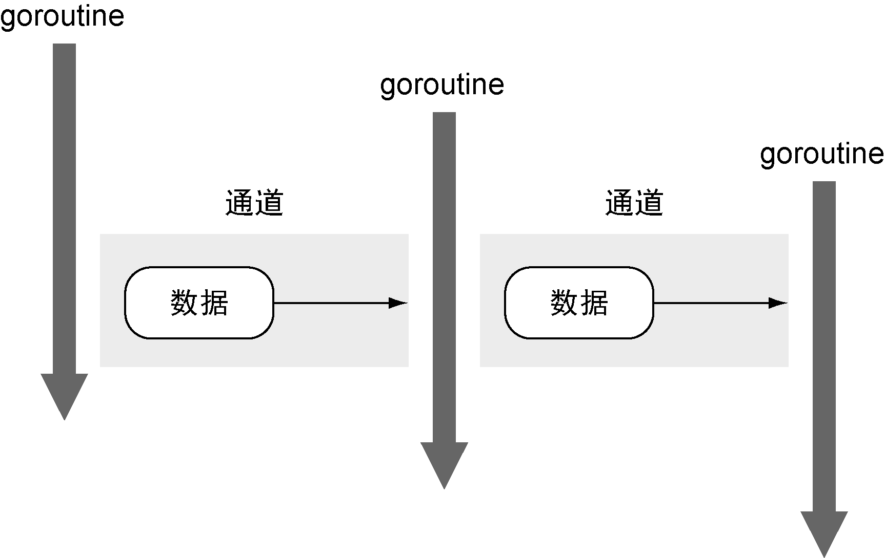

### 1.1.2　并发

作为程序员，要开发出能充分利用硬件资源的应用程序是一件很难的事情。现代计算机都拥有多个核，但是大部分编程语言都没有有效的工具让程序可以轻易利用这些资源。这些语言需要写大量的线程同步代码来利用多个核，很容易导致错误。

Go语言对并发的支持是这门语言最重要的特性之一。goroutine很像线程，但是它占用的内存远少于线程，使用它需要的代码更少。通道（channel）是一种内置的数据结构，可以让用户在不同的goroutine之间同步发送具有类型的消息。这让编程模型更倾向于在goroutine之间发送消息，而不是让多个goroutine争夺同一个数据的使用权。让我们看看这些特性的细节。

#### 1．goroutine

goroutine是可以与其他goroutine并行执行的函数，同时也会与主程序（程序的入口）并行执行。在其他编程语言中，你需要用线程来完成同样的事情，而在Go语言中会使用同一个线程来执行多个goroutine。例如，用户在写一个Web服务器，希望同时处理不同的Web请求，如果使用C或者Java，不得不写大量的额外代码来使用线程。在Go语言中，net/http库直接使用了内置的goroutine。每个接收到的请求都自动在其自己的goroutine里处理。goroutine使用的内存比线程更少，Go语言运行时会自动在配置的一组逻辑处理器上调度执行goroutine。每个逻辑处理器绑定到一个操作系统线程上（见图1-2）。这让用户的应用程序执行效率更高，而开发工作量显著减少。


<center class="my_markdown"><b class="my_markdown">图1-2　在单一系统线程上执行多个goroutine</b></center>

如果想在执行一段代码的同时，并行去做另外一些事情，goroutine是很好的选择。下面是一个简单的例子：

```go
func log(msg string) {
    ..．这里是一些记录日志的代码
}
// 代码里有些地方检测到了错误
go log("发生了可怕的事情")
```

关键字 `go` 是唯一需要去编写的代码，调度 `log` 函数作为独立的goroutine去运行，以便与其他goroutine并行执行。这意味着应用程序的其余部分会与记录日志并行执行，通常这种并行能让最终用户觉得性能更好。就像之前说的，goroutine占用的资源更少，所以常常能启动成千上万个goroutine。我们会在第6章更加深入地探讨goroutine和并发。

#### 2．通道

通道是一种数据结构，可以让goroutine之间进行安全的数据通信。通道可以帮用户避免其他语言里常见的共享内存访问的问题。

并发的最难的部分就是要确保其他并发运行的进程、线程或goroutine不会意外修改用户的数据。当不同的线程在没有同步保护的情况下修改同一个数据时，总会发生灾难。在其他语言中，如果使用全局变量或者共享内存，必须使用复杂的锁规则来防止对同一个变量的不同步修改。

为了解决这个问题，通道提供了一种新模式，从而保证并发修改时的数据安全。通道这一模式保证同一时刻只会有一个goroutine修改数据。通道用于在几个运行的goroutine之间发送数据。在图1-3中可以看到数据是如何流动的示例。想象一个应用程序，有多个进程需要顺序读取或者修改某个数据，使用goroutine和通道，可以为这个过程建立安全的模型。


<center class="my_markdown"><b class="my_markdown">图1-3　使用通道在goroutine之间安全地发送数据</b></center>

图1-3中有3个goroutine，还有2个不带缓存的通道。第一个goroutine通过通道把数据传给已经在等待的第二个goroutine。在两个goroutine间传输数据是同步的，一旦传输完成，两个goroutine都会知道数据已经完成传输。当第二个goroutine利用这个数据完成其任务后，将这个数据传给第三个正在等待的goroutine。这次传输依旧是同步的，两个goroutine都会确认数据传输完成。这种在goroutine之间安全传输数据的方法不需要任何锁或者同步机制。

需要强调的是，通道并不提供跨goroutine的数据访问保护机制。如果通过通道传输数据的一份副本，那么每个goroutine都持有一份副本，各自对自己的副本做修改是安全的。当传输的是指向数据的指针时，如果读和写是由不同的goroutine完成的，每个goroutine依旧需要额外的同步动作。

