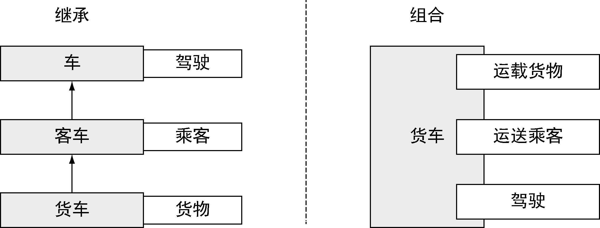

### 1.1.3　Go语言的类型系统

Go语言提供了灵活的、无继承的类型系统，无需降低运行性能就能最大程度上复用代码。这个类型系统依然支持面向对象开发，但避免了传统面向对象的问题。如果你曾经在复杂的Java和C++程序上花数周时间考虑如何抽象类和接口，你就能意识到Go语言的类型系统有多么简单。Go 开发者使用 **组合** （composition）设计模式，只需简单地将一个类型嵌入到另一个类型，就能复用所有的功能。其他语言也能使用组合，但是不得不和继承绑在一起使用，结果使整个用法非常复杂，很难使用。在Go语言中，一个类型由其他更微小的类型 **组合** 而成，避免了传统的基于继承的模型。

另外，Go语言还具有独特的接口实现机制，允许用户对行为进行建模，而不是对类型进行建模。在Go语言中，不需要声明某个类型实现了某个接口，编译器会判断一个类型的实例是否符合正在使用的接口。Go标准库里的很多接口都非常简单，只开放几个函数。从实践上讲，尤其对那些使用类似Java的面向对象语言的人来说，需要一些时间才能习惯这个特性。

#### 1．类型简单

Go语言不仅有类似 `int` 和 `string` 这样的内置类型，还支持用户定义的类型。在Go语言中，用户定义的类型通常包含一组带类型的字段，用于存储数据。Go语言的用户定义的类型看起来和C语言的结构很像，用起来也很相似。不过Go语言的类型可以声明操作该类型数据的方法。传统语言使用继承来扩展结构——Client继承自User，User继承自Entity，Go语言与此不同，Go开发者构建更小的类型——Customer和Admin，然后把这些小类型组合成更大的类型。图1-4展示了继承和组合之间的不同。


<center class="my_markdown"><b class="my_markdown">图1-4　继承和组合的对比</b></center>

#### 2．Go接口对一组行为建模

接口用于描述类型的行为。如果一个类型的实例实现了一个接口，意味着这个实例可以执行一组特定的行为。你甚至不需要去声明这个实例实现某个接口，只需要实现这组行为就好。其他的语言把这个特性叫作 **鸭子类型** ——如果它叫起来像鸭子，那它就可能是只鸭子。Go语言的接口也是这么做的。在Go语言中，如果一个类型实现了一个接口的所有方法，那么这个类型的实例就可以存储在这个接口类型的实例中，不需要额外声明。

在类似Java这种严格的面向对象语言中，所有的设计都围绕接口展开。在编码前，用户经常不得不思考一个庞大的继承链。下面是一个Java接口的例子：

```go
interface User {
    public void login();
    public void logout();
}
```

在Java中要实现这个接口，要求用户的类必须满足 `User` 接口里的所有约束，并且显式声明这个类实现了这个接口。而Go语言的接口一般只会描述一个单一的动作。在Go语言中，最常使用的接口之一是 `io.Reader` 。这个接口提供了一个简单的方法，用来声明一个类型有数据可以读取。标准库内的其他函数都能理解这个接口。这个接口的定义如下：

```go
type Reader interface {
    Read(p []byte) (n int, err error)
}
```

为了实现 `io.Reader` 这个接口，你只需要实现一个 `Read` 方法，这个方法接受一个 `byte` 切片，返回一个整数和可能出现的错误。

这和传统的面向对象编程语言的接口系统有本质的区别。Go语言的接口更小，只倾向于定义一个单一的动作。实际使用中，这更有利于使用组合来复用代码。用户几乎可以给所有包含数据的类型实现 `io.Reader` 接口，然后把这个类型的实例传给任意一个知道如何读取 `io.Reader` 的Go函数。

Go语言的整个网络库都使用了 `io.Reader` 接口，这样可以将程序的功能和不同网络的实现分离。这样的接口用起来有趣、优雅且自由。文件、缓冲区、套接字以及其他的数据源都实现了 `io.Reader` 接口。使用同一个接口，可以高效地操作数据，而不用考虑到底数据来自哪里。

