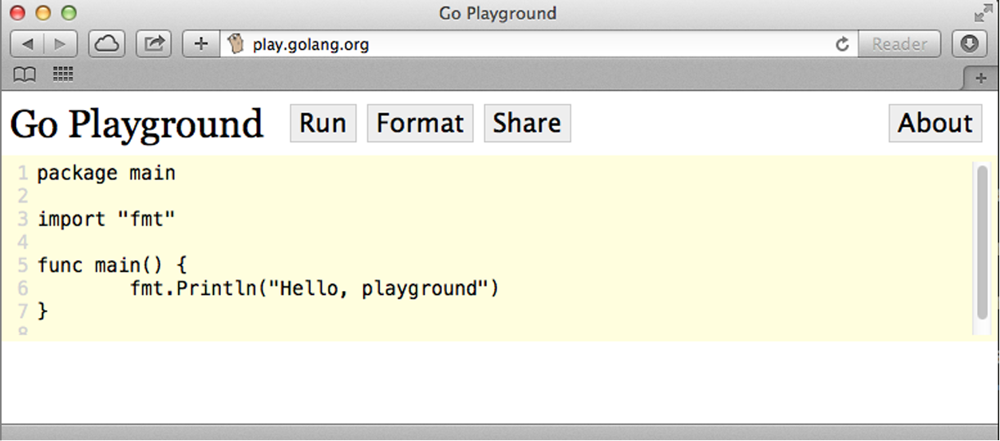

### 介绍Go Playground

Go Playground允许在浏览器里编辑并运行Go语言代码。在浏览器中打开<a class="my_markdown" href="['http://play.golang.org']">http://play.golang.org</a>。浏览器里展示的代码是可编辑的（见图1-5）。点击Run，看看会发生什么。

<b class="my_markdown">图1-5　Go Playground</b>

可以把输出的问候文字改成别的语言。试着改动 `fmt.Println()` 里面的文字，然后再次点击Run。

> **分享Go代码** 　Go开发者使用Playground分享他们的想法，测试理论，或者调试代码。你也可以这么做。每次使用Playground创建一个新程序之后，可以点击Share得到一个用于分享的网址。任何人都能打开这个链接。试试<a class="my_markdown" href="['http://play.golang.org/p/EWIXicJdmz']">http://play.golang.org/p/EWIXicJdmz</a>。

要给想要学习写东西或者寻求帮助的同事或者朋友演示某个想法时，Go Playground是非常好的方式。在Go语言的IRC频道、Slack群组、邮件列表和Go开发者发送的无数邮件里，用户都能看到创建、修改和分享Go Playground上的程序。

