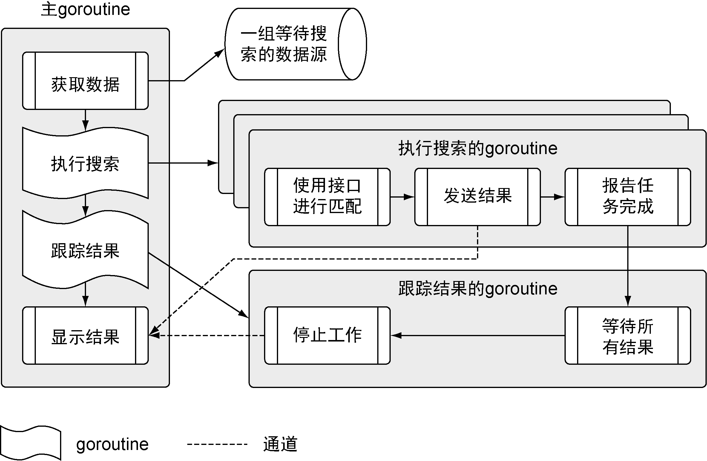

### 2.1　程序架构

在深入代码之前，让我们看一下程序的架构（如图 2-1 所示），看看如何在所有不同的数据源中搜索数据。


<center class="my_markdown"><b class="my_markdown">图2-1　程序架构流程图</b></center>

这个程序分成多个不同步骤，在多个不同的goroutine里运行。我们会根据流程展示代码，从主goroutine开始，一直到执行搜索的goroutine和跟踪结果的goroutine，最后回到主goroutine。首先来看一下整个项目的结构，如代码清单2-1所示。

代码清单2-1　应用程序的项目结构

```go
cd $GOPATH/src/github.com/goinaction/code/chapter2
- sample
    - data
        data.json   -- 包含一组数据源
    - matchers
        rss.go      -- 搜索rss源的匹配器
    - search
        default.go  -- 搜索数据用的默认匹配器
        feed.go     -- 用于读取json数据文件
        match.go    -- 用于支持不同匹配器的接口
        search.go   -- 执行搜索的主控制逻辑
    main.go         -- 程序的入口
```

这个应用的代码使用了4个文件夹，按字母顺序列出。文件夹data中有一个JSON文档，其内容是程序要拉取和处理的数据源。文件夹matchers中包含程序里用于支持搜索不同数据源的代码。目前程序只完成了支持处理RSS类型的数据源的匹配器。文件夹search中包含使用不同匹配器进行搜索的业务逻辑。最后，父级文件夹sample中有个main.go文件，这是整个程序的入口。

现在了解了如何组织程序的代码，可以继续探索并了解程序是如何工作的。让我们从程序的入口开始。

