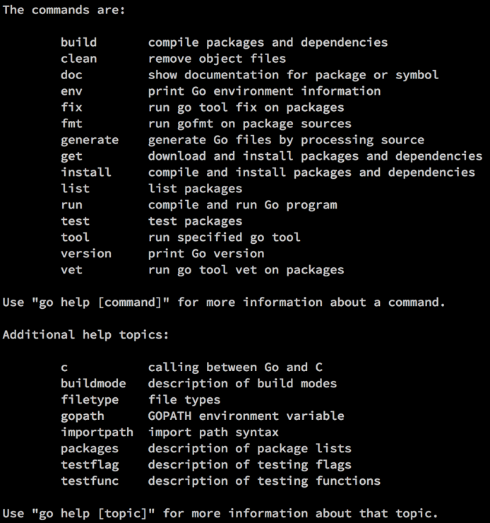

### 3.4　使用Go的工具

在前几章里，我们已经使用过了 `go` 这个工具，但我们还没有探讨这个工具都能做哪些事情。让我们进一步深入了解这个短小的命令，看看都有哪些强大的能力。在命令行提示符下，不带参数直接键入 `go` 这个命令：

```go
$ go
```

`go` 这个工具提供了很多功能，如图3-1所示。


<center class="my_markdown"><b class="my_markdown">图3-1　 `go` 命令输出的帮助文本</b></center>

通过输出的列表可以看到，这个命令包含一个编译器，这个编译器可以通过 `build` 命令启动。正如预料的那样， `build` 和 `clean` 命令会执行编译和清理的工作。现在使用代码清单3-2里的源代码，尝试执行这些命令：

```go
go build hello.go
```

当用户将代码签入源码库里的时候，开发人员可能并不想签入编译生成的文件。可以用 `clean` 命令解决这个问题：

```go
go clean hello.go
```

调用 `clean` 后会删除编译生成的可执行文件。让我们看看 `go` 工具的其他一些特性，以及使用这些命令时可以节省时间的方法。接下来的例子中，我们会使用代码清单3-7中的样例代码。

代码清单3-7　使用 `io` 包的工作

```go
01 package main
02
03 import (
04　　 "fmt"
05　　 "io/ioutil"
06　　 "os"
07
08　　 "github.com/goinaction/code/chapter3/words"
09 )
10
11 // main是应用程序的入口
12 func main() {
13　　 filename := os.Args[1]
14
15　　 contents, err := ioutil.ReadFile(filename)
16　　 if err != nil {
17　　　　 fmt.Println(err)
18　　　　 return
19　　 }
20
21　　 text := string(contents)
22
23　　 count := words.CountWords(text)
24　　 fmt.Printf("There are %d words in your text．\n", count)
25 }
```

如果已经下载了本书的源代码，应该可以在$GOPATH/src/github.com/goinaction/code/chapter3/words找到这个包。确保已经有了这段代码再进行后面的内容。

大部分Go工具的命令都会接受一个包名作为参数。回顾一下已经用过的命令，会想起 `build` 命令可以简写。在不包含文件名时， `go` 工具会默认使用 **当前目录** 来编译。

```go
go build
```

因为构建包是很常用的动作，所以也可以直接指定包：

```go
go build github.com/goinaction/code/chapter3/wordcount
```

也可以在指定包的时候使用通配符。3个点表示匹配所有的字符串。例如，下面的命令会编译 `chapter3` 目录下的所有包：

```go
go build github.com/goinaction/code/chapter3/...
```

除了指定包，大部分Go命令使用短路径作为参数。例如，下面两条命令的效果相同：

```go
go build wordcount.go
go build .
```

要执行程序，需要首先编译，然后执行编译创建的 `wordcount` 或者 `wordcount.exe` 程序。不过这里有一个命令可以在一次调用中完成这两个操作：

```go
go run wordcount.go
```

`go run` 命令会先构建wordcount.go里包含的程序，然后执行构建后的程序。这样可以节省好多录入工作量。

做开发会经常使用 `go build` 和 `go run` 命令。让我们看另外几个可用的命令，以及这些命令可以做什么。

