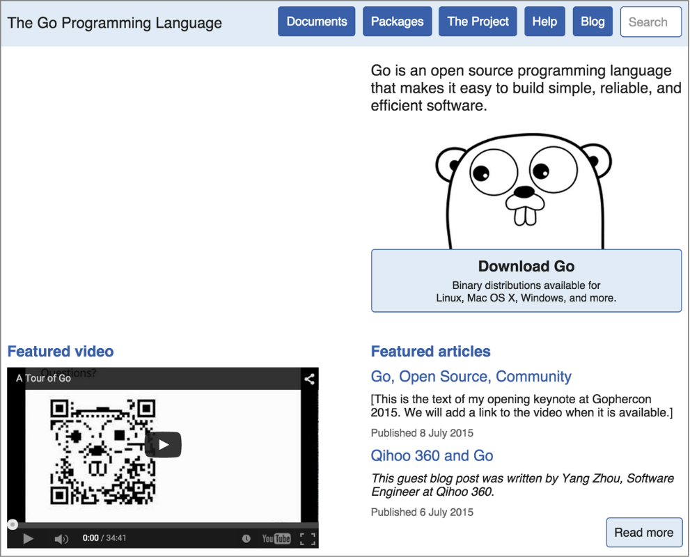

### 3.5.3　Go语言的文档

还有另外一个工具能让Go开发过程变简单。Go语言有两种方法为开发者生成文档。如果开发人员使用命令行提示符工作，可以在终端上直接使用 `go doc` 命令来打印文档。无需离开终端，即可快速浏览命令或者包的帮助。不过，如果开发人员认为一个浏览器界面会更有效率，可以使用 `godoc` 程序来启动一个Web服务器，通过点击的方式来查看Go语言的包的文档。Web服务器 `godoc` 能让开发人员以网页的方式浏览自己的系统里的所有Go语言源代码的文档。

#### 1．从命令行获取文档

对那种总会打开一个终端和一个文本编辑器（或者在终端内打开文本编辑器）的开发人员来说， `go doc` 是很好的选择。假设要用Go语言第一次开发读取UNIX  `tar` 文件的应用程序，想要看看 `archive/tar` 包的相关文档，就可以输入：

```go
go doc tar
```

执行这个命令会直接在终端产生如下输出：

```go
PACKAGE DOCUMENTATION
package tar // import "archive/tar"
Package tar implements access to tar archives．It aims to cover most of the
variations, including those produced by GNU and BSD tars.
References:
　　http://www.freebsd.org/cgi/man.cgi?query=tar&sektion=5
　　http://www.gnu.org/software/tar/manual/html_node/Standard.html
　　http://pubs.opengroup.org/onlinepubs/9699919799/utilities/pax.html
var ErrWriteTooLong = errors.New("archive/tar: write too long") ...
var ErrHeader = errors.New("archive/tar: invalid tar header")
func FileInfoHeader(fi os.FileInfo, link string) (*Header, error)
func NewReader(r io.Reader) *Reader
func NewWriter(w io.Writer) *Writer
type Header struct { ..．}
type Reader struct { ..．}
type Writer struct { ..．}

```

开发人员无需离开终端即可直接翻看文档，找到自己需要的部分。

#### 2．浏览文档

Go语言的文档也提供了浏览器版本。有时候，通过跳转到文档，查阅相关的细节，能更容易理解整个包或者某个函数。在这种情况下，会想使用 `godoc` 作为Web服务器。如果想通过Web浏览器查看可以点击跳转的文档，下面就是得到这种文档的好方式。

开发人员启动自己的文档服务器，只需要在终端会话中输入如下命令：

```go
godoc -http=:6060
```

这个命令通知 `godoc` 在端口6060启动Web服务器。如果浏览器已经打开，导航到<a class="my_markdown" href="['http://localhost:6060']">http://localhost:6060</a>可以看到一个页面，包含所有Go标准库和你的 `GOPATH` 下的Go源代码的文档。

如果图3-2显示的文档对开发人员来说很熟悉，并不奇怪，因为Go官网就是通过一个略微修改过的 `godoc` 来提供文档服务的。要进入某个特定包的文档，只需要点击页面顶端的Packages。


<center class="my_markdown"><b class="my_markdown">图3-2　本地Go文档</b></center>

Go文档工具最棒的地方在于，它也支持开发人员自己写的代码。如果开发人员遵从一个简单的规则来写代码，这些代码就会自动包含在 `godoc` 生成的文档里。

为了在 `godoc` 生成的文档里包含自己的代码文档，开发人员需要用下面的规则来写代码和注释。我们不会在本章介绍所有的规则，只会提一些重要的规则。

用户需要在标识符之前，把自己想要的文档作为注释加入到代码中。这个规则对包、函数、类型和全局变量都适用。注释可以以双斜线开头，也可以用斜线和星号风格。

```go
// Retrieve连接到配置库，收集各种链接设置、用户名和密码。这个函数在成功时
// 返回config结构，否则返回一个错误
func Retrieve() (config, error) {
　　// ..．省略
}
```

在这个例子里，我们展示了在Go语言里为一个函数写文档的惯用方法。函数的文档直接写在函数声明之前，使用人类可读的句子编写。如果想给包写一段文字量比较大的文档，可以在工程里包含一个叫作doc.go的文件，使用同样的包名，并把包的介绍使用注释加在包名声明之前。

```go
/*
　　包usb提供了用于调用USB设备的类型和函数。想要与USB设备创建一个新链接，使用NewConnection
　　...
*/
package usb
```

这段关于包的文档会显示在所有类型和函数文档之前。这个例子也展示了如何使用斜线和星号做注释。可以在Google上搜索golang documentation来查找更多关于如何给代码创建一个好文档的内容。

