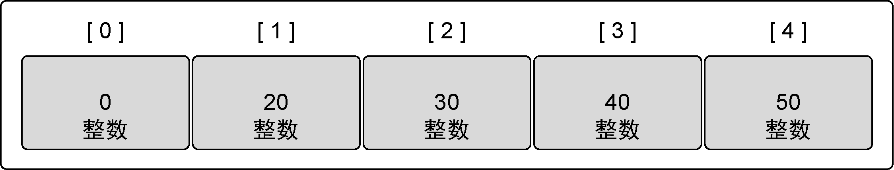

### 4.1.1　内部实现

在Go语言里，数组是一个长度固定的数据类型，用于存储一段具有相同的类型的元素的连续块。数组存储的类型可以是内置类型，如整型或者字符串，也可以是某种结构类型。

在图4-1中可以看到数组的表示。灰色格子代表数组里的元素，每个元素都紧邻另一个元素。每个元素包含相同的类型，这个例子里是整数，并且每个元素可以用一个唯一的索引（也称下标或标号）来访问。

<b class="my_markdown">图4-1　数组的内部实现</b>

数组是一种非常有用的数据结构，因为其占用的内存是连续分配的。由于内存连续，CPU能把正在使用的数据缓存更久的时间。而且内存连续很容易计算索引，可以快速迭代数组里的所有元素。数组的类型信息可以提供每次访问一个元素时需要在内存中移动的距离。既然数组的每个元素类型相同，又是连续分配，就可以以固定速度索引数组中的任意数据，速度非常快。

