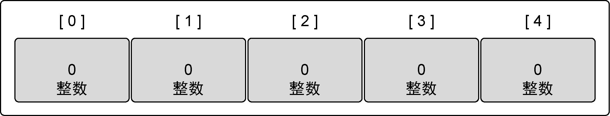
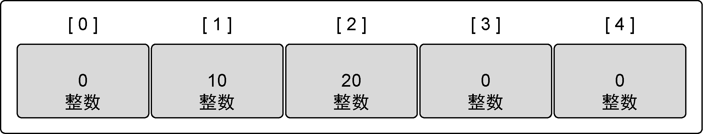

### 4.1.2　声明和初始化

声明数组时需要指定内部存储的数据的类型，以及需要存储的元素的数量，这个数量也称为数组的长度，如代码清单4-1所示。

代码清单4-1　声明一个数组，并设置为零值

```go
// 声明一个包含5个元素的整型数组
var array [5]int
```

一旦声明，数组里存储的数据类型和数组长度就都不能改变了。如果需要存储更多的元素，就需要先创建一个更长的数组，再把原来数组里的值复制到新数组里。

在Go语言中声明变量时，总会使用对应类型的零值来对变量进行初始化。数组也不例外。当数组初始化时，数组内每个元素都初始化为对应类型的零值。在图4-2里，可以看到整型数组里的每个元素都初始化为0，也就是整型的零值。


<center class="my_markdown"><b class="my_markdown">图4-2　声明数组变量后数组的值</b></center>

一种快速创建数组并初始化的方式是使用数组字面量。数组字面量允许声明数组里元素的数量同时指定每个元素的值，如代码清单4-2所示。

代码清单4-2　使用数组字面量声明数组

```go
// 声明一个包含5个元素的整型数组
// 用具体值初始化每个元素
array := [5]int{10, 20, 30, 40, 50}
```

如果使用 `...` 替代数组的长度，Go 语言会根据初始化时数组元素的数量来确定该数组的长度，如代码清单4-3所示。

代码清单4-3　让Go自动计算声明数组的长度

```go
// 声明一个整型数组
// 用具体值初始化每个元素
// 容量由初始化值的数量决定
array := [...]int{10, 20, 30, 40, 50}
```

如果知道数组的长度而且准备给每个值都指定具体值，就可以使用代码清单4-4所示的这种语法。

代码清单4-4　声明数组并指定特定元素的值

```go
// 声明一个有5个元素的数组
// 用具体值初始化索引为1和2的元素
// 其余元素保持零值
array := [5]int{1: 10, 2: 20}
```

代码清单4-4中声明的数组在声明和初始化后，会和图4-3所展现的一样。


<center class="my_markdown"><b class="my_markdown">图4-3　声明之后数组的值</b></center>

