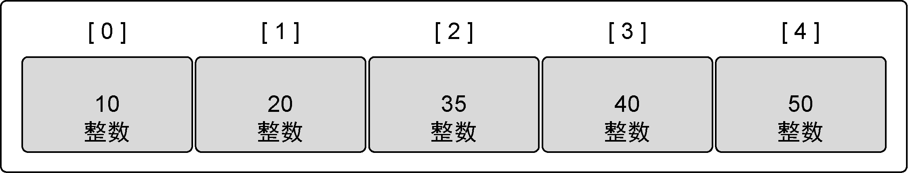
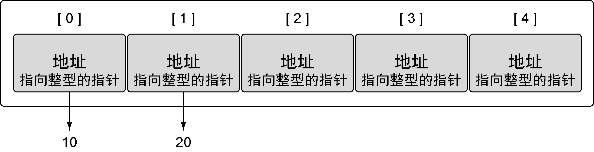
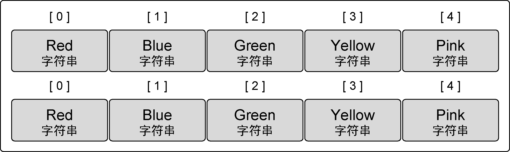
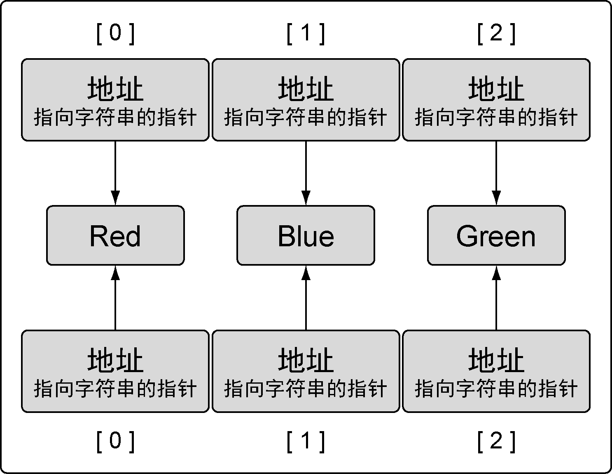

### 4.1.3　使用数组

正像之前提到的，因为内存布局是连续的，所以数组是效率很高的数据结构。在访问数组里任意元素的时候，这种高效都是数组的优势。要访问数组里某个单独元素，使用 `[]` 运算符，如代码清单4-5所示。

代码清单4-5　访问数组元素

```go
// 声明一个包含5个元素的整型数组
// 用具体值初始为每个元素
array := [5]int{10, 20, 30, 40, 50}
// 修改索引为2的元素的值
array[2] = 35
```

代码清单4-5中声明的数组的值在操作完成后，会和图4-4所展现的一样。


<center class="my_markdown"><b class="my_markdown">图4-4　修改索引为2的值之后数组的值</b></center>

可以像第2章一样，声明一个所有元素都是指针的数组。使用 `*` 运算符就可以访问元素指针所指向的值，如代码清单4-6所示。

代码清单4-6　访问指针数组的元素

```go
// 声明包含5个元素的指向整数的数组
// 用整型指针初始化索引为0和1的数组元素
array := [5]*int{0: new(int), 1: new(int)}
// 为索引为0和1的元素赋值
*array[0] = 10
*array[1] = 20
```

代码清单4-6中声明的数组的值在操作完毕后，会和图4-5所展现的一样。


<center class="my_markdown"><b class="my_markdown">图4-5　指向整数的指针数组</b></center>

在Go语言里，数组是一个值。这意味着数组可以用在赋值操作中。变量名代表整个数组，因此，同样类型的数组可以赋值给另一个数组，如代码清单4-7所示。

代码清单4-7　把同样类型的一个数组赋值给另外一个数组

```go
// 声明第一个包含5个元素的字符串数组
var array1 [5]string
// 声明第二个包含5个元素的字符串数组
// 用颜色初始化数组
array2 := [5]string{"Red", "Blue", "Green", "Yellow", "Pink"}
// 把array2的值复制到array1
array1 = array2
```

复制之后，两个数组的值完全一样，如图4-6所示。


<center class="my_markdown"><b class="my_markdown">图4-6　复制之后的两个数组</b></center>

数组变量的类型包括数组长度和每个元素的类型。只有这两部分都相同的数组，才是类型相同的数组，才能互相赋值，如代码清单4-8所示。

代码清单4-8　编译器会阻止类型不同的数组互相赋值

```go
// 声明第一个包含4个元素的字符串数组
var array1 [4]string
// 声明第二个包含5个元素的字符串数组
// 使用颜色初始化数组
array2 := [5]string{"Red", "Blue", "Green", "Yellow", "Pink"}
// 将array2复制给array1
array1 = array2
Compiler Error:
cannot use array2 (type [5]string) as type [4]string in assignment
```

复制数组指针，只会复制指针的值，而不会复制指针所指向的值，如代码清单4-9所示。

代码清单4-9　把一个指针数组赋值给另一个

```go
// 声明第一个包含3个元素的指向字符串的指针数组
var array1 [3]*string
// 声明第二个包含3个元素的指向字符串的指针数组
// 使用字符串指针初始化这个数组
array2 := [3]*string{new(string), new(string), new(string)}
// 使用颜色为每个元素赋值
*array2[0] = "Red"
*array2[1] = "Blue"
*array2[2] = "Green"
// 将array2复制给array1
array1 = array2
```

复制之后，两个数组指向同一组字符串，如图4-7所示。


<center class="my_markdown"><b class="my_markdown">图4-7　两组指向同样字符串的数组</b></center>

