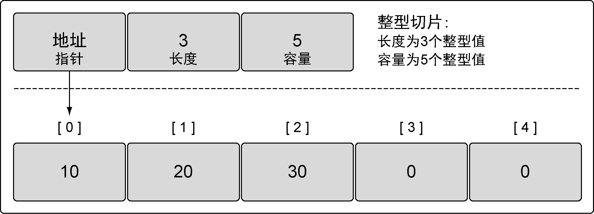

### 4.2.1　内部实现

切片是一个很小的对象，对底层数组进行了抽象，并提供相关的操作方法。切片有3个字段的数据结构，这些数据结构包含Go语言需要操作底层数组的元数据（见图4-9）。

<b class="my_markdown">图4-9　切片内部实现：底层数组</b>

这3个字段分别是指向底层数组的指针、切片访问的元素的个数（即长度）和切片允许增长到的元素个数（即容量）。后面会进一步讲解长度和容量的区别。

