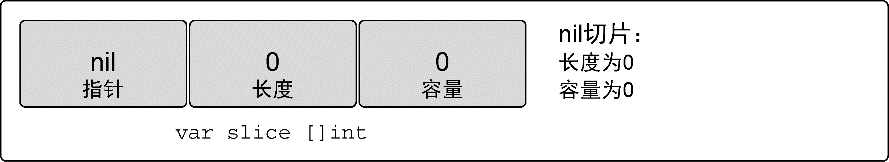
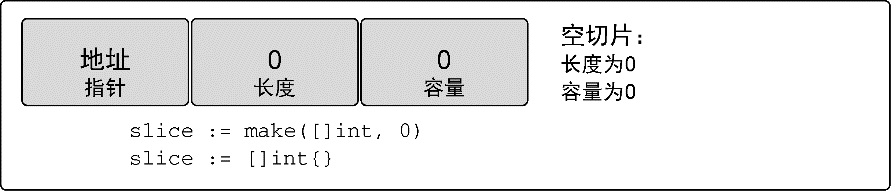

### 4.2.2　创建和初始化

Go语言中有几种方法可以创建和初始化切片。是否能提前知道切片需要的容量通常会决定要如何创建切片。

#### 1．make和切片字面量

一种创建切片的方法是使用内置的 `make` 函数。当使用 `make` 时，需要传入一个参数，指定切片的长度，如代码清单4-16所示。

代码清单4-16　使用长度声明一个字符串切片

```go
// 创建一个字符串切片
// 其长度和容量都是5个元素
slice := make([]string, 5)
```

如果只指定长度，那么切片的容量和长度相等。也可以分别指定长度和容量，如代码清单4-17所示。

代码清单4-17　使用长度和容量声明整型切片

```go
// 创建一个整型切片
// 其长度为3个元素，容量为5个元素
slice := make([]int, 3, 5)
```

分别指定长度和容量时，创建的切片，底层数组的长度是指定的容量，但是初始化后并不能访问所有的数组元素。图4-9描述了代码清单4-17里声明的整型切片在初始化并存入一些值后的样子。

代码清单4-17中的切片可以访问3个元素，而底层数组拥有5个元素。剩余的2个元素可以在后期操作中合并到切片，可以通过切片访问这些元素。如果基于这个切片创建新的切片，新切片会和原有切片共享底层数组，也能通过后期操作来访问多余容量的元素。

不允许创建容量小于长度的切片，如代码清单4-18所示。

代码清单4-18　容量小于长度的切片会在编译时报错

```go
// 创建一个整型切片
// 使其长度大于容量
slice := make([]int, 5, 3)
Compiler Error:
len larger than cap in make([]int)
```

另一种常用的创建切片的方法是使用切片字面量，如代码清单 4-19 所示。这种方法和创建数组类似，只是不需要指定 `[]` 运算符里的值。初始的长度和容量会基于初始化时提供的元素的个数确定。

代码清单4-19　通过切片字面量来声明切片

```go
// 创建字符串切片
// 其长度和容量都是5个元素
slice := []string{"Red", "Blue", "Green", "Yellow", "Pink"}
// 创建一个整型切片
// 其长度和容量都是3个元素
slice := []int{10, 20, 30}
```

当使用切片字面量时，可以设置初始长度和容量。要做的就是在初始化时给出所需的长度和容量作为索引。代码清单4-20中的语法展示了如何创建长度和容量都是100个元素的切片。

代码清单4-20　使用索引声明切片

```go
// 创建字符串切片
// 使用空字符串初始化第 100 个元素
slice := []string{99: ""}
```

记住，如果在 `[]` 运算符里指定了一个值，那么创建的就是数组而不是切片。只有不指定值的时候，才会创建切片，如代码清单4-21所示。

代码清单4-21　声明数组和声明切片的不同

```go
// 创建有3个元素的整型数组
array := [3]int{10, 20, 30}
// 创建长度和容量都是3的整型切片
slice := []int{10, 20, 30}
```

#### 2．nil和空切片

有时，程序可能需要声明一个值为 `nil` 的切片（也称 `nil` 切片）。只要在声明时不做任何初始化，就会创建一个 `nil` 切片，如代码清单4-22所示。

代码清单4-22　创建nil切片

```go
// 创建nil整型切片
var slice []int
```

在Go语言里， `nil` 切片是很常见的创建切片的方法。 `nil` 切片可以用于很多标准库和内置函数。在需要描述一个不存在的切片时， `nil` 切片会很好用。例如，函数要求返回一个切片但是发生异常的时候（见图4-10）。


<center class="my_markdown"><b class="my_markdown">图4-10　 `nil` 切片的表示</b></center>

利用初始化，通过声明一个切片可以创建一个空切片，如代码清单4-23所示。

代码清单4-23　声明空切片

```go
// 使用make创建空的整型切片
slice := make([]int, 0)
// 使用切片字面量创建空的整型切片
slice := []int{}
```

空切片在底层数组包含0个元素，也没有分配任何存储空间。想表示空集合时空切片很有用，例如，数据库查询返回0个查询结果时（见图4-11）。


<center class="my_markdown"><b class="my_markdown">图4-11　空切片的表示</b></center>

不管是使用 `nil` 切片还是空切片，对其调用内置函数 `append` 、 `len` 和 `cap` 的效果都是一样的。

