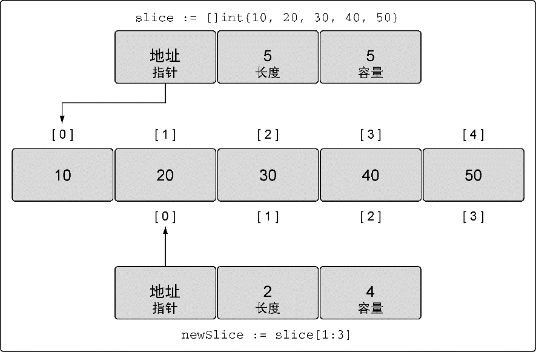
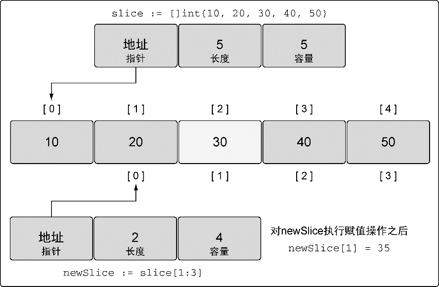
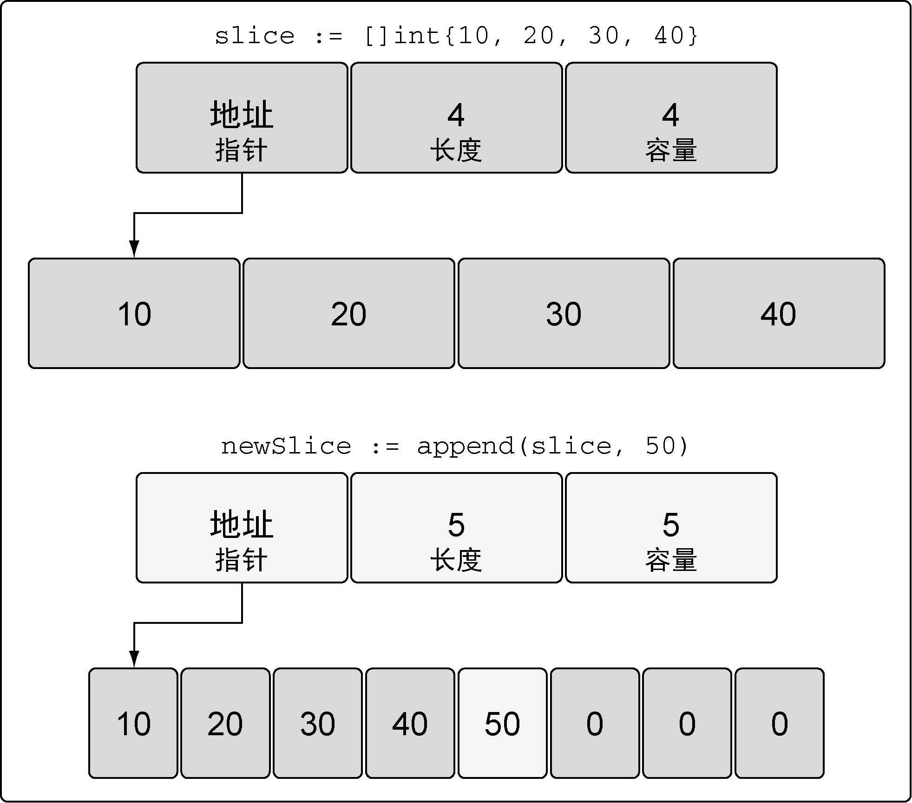
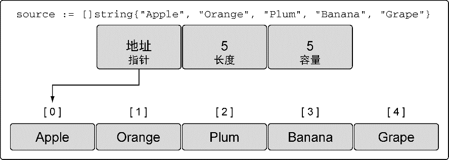
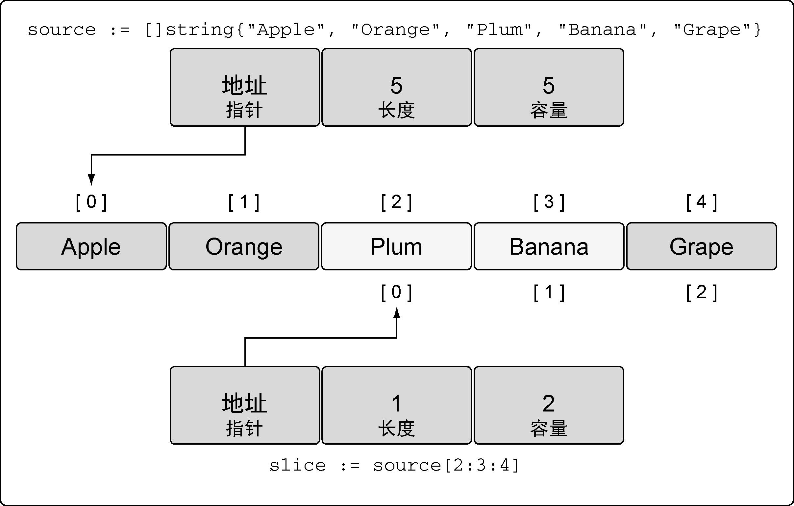
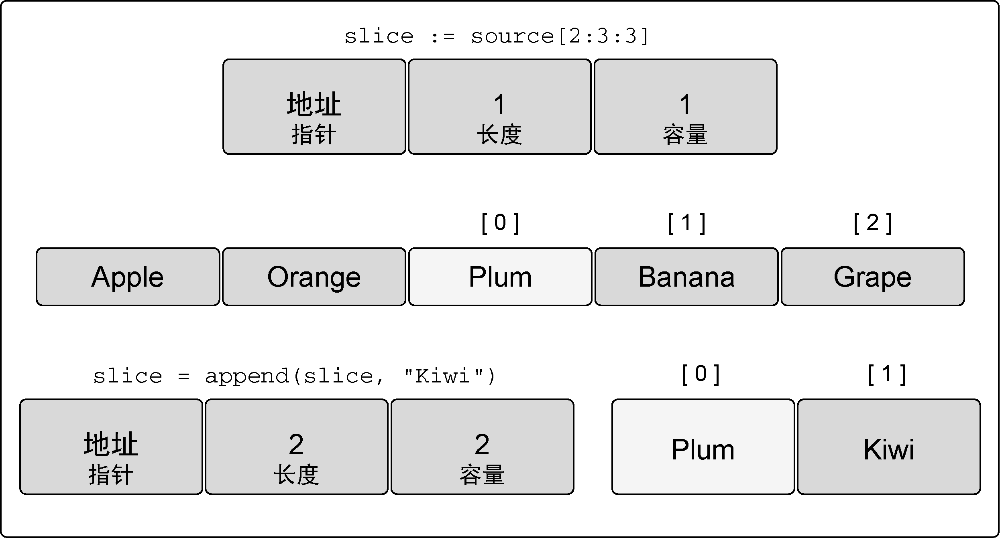
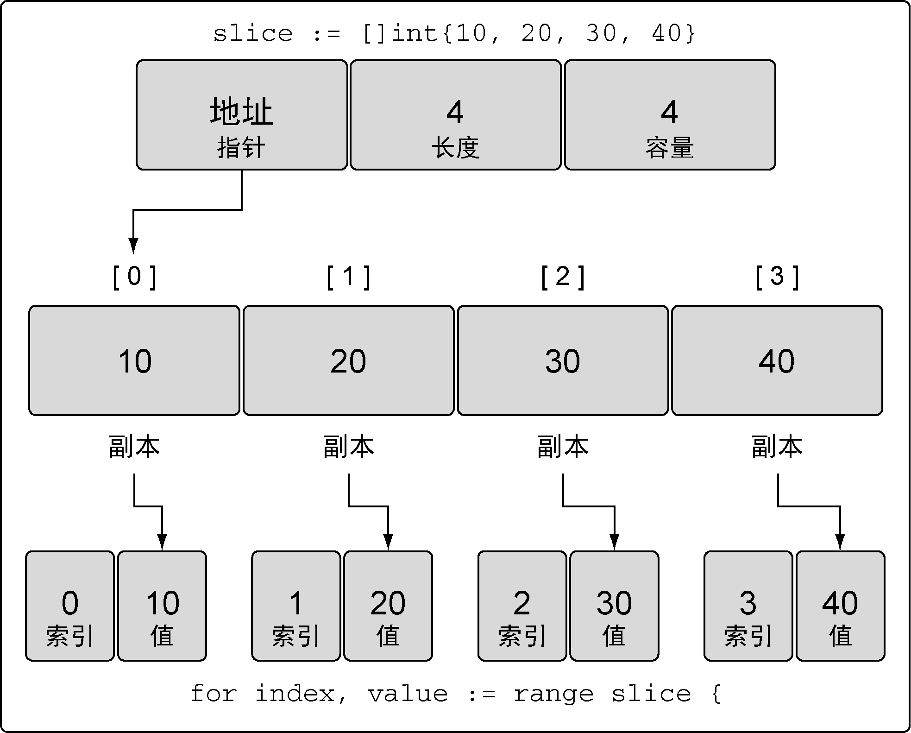

### 4.2.3　使用切片

现在知道了什么是切片，也知道如何创建切片，来看看如何在程序里使用切片。

#### 1．赋值和切片

对切片里某个索引指向的元素赋值和对数组里某个索引指向的元素赋值的方法完全一样。使用 `[]` 操作符就可以改变某个元素的值，如代码清单4-24所示。

代码清单4-24　使用切片字面量来声明切片

```go
// 创建一个整型切片
// 其容量和长度都是5个元素
slice := []int{10, 20, 30, 40, 50}
// 改变索引为1的元素的值
slice[1] = 25
```

切片之所以被称为切片，是因为创建一个新的切片就是把底层数组切出一部分，如代码清单4-25所示。

代码清单4-25　使用切片创建切片

```go
// 创建一个整型切片
// 其长度和容量都是5个元素
slice := []int{10, 20, 30, 40, 50}
// 创建一个新切片
// 其长度为2个元素，容量为4个元素
newSlice := slice[1:3]
```

执行完代码清单 4-25 中的切片动作后，我们有了两个切片，它们共享同一段底层数组，但通过不同的切片会看到底层数组的不同部分（见图4-12）。


<center class="my_markdown"><b class="my_markdown">图4-12　共享同一底层数组的两个切片</b></center>

第一个切片 `slice` 能够看到底层数组全部5个元素的容量，不过之后的 `newSlice` 就看不到。对于 `newSlice` ，底层数组的容量只有4个元素。 `newSlice` 无法访问到它所指向的底层数组的第一个元素之前的部分。所以，对 `newSlice` 来说，之前的那些元素就是不存在的。

使用代码清单4-26所示的公式，可以计算出任意切片的长度和容量。

代码清单4-26　如何计算长度和容量

```go
对底层数组容量是k的切片slice[i:j]来说
长度: j - i
容量: k - i
```

对 `newSlice` 应用这个公式就能得到代码清单4-27所示的数字。

代码清单4-27　计算新的长度和容量

```go
对底层数组容量是5的切片slice[1:3]来说
长度: 3 - 1 = 2
容量: 5 - 1 = 4
```

可以用另一种方法来描述这几个值。第一个值表示新切片开始的元素的索引位置，这个例子中是1。第二个值表示开始的索引位置（1），加上希望包含的元素的个数（2），1+2的结果是3，所以第二个值就是3。容量是该与切片相关联的所有元素的数量。

需要记住的是，现在两个切片共享同一个底层数组。如果一个切片修改了该底层数组的共享部分，另一个切片也能感知到，如代码清单4-28所示。

代码清单4-28　修改切片内容可能导致的结果

```go
// 创建一个整型切片
// 其长度和容量都是5个元素
slice := []int{10, 20, 30, 40, 50}
// 创建一个新切片
// 其长度是2个元素，容量是4个元素
newSlice := slice[1:3]
// 修改newSlice索引为1的元素
// 同时也修改了原来的slice的索引为2的元素
newSlice[1] = 35
```

把35赋值给 `newSlice` 的第二个元素（索引为1的元素）的同时也是在修改原来的 `slice` 的第3个元素（索引为2的元素）（见图4-13）。


<center class="my_markdown"><b class="my_markdown">图4-13　赋值操作之后的底层数组</b></center>

切片只能访问到其长度内的元素。试图访问超出其长度的元素将会导致语言运行时异常，如代码清单4-29所示。与切片的容量相关联的元素只能用于增长切片。在使用这部分元素前，必须将其合并到切片的长度里。

代码清单4-29　表示索引越界的语言运行时错误

```go
// 创建一个整型切片
// 其长度和容量都是5个元素
slice := []int{10, 20, 30, 40, 50}
// 创建一个新切片
// 其长度为2个元素，容量为4个元素
newSlice := slice[1:3]
// 修改newSlice索引为3的元素
// 这个元素对于newSlice来说并不存在
newSlice[3] = 45
Runtime Exception:
panic: runtime error: index out of range
```

切片有额外的容量是很好，但是如果不能把这些容量合并到切片的长度里，这些容量就没有用处。好在可以用Go语言的内置函数 `append` 来做这种合并很容易。

#### 2．切片增长

相对于数组而言，使用切片的一个好处是，可以按需增加切片的容量。Go语言内置的 `append` 函数会处理增加长度时的所有操作细节。

要使用 `append` ，需要一个被操作的切片和一个要追加的值，如代码清单4-30所示。当 `append` 调用返回时，会返回一个包含修改结果的新切片。函数 `append` 总是会增加新切片的长度，而容量有可能会改变，也可能不会改变，这取决于被操作的切片的可用容量。

代码清单4-30　使用 `append` 向切片增加元素

```go
// 创建一个整型切片
// 其长度和容量都是5个元素
slice := []int{10, 20, 30, 40, 50}
// 创建一个新切片
// 其长度为2个元素，容量为4个元素
newSlice := slice[1:3]
// 使用原有的容量来分配一个新元素
// 将新元素赋值为60
newSlice = append(newSlice, 60)
```

当代码清单4-30中的 `append` 操作完成后，两个切片和底层数组的布局如图4-14所示。


<center class="my_markdown"><b class="my_markdown">图4-14　 `append` 操作之后的底层数组</b></center>

因为 `newSlice` 在底层数组里还有额外的容量可用， `append` 操作将可用的元素合并到切片的长度，并对其进行赋值。由于和原始的 `slice` 共享同一个底层数组， `slice` 中索引为3的元素的值也被改动了。

如果切片的底层数组没有足够的可用容量， `append` 函数会创建一个新的底层数组，将被引用的现有的值复制到新数组里，再追加新的值，如代码清单4-31所示。

代码清单4-31　使用 `append` 同时增加切片的长度和容量

```go
// 创建一个整型切片
// 其长度和容量都是4个元素
slice := []int{10, 20, 30, 40}
// 向切片追加一个新元素
// 将新元素赋值为50
newSlice := append(slice, 50)
```

当这个 `append` 操作完成后， `newSlice` 拥有一个全新的底层数组，这个数组的容量是原来的两倍（见图4-15）。


<center class="my_markdown"><b class="my_markdown">图4-15　 `append` 操作之后的新的底层数组</b></center>

函数 `append` 会智能地处理底层数组的容量增长。在切片的容量小于1000个元素时，总是会成倍地增加容量。一旦元素个数超过1000，容量的增长因子会设为1.25，也就是会每次增加25%的容量。随着语言的演化，这种增长算法可能会有所改变。

#### 3．创建切片时的3个索引

在创建切片时，还可以使用之前我们没有提及的第三个索引选项。第三个索引可以用来控制新切片的容量。其目的并不是要增加容量，而是要限制容量。可以看到，允许限制新切片的容量为底层数组提供了一定的保护，可以更好地控制追加操作。

让我们看看一个包含5个元素的字符串切片。这个切片包含了本地超市能找到的水果名字，如代码清单4-32所示。

代码清单4-32　使用切片字面量声明一个字符串切片

```go
// 创建字符串切片
// 其长度和容量都是5个元素
source := []string{"Apple", "Orange", "Plum", "Banana", "Grape"}
```

如果查看这个包含水果的切片的值，就像图4-16所展示的样子。


<center class="my_markdown"><b class="my_markdown">图4-16　字符串切片的表示</b></center>

现在，让我们试着用第三个索引选项来完成切片操作，如代码清单4-33所示。

代码清单4-33　使用3个索引创建切片

```go
// 将第三个元素切片，并限制容量
// 其长度为1个元素，容量为2个元素
slice := source[2:3:4]
```

这个切片操作执行后，新切片里从底层数组引用了1个元素，容量是2个元素。具体来说，新切片引用了 `Plum` 元素，并将容量扩展到 `Banana` 元素，如图4-17所示。


<center class="my_markdown"><b class="my_markdown">图4-17　操作之后的新切片的表示</b></center>

我们可以应用之前定义的公式来计算新切片的长度和容量，如代码清单4-34所示。

代码清单4-34　如何计算长度和容量

```go
对于slice[i:j:k] 或 [2:3:4]
长度: j – i 或 3 - 2 = 1
容量: k – i 或 4 - 2 = 2
```

和之前一样，第一个值表示新切片开始的元素的索引位置，这个例子中是2。第二个值表示开始的索引位置（2）加上希望包括的元素的个数（1），2+1的结果是3，所以第二个值就是3。为了设置容量，从索引位置2开始，加上希望容量中包含的元素的个数（2），就得到了第三个值4。

如果试图设置的容量比可用的容量还大，就会得到一个语言运行时错误，如代码清单4-35所示。

代码清单4-35　设置容量大于已有容量的语言运行时错误

```go
// 这个切片操作试图设置容量为4
// 这比可用的容量大
slice := source[2:3:6]
Runtime Error:
panic: runtime error: slice bounds out of range
```

我们之前讨论过，内置函数 `append` 会首先使用可用容量。一旦没有可用容量，会分配一个新的底层数组。这导致很容易忘记切片间正在共享同一个底层数组。一旦发生这种情况，对切片进行修改，很可能会导致随机且奇怪的问题。对切片内容的修改会影响多个切片，却很难找到问题的原因。

如果在创建切片时设置切片的容量和长度一样，就可以强制让新切片的第一个 `append` 操作创建新的底层数组，与原有的底层数组分离。新切片与原有的底层数组分离后，可以安全地进行后续修改，如代码清单4-36所示。

代码清单4-36　设置长度和容量一样的好处

```go
// 创建字符串切片
// 其长度和容量都是5个元素
source := []string{"Apple", "Orange", "Plum", "Banana", "Grape"}
// 对第三个元素做切片，并限制容量
// 其长度和容量都是1个元素
slice := source[2:3:3]
// 向slice追加新字符串
slice = append(slice, "Kiwi")
```

如果不加第三个索引，由于剩余的所有容量都属于 `slice` ，向 `slice` 追加 `Kiwi` 会改变原有底层数组索引为3的元素的值 `Banana` 。不过在代码清单4-36中我们限制了 `slice` 的容量为1。当我们第一次对 `slice` 调用 `append` 的时候，会创建一个新的底层数组，这个数组包括2个元素，并将水果 `Plum` 复制进来，再追加新水果 `Kiwi` ，并返回一个引用了这个底层数组的新切片，如图4-18所示。


<center class="my_markdown"><b class="my_markdown">图4-18　 `append` 操作之后的新切片的表示</b></center>

因为新的切片 `slice` 拥有了自己的底层数组，所以杜绝了可能发生的问题。我们可以继续向新切片里追加水果，而不用担心会不小心修改了其他切片里的水果。同时，也保持了为切片申请新的底层数组的简洁。

内置函数 `append` 也是一个可变参数的函数。这意味着可以在一次调用传递多个追加的值。如果使用 `...` 运算符，可以将一个切片的所有元素追加到另一个切片里，如代码清单4-37所示。

代码清单4-37　将一个切片追加到另一个切片

```go
// 创建两个切片，并分别用两个整数进行初始化
s1 := []int{1, 2}
s2 := []int{3, 4}
// 将两个切片追加在一起，并显示结果
fmt.Printf("%v\n", append(s1, s2...))
Output:
[1 2 3 4]
```

就像通过输出看到的那样，切片 `s2` 里的所有值都追加到了切片 `s1` 的后面。使用 `Printf` 时用来显示 `append` 函数返回的新切片的值。

#### 4．迭代切片

既然切片是一个集合，可以迭代其中的元素。Go语言有个特殊的关键字 `range` ，它可以配合关键字 `for` 来迭代切片里的元素，如代码清单4-38所示。

代码清单4-38　使用 `for range` 迭代切片

```go
// 创建一个整型切片
// 其长度和容量都是4个元素
slice := []int{10, 20, 30, 40}
// 迭代每一个元素，并显示其值
for index, value := range slice {
　fmt.Printf("Index: %d　Value: %d\n", index, value)
}
Output:
Index: 0　Value: 10
Index: 1　Value: 20
Index: 2　Value: 30
Index: 3　Value: 40
```

当迭代切片时，关键字 `range` 会返回两个值。第一个值是当前迭代到的索引位置，第二个值是该位置对应元素值的一份副本（见图4-19）。


<center class="my_markdown"><b class="my_markdown">图4-19　使用 `range` 迭代切片会创建每个元素的副本</b></center>

需要强调的是， `range` 创建了每个元素的副本，而不是直接返回对该元素的引用，如代码清单4-39所示。如果使用该值变量的地址作为指向每个元素的指针，就会造成错误。让我们看看是为什么。

代码清单4-39　 `range` 提供了每个元素的副本

```go
// 创建一个整型切片
// 其长度和容量都是4个元素
slice := []int{10, 20, 30, 40}
// 迭代每个元素，并显示值和地址
for index, value := range slice {
　　fmt.Printf("Value: %d　Value-Addr: %X　ElemAddr: %X\n",
　　　　value, &value, &slice[index])
}
Output:
Value: 10　Value-Addr: 10500168　ElemAddr: 1052E100
Value: 20　Value-Addr: 10500168　ElemAddr: 1052E104
Value: 30　Value-Addr: 10500168　ElemAddr: 1052E108
Value: 40　Value-Addr: 10500168　ElemAddr: 1052E10C
```

因为迭代返回的变量是一个迭代过程中根据切片依次赋值的新变量，所以 `value` 的地址总是相同的。要想获取每个元素的地址，可以使用切片变量和索引值。

如果不需要索引值，可以使用占位字符来忽略这个值，如代码清单4-40所示。

代码清单4-40　使用空白标识符（下划线）来忽略索引值

```go
// 创建一个整型切片
// 其长度和容量都是4个元素
slice := []int{10, 20, 30, 40}
// 迭代每个元素，并显示其值
for _, value := range slice {
　　fmt.Printf("Value: %d\n", value)
}
Output:
Value: 10
Value: 20
Value: 30
Value: 40
```

关键字 `range` 总是会从切片头部开始迭代。如果想对迭代做更多的控制，依旧可以使用传统的 `for` 循环，如代码清单4-41所示。

代码清单4-41　使用传统的 `for` 循环对切片进行迭代

```go
// 创建一个整型切片
// 其长度和容量都是4个元素
slice := []int{10, 20, 30, 40}
// 从第三个元素开始迭代每个元素
for index := 2; index < len(slice); index++ {
　　fmt.Printf("Index: %d　Value: %d\n", index, slice[index])
}
Output:
Index: 2　Value: 30
Index: 3　Value: 40
```

有两个特殊的内置函数 `len` 和 `cap` ，可以用于处理数组、切片和通道。对于切片，函数 `len` 返回切片的长度，函数 `cap` 返回切片的容量。在代码清单4-41里，我们使用函数 `len` 来决定什么时候停止对切片的迭代。

现在知道了如何创建和使用切片。可以组合多个切片成为多维切片，并对其进行迭代。

