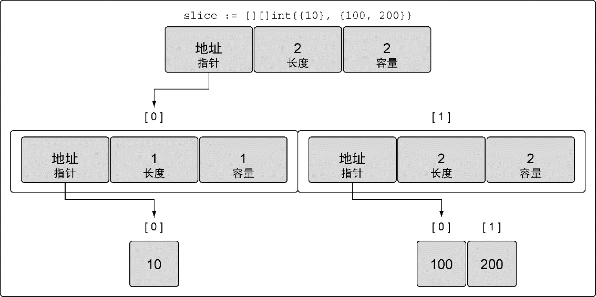
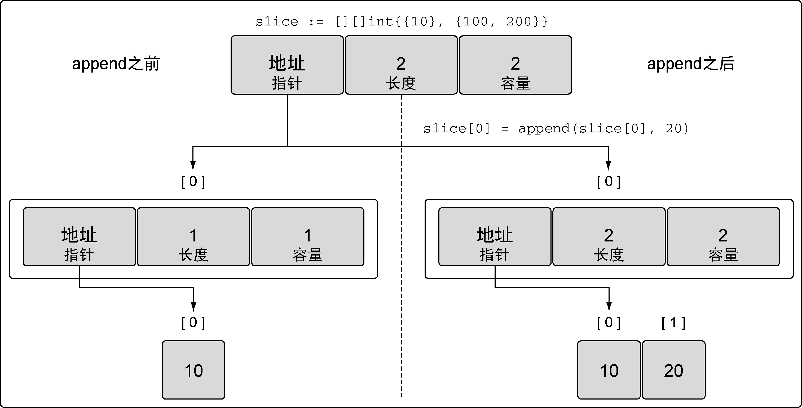

### 4.2.4　多维切片

和数组一样，切片是一维的。不过，和之前对数组的讨论一样，可以组合多个切片形成多维切片，如代码清单4-42所示。

代码清单4-42　声明多维切片

```go
// 创建一个整型切片的切片
slice := [][]int{{10}, {100, 200}}
```

我们有了一个包含两个元素的外层切片，每个元素包含一个内层的整型切片。切片 `slice` 的值看起来像图4-20展示的样子。


<center class="my_markdown"><b class="my_markdown">图4-20　整型切片的切片的值</b></center>

在图4-20里，可以看到组合切片的操作是如何将一个切片嵌入到另一个切片中的。外层的切片包括两个元素，每个元素都是一个切片。第一个元素中的切片使用单个整数10来初始化，第二个元素中的切片包括两个整数，即100和200。

这种组合可以让用户创建非常复杂且强大的数据结构。已经学过的关于内置函数 `append` 的规则也可以应用到组合后的切片上，如代码清单4-43所示。

代码清单4-43　组合切片的切片

```go
// 创建一个整型切片的切片
slice := [][]int{{10}, {100, 200}}
// 为第一个切片追加值为20的元素
slice[0] = append(slice[0], 20)
```

Go语言里使用 `append` 函数处理追加的方式很简明：先增长切片，再将新的整型切片赋值给外层切片的第一个元素。当代码清单4-43中的操作完成后，会为新的整型切片分配新的底层数组，然后将切片复制到外层切片的索引为0的元素，如图4-21所示。


<center class="my_markdown"><b class="my_markdown">图4-21　 `append` 操作之后外层切片索引为0的元素的布局</b></center>

即便是这么简单的多维切片，操作时也会涉及众多布局和值。看起来在函数间像这样传递数据结构也会很复杂。不过切片本身结构很简单，可以以很小的成本在函数间传递。

